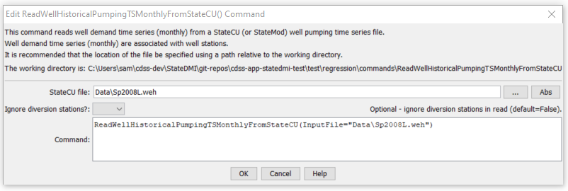

# StateDMI / Command / ReadWellHistoricalPumpingTSMonthlyFromStateCU #

* [Overview](#overview)
* [Command Editor](#command-editor)
* [Command Syntax](#command-syntax)
* [Examples](#examples)
* [Troubleshooting](#troubleshooting)
* [See Also](#see-also)

-------------------------

## Overview ##

The `ReadWellHistoricalPumpingTSMonthlyFromStateCU` command (for StateCU and StateMod)
reads well historical pumping time series (monthly) and defines the data in memory.
This command is used when estimating average efficiencies and calculating demand time series.
All time series are read, whether or not they match the list of well stations.
This command is equivalent to the
[`ReadWellHistoricalPumpingTSMonthlyFromStateMod`](../ReadWellHistoricalPumpingTSMonthlyFromStateMod/ReadWellHistoricalPumpingTSMonthlyFromStateMod.md) command – use
the commands as appropriate depending on which data set file is being read (the file format is the StateMod time series file format).

## Command Editor ##

The following dialog is used to edit the command and illustrates the command syntax.

**<p style="text-align: center;">

</p>**

**<p style="text-align: center;">
`ReadWellHistoricalPumpingTSMonthlyFromStateCU` Command Editor (<a href="../ReadWellHistoricalPumpingTSMonthlyFromStateCU.png">see also the full-size image</a>)
</p>**

## Command Syntax ##

The command syntax is as follows:

```text
ReadWellHistoricalPumpingTSMonthlyFromStateCU(Parameter="Value",...)
```
**<p style="text-align: center;">
Command Parameters
</p>**

| **Parameter**&nbsp;&nbsp;&nbsp;&nbsp;&nbsp;&nbsp;&nbsp;&nbsp;&nbsp;&nbsp;&nbsp;&nbsp; | **Description** | **Default**&nbsp;&nbsp;&nbsp;&nbsp;&nbsp;&nbsp;&nbsp;&nbsp;&nbsp;&nbsp; |
| --------------|-----------------|----------------- |
| `InputFile`<br>**required** | The name of the well historical pumping time series (monthly) file to read. | None – must be specified. |

## Examples ##

See the [automated tests](https://github.com/OpenCDSS/cdss-app-statedmi-test/tree/master/test/regression/commands/ReadWellHistoricalPumpingTSMonthlyFromStateCU).

## Troubleshooting ##

[See the main troubleshooting documentation](../../troubleshooting/troubleshooting.md)

## See Also ##

* [`ReadWellHistoricalPumpingTSMonthlyFromStateMod`](../ReadWellHistoricalPumpingTSMonthlyFromStateMod/ReadWellHistoricalPumpingTSMonthlyFromStateMod.md) command
* [`WriteWellHistoricalPumpingTSMonthlyToStateMod`](../WriteWellHistoricalPumpingTSMonthlyToStateMod/WriteWellHistoricalPumpingTSMonthlyToStateMod.md) command
