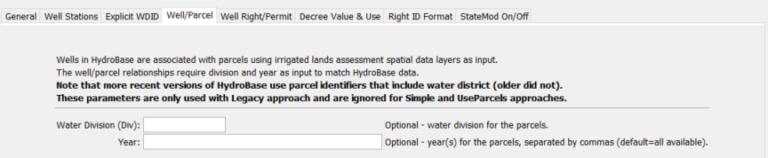
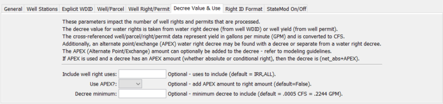

# StateDMI / Command / ReadWellRightsFromHydroBase #

* [Overview](#overview)
	+ [Default (Simple) Approach](#default-simple-approach)
	+ [Parcel (Legacy) Approach](#parcel-legacy-approach)
* [Command Editor](#command-editor)
* [Command Syntax](#command-syntax)
* [Examples](#examples)
* [Troubleshooting](#troubleshooting)
* [See Also](#see-also)

-------------------------

## Overview ##

The `ReadWellRightsFromHydroBase` command (for StateCU and StateMod) reads well rights
from HydroBase for each well station that is defined.
The well rights can then be manipulated and output with other commands.  

As of StateDMI version 4.x, a new Simple approach has been implemented as the default.
Instead of using detailed parcel data to split well water right decree and permit yield amount,
parcels served by a well right/permit are assigned the full well decree (or permit yield).
For groundwater-only well stations,
the new approach is to provide the well identifiers using WDID and permit identifiers, rather than parcels.
Duplicates resulting from this assignment, within the same explicit or aggregate well, are removed.
However, the well’s full decree/yield may be assigned to multiple model well stations.
This approach recognizes that the complexity of splitting right/permit data makes it difficult to verify data.
Additionally, groundwater-only supply is typically limited by other data in model datasets.
StateDMI 4.x also allows use of 11 digit parcel IDs in the StateMod well right file,
consistent with recent irrigated lands assessment data layers, whereas the Legacy version cannot,
particularly if the [`MergeWellRights`](../MergeWellRights/MergeWellRights.md) command is used.
The following figure illustrates possible water supply for parcels.

**<p style="text-align: center;">

</p>**

**<p style="text-align: center;">
Example Supply for Parcels (<a href="../ParcelSupplyDiagram.png">see also the full-size image</a>)
</p>**

In this example, two ditches (D1 and D2, represented with hatching in vertical and horizontal directions)
provide surface water supply to the indicated parcels.
In some cases, only one ditch provides supply.
Both ditches supply water to shared parcels that are indicated by cross-hatching in the figure.
Wells can supplement surface water supply (parcels shown above the river in the figure)
or can be the sole supplier of water (lower right) and wells do not need to be physically
located on a parcel to provide supply to the parcel.

For StateCU, well-only lands are identified by CU locations that are defined by a collection (aggregate/system)
of wells (specified with a list of well WDIDs and/or permit receipts as of StateDMI 4.x,
and in earlier versions of StateDMI a list of parcel identifiers).

For StateMod, well-only lands are well stations that do not have a related diversion station
(and consequently also are defined by a list of well wells [again in StateDMI 4.x a list of well
WDIDs and/or permit identifiers and in earlier versions of StateDMI by a list of parcel identifiers]).

Lands irrigated by surface water are identified with ditch identifiers and parcels
are determined for the ditches using HydroBase data relationships,
which originally were determined in GIS.
Processing logic is different for ditch and well-only lands only in
how the list of parcels and related rights/permits is obtained.
Explicit wells and groups of such wells can also be modeled,
in which case a list of WDIDs is provided for the wells.
StateMod and StateCU files do not contain enough detail to indicate all of the lists that
comprise aggregates/systems and therefore well station aggregate and system information
is used by StateDMI (see the
[`SetWellAggregate`](../SetWellAggregate/SetWellAggregate.md),
[`SetWellAggregateFromList`](../SetWellAggregateFromList/SetWellAggregateFromList.md),
[`SetWellSystem`](../SetWellSystem/SetWellSystem.md),
and [`SetWellSystemFromList`](../SetWellSystemFromList/SetWellSystemFromList.md) commands).

A well (hole in the ground) in HydroBase can be a structure with water rights identified by a WDID,
a well permit identified with well receipt, or both (a matched location).
In HydroBase, the relationship between well structure and well permit has been determined
in CDSS projects by using a common well attributes (e.g., name) or by spatial proximity analysis using GIS tools.
For general well data in HydroBase, there has been no explicit link to help identify
when a well structure matched a well permit:  well structures do not reference permits and well permits don’t reference well structures.
This relationship may only available as a result of DSS projects for modeling
and may not be available for basins where no DSS project has been completed.
Well permit records can be difficult to interpret because of replacement wells.
Well structures with WDID may also be abandoned, at which time water rights will have zero net amount decree,
even if a matching well permit receipt is found.
Typically, major wells do have water rights, although a corresponding permit may also exist,
perhaps with different date and other information.
The CDSS projects have attempted to uniquely identify holes in the ground such that
subsequent data processing can treat the hole as a structure or permit, but not both (to avoid double-counting).
Wells were first modeled in the Rio Grande RGDSS project and subsequently the South Platte DSS.

The steps used to determine well rights are described below.
Note that “well station” refers to the StateMod model node
(which is often a collection of wells associated with groundwater-only lands,
a ditch, or explicit well structures with WDIDs) and “well” refers to a hole in the ground
that has physical characteristics, water rights, and/or well permits, and a relationship with one or more parcels.

StateDMI only reads water rights with use type that includes IRR and the right must be absolute.
If `UseApex=True` the water right will be included if it is an APEX right (alternate point or exchange),
regardless of whether absolute or conditional.

### Default (Simple) Approach ###

This approach is used if `Approach=Simple`.  As of StateDMI 4.x, this is the new default approach.

Loop through each location that matches the ID pattern and perform the following:

Note that sometimes redundant queries are performed at different levels.
This allows the same low-level code to be used regardless of how wells are specified in collections.
The queries are generally fast so this does not seem to be an issue.

1. First evaluate the well station data from the input list, and aggregate/system information.
Keep track internally whether a well station is a collection or explicitly modeled.i
If a collection, determine whether an aggregate, or system.
Collection information must have been set by
[`SetWellAggregate`](../SetWellAggregate/SetWellAggregate.md),
[`SetWellAggregateFromList`](../SetWellAggregateFromList/SetWellAggregateFromList.md),
[`SetWellSystem`](../SetWellSystem/SetWellSystem.md),
and [`SetWellSystemFromList`](../SetWellSystemFromList/SetWellSystemFromList.md) commands).
2. **If a D&W collection (aggregate/system) specified using a list a ditch WDIDs:**
	1. Verify that the well station’s StateMod data indicate that it is a D&W node.
	If not, generate an error.
	2. Get the list of ditch IDs that form the aggregate/system
	(will have been specified with
	[`SetWellAggregate`](../SetWellAggregate/SetWellAggregate.md),
	[`SetWellAggregateFromList`](../SetWellAggregateFromList/SetWellAggregateFromList.md),
	[`SetWellSystem`](../SetWellSystem/SetWellSystem.md),
	and [`SetWellSystemFromList`](../SetWellSystemFromList/SetWellSystemFromList.md) commands).
	For each ditch in the list do the following (via internal call to `readHydroBaseWellRighsForDWStationsSimple`):
		1. Read the ditch/well/parcel relationships available in HydroBase from
		`vw_CDSS_WellsWellToParcelWellToStructure` view (via internal call to DMI `readWellsWellToParcelWellToStructureList`).
		This will include many data columns and some redundant row information due to the one-to-many relationships.
		2. Determine the unique list of WDID/permit receipt combinations that supply the ditch.
		A water supply may be a well right WDID with no matching well permit,
		a well permit receipt with no matching well right WDID,
		or a well right WDID with a matching well permit receipt.
		When both are provided, the well right data are used first if actually available, recognizing the higher quality of well right data.
		3. For each unique well WDID right and permit number,
		read data to fill out the StateMod right for modeling,
		including extended data that can be output on far right of rights file.
		APEX will be handled as specified with UseApex command parameter
		(via internal call to `readHydroBaseWellRightsForWellStationsSimple`,
		which calls DMI `readWellRightsFromHydroBaseWellsHelper`):
			1. Read data from the `vw_CDSS_Wells` view,
			which contains data for WDID and well permit.
			If a WDID, match the WD and ID.  If a receipt, match the receipt.
			A single record is expected and a warning will result if more than one record is returned.
			For each object:
				* If well right WDID is being processed (because WDID exists as determined above),
				read net amount water rights from the `vw_CDSS_NetAmts` view.
					+ Assign data to the StateMod well right object:
					+ Station ID is the well station ID.
					+ Decree is well water right in CFS units.
					+ If `UseApex=True`, add the net rate APEX decree to the decree.
					If only the APEX value is specified and decree is zero, the APEX decree value will be used.
					+ Initial well right ID is the WDID (will be modified before output
					with right format command parameters).
					The options for outputting the Well Right ID use the structure ID, not the WDID from the well.
					+ Administration number is the appropriation date converted to administration number.
					+ Water right name is the right name from HydroBase.
					+ Many extended data values are set in the StateMod water right object for data checks and troubleshooting.
				* Else, if a receipt was requested (or no water rights were read from above and a well permit receipt does exist),
				use the data from HydroBase `vw_CDSS_Wells` table for well yield, etc.
				This is because HydroBase is typically not distributed with full well permit tables and the
				`vw_CDSS_Wells` table is the only source of well permit data.
				Assign data to the StateMod well right object:
					+ Station ID is the well station ID.
					+ Decree is the well permit yield in CFS units.
					+ If `UseApex=True`, add the yield APEX to the decree.
					+ Initial well right ID is the receipt number
					(will be modified before output with right format command parameters).
					+ Administration number is the well permit date converted to administration number.
					If the permit date is null, use the default appropriation date and corresponding
					administration number provided by DefaultAppropriationDate command parameter.
					+ Water right name is the permit name.
					+ Many extended data values are set in the StateMod water right object for data checks and troubleshooting.
		4. If WDID was requested but no rights were returned,
		and receipt is also available for the record, the receipt will not be processed.
		In other words, the WDID will take precedent. This is different from the Legacy approach.
3. **If a well collection (aggregate/system) for groundwater-only supply specified using a list a well identifiers:**
	1. Get the list of well IDs that form the aggregate/system (will have been specified with
	[`SetWellAggregate`](../SetWellAggregate/SetWellAggregate.md),
	[`SetWellAggregateFromList`](../SetWellAggregateFromList/SetWellAggregateFromList.md),
	[`SetWellSystem`](../SetWellSystem/SetWellSystem.md),
	and [`SetWellSystemFromList`](../SetWellSystemFromList/SetWellSystemFromList.md) commands).
	2. For each well ID in the list, read the well rights using a process similar to 2.b.iii above,
	except that the well part type is known as either a WDID or well permit receipt
	based on the aggregate/system specification (via internal call to `readHydroBaseWellRightsForWellStationsSimple`).
4. **If a D&W (diversion and well) for single ditch:**
	1. Set the diversion ID to the single WDID specified for the ditch (no aggregate/system list is used).
	2. Read the well rights for the list of 1 collection parts, using same logic as step 2.
5. **If an explicit well for groundwater-only supply specified using a single well identifier:**
	1. This mode is currently not enabled and failure message will result.
	The work-around is to use a 1-well aggregate/system or use set commands to set the well right(s).

### Parcel (Legacy) Approach ###

This approach is used if `Approach=Legacy` (default behavior for versions older prior to StateDMI 4.x).

Loop through each location that matches the ID pattern and perform the following.

For each year being processed (specified by the Year parameter or by default all available parcel years in HydroBase for the specified water division), perform the following:

1. Evaluate the type of location to set up further processing
	1. If the location is a diversion station or collection specified with part type Ditch, go to step 2.
	2. If the location is a well station or collection specified with part type Parcel, go to step 2.
	3. If the location is an explicit well (with WDID) or collection specified with part type Well,
	go to step 4 (no need to involve parcels in processing).
2. Get the list of parcels associated with the location (note that in a given year
there may be zero or more parcels associated with a location):
	1. If the location is a groundwater-only location, get the list of parcels from the aggregate/system definitions, where `PartType=Parcel`.
	2. If the location is a diversion+well node (and/or an aggregate/system where `PartType=Ditch`):
		1. If the ditch is explicit (no aggregate/system information has been provided for the location),
		get the list of parcels associated with the single ditch.
		2. If the ditch is an aggregate/system, get the list of parcels associated with
		each part of the aggregate/system and form one list of parcels.
3. Get the list of wells (holes in the ground) from the joined parcel/well data using the parcel identifiers.
	1. Query HydroBase to get the joined parcel/well data, using the parcel year, division, and parcel identifier.
4. Get the HydroBase well right/permit detailed data.
	Based on command parameters, read the HydroBase well rights and permits as follows:
	* If the `ReadWellRights=False`, use the well/parcel matching data without further reads;
	consequently the resulting well right information may not exactly match all the rights
	that are available in HydroBase because the well matching results are a sum of net amount rights.
	* If `ReadWellRights=True` and a well has a WDID,
	the well rights are re-read from the HydroBase net amounts table.
	This ensures that all information is considered, including APEX.
	This parameter setting is recommended and will always be used for
	explicit wells (those with no associated diversion).
	* In either case, well permits are taken from the well/parcel matching data for
	quality control reasons and because HydroBase traditionally has not been distributed with well permit data.
	<br>
	1. Use the `DefineRightHow` parameter value to determine how to define the right.
	If the value of DefineRightHow=RightIfAvailable (recommended in current procedures):
		* Set the date.
			+ If `ReadWellRights=True`, read the individual well rights from HydroBase.
			If a water right is available,
			use the appropriation date (and corresponding administration number) for the water right.
			If no date is available for the water right (this should not happen),
			assign the administration number to the value corresponding to the
			`DefaultAppropriationDate` parameter value or `99999.99999` as a final default.
			+ If `ReadWellRights=False`, use the processed appropriation date determined during the irrigated lands load process.
		* Set the decree amount.
			+ If `ReadWellRights=True`, use the decree from the water rights (CFS).
			If `UseApex=True`, the alternate point/exchange values will also be added to the well right decree.
			Because well rights typically have either the decree or the APEX (not both),
			this will result in water rights that are either the decree or the APEX value.
			Multiply the right amount by the percent of the well that irrigates the parcel
			(AND the percent of the parcel that is irrigated by the ditch if the lands are associated with a ditch).
			If warnings are generated, it may be due to older well matching data indicating that well rights should be in HydroBase;
			however, subsequent changes now result in no net amounts in the database.
			Additional evaluation of loaded data may need to occur.
			+ If `ReadWellRights=False`, assign the decree as the well yield determined from well matching
			(converted from GPM to CFS), multiplied by the percent of the well that irrigates the parcel
			(AND the percent of the parcel that is irrigated by the ditch if the lands are associated with a ditch).
	2. Else if `DefineRightHow=EarliestDate` (used with Phase 4 Rio Grande data set):
		* From the DSS well matching data, use the earliest of the right’s appropriation
		date and permit’s permit date.  Convert the date to an administration number.
		If no date is available, assign the administration number to the value corresponding
		to the `DefaultAppropriationDate` parameter value or `99999.99999` as a final default.
		* Assign the decree as the well yield, converted from GPM to CFS,
		multiplied by the percent of the well that irrigates the parcel
		(AND the percent of the parcel that is irrigated by the ditch if the lands are associated with a ditch).
		* This option currently does not allow reading well right net amounts.
	3. Else if `DefineRightHow=LatestDate` (used experimentally):  similar to above, except the latest date is used.
5. Add the StateMod well rights for the location by converting the HydroBase rights to StateMod rights.
 	*  Water rights from HydroBase that are less than the decree minimum
	(.0005 CFS, as per previously determined conventions) are ignored and during final output,
	water rights with a decree of 0.00 (the StateMod file format) are ignored.
	* The identifier will be assigned as specified by the `IDFormat` parameter.
	The formatted identifier must fit within StateMod limit of 12 characters.
	* The name of the final right will include either water right (WDID and name)
	or permit information (number, suffix, and replacement), depending on the input that was used.

In the above process, status messages and warnings are printed to the log file as appropriate and command status messages are added.
For example, the following information is listed in the log file:
the number of parcels for a well station, the number of wells for the parcel,
and the number of rights/permits for the well.

After reading the well rights from HydroBase,
it is typical to write the results to a file similar to `rg2007_NotMerged.wer`.
This file can then be used to fill crop pattern and irrigation practice acreage time series.
The water rights determined from multiple years can then be processed with the
[`MergeWellRights`](../MergeWellRights/MergeWellRights.md) command,
resulting in a file that can be used for modeling (if all rights are to be modeled)
and to set the irrigation practice pumping maximum time series – this file typically has a name similar to `rg2007.wer`.
Finally, if aggregation of well rights by administration number class is desired,
the [`AggregateWellRights`](../AggregateWellRights/AggregateWellRights.md) command can be used,
and the results written to a file with a name similar to `rg2007_Agg.wer`.

An excerpt from a StateMod well rights file with data comments is shown below.
The parcel year, well/parcel matching class, and parcel ID are shown on the
far right and are not part of the standard StateMod well right file.
Well class 4 and 9 are “estimated wells”, which are essentially a copy of other wells.
These values are used by the
[`MergeWellRights`](../MergeWellRights/MergeWellRights.md) command.
See CDSS technical memoranda for a description of well classes
(SPDSS Task Memorandum “SPDSS, Spatial System Integration Component, Well Class Adjustments”, March 15th, 2007)

```
#>   ID               Name             Struct          Admin #   Decree  On/Off  PYr--Cls--PID
#>---------eb----------------------------------------------------------exb--------e
2005001     W0006 WELL NO 01        200812           31592.00000    2.34    1936 1936    1   3107
2005001     W0006 WELL NO 01        200812           38836.00000    1.23    1956 1936    1   3107
2005001     W0006 WELL NO 01        200812           31592.00000    2.34    1936 1998    2  11016
2005001     W0006 WELL NO 01        200812           38836.00000    1.23    1956 1998    2  11016
2005001     W0006 WELL NO 01        200812           31592.00000    1.19    1936 2002    2  20901
2005001     W0006 WELL NO 01        200812           38836.00000    0.62    1956 2002    2  20901
2005001     W0006 WELL NO 01        200812           31592.00000    1.15    1936 2002    5  20902
2005001     W0006 WELL NO 01        200812           38836.00000    0.61    1956 2002    5  20902
```

## Command Editor ##

The following dialog is used to edit the command and illustrates the command syntax.

**<p style="text-align: center;">

</p>**

**<p style="text-align: center;">
`ReadWellRightsFromHydroBase` Command Editor Showing General Parameters (<a href="../ReadWellRightsFromHydroBase.png">see also the full-size image</a>)
</p>**

**<p style="text-align: center;">

</p>**

**<p style="text-align: center;">
`ReadWellRightsFromHydroBase` Command Editor Showing Well Station Parameters (<a href="../ReadWellRightsFromHydroBase_WellStations.png">see also the full-size image</a>)
</p>**

**<p style="text-align: center;">

</p>**

**<p style="text-align: center;">
`ReadWellRightsFromHydroBase` Command Editor Showing Parameter to Handle Explicit WDID (<a href="../ReadWellRightsFromHydroBase_ExplicitWDID.png">see also the full-size image</a>)
</p>**

**<p style="text-align: center;">

</p>**

**<p style="text-align: center;">
`ReadWellRightsFromHydroBase` Command Editor Showing Well Parcel Year Parameters (<a href="../ReadWellRightsFromHydroBase_WellParcel.png">see also the full-size image</a>)
</p>**

**<p style="text-align: center;">

</p>**

**<p style="text-align: center;">
`ReadWellRightsFromHydroBase` Command Editor Showing Well Right/Permit Parameters (<a href="../ReadWellRightsFromHydroBase_WellRightPermit.png">see also the full-size image</a>)
</p>**

**<p style="text-align: center;">

</p>**

**<p style="text-align: center;">
`ReadWellRightsFromHydroBase` Command Editor Showing Decree Value Parameters (<a href="../ReadWellRightsFromHydroBase_DecreeValue.png">see also the full-size image</a>)
</p>**

**<p style="text-align: center;">

</p>**

**<p style="text-align: center;">
`ReadWellRightsFromHydroBase` Command Editor Showing Right ID Format Parameters (<a href="../ReadWellRightsFromHydroBase_RightIDFormat.png">see also the full-size image</a>)
</p>**

**<p style="text-align: center;">

</p>**

**<p style="text-align: center;">
`ReadWellRightsFromHydroBase` Command Editor Showing StateMod On/Off Parameter (<a href="../ReadWellRightsFromHydroBase_StateModOnOff.png">see also the full-size image</a>)
</p>**

## Command Syntax ##

The command syntax is as follows:

```text
ReadDiversionRightsFromHydroBase(Parameter="Value",...)
```
**<p style="text-align: center;">
Command Parameters
</p>**

| **Parameter Group** | **Parameter**&nbsp;&nbsp;&nbsp;&nbsp;&nbsp;&nbsp;&nbsp;&nbsp;&nbsp;&nbsp;&nbsp;&nbsp; | **Description** | **Default**&nbsp;&nbsp;&nbsp;&nbsp;&nbsp;&nbsp;&nbsp;&nbsp;&nbsp;&nbsp; |
|-----|--------------|-----------------|----------------- |
| ***General*** | `Approach` | Indicate the processing approach:<ul><li>`Simple` – include well rights using WDIDs and permit receipt numbers (logic is simple)</li><li>`Legacy` – split well rights and permits using acreage assignment factors (logic is more complicated)</li></ul> | `Simple` |
| ***General*** | `Optimization` | Indicate how queries are performed, one of:<ul><li>`UseLessMemory` – run time will be slower, but this may be required on computers that do not have enough memory for optimization</li><li>`UseMoreMemory` – run time will be faster, but more computer memory is required</li></ul> This parameter should generally only be used by developers, as the default behavior has been determined to be best for general use. | `UseMoreMemory` |
| ***Well Stations*** | `ID` | Indicate which well stations to include in processing:  a single well station identifier to match or a pattern using wildcards (e.g., `20*`).  This parameter is useful when processing data for a subset of the full dataset. |Process all well stations (`*`). |
| ***Well Stations*** | `PermitID`<br>`Pattern` | Specify a pattern to match for explicitly modeled wells.  The default is to treat the well as a WDID first and if no well rights are returned, try to find matching well receipt.  This parameter indicates that the well should be treated as a receipt.  This parameter is only used with Simple approach. | Well is not indicated as a permit. |
| ***Explicit WDID*** | `ReadWellRights` | This parameter is only used with `Approach=Legacy` when `DefineRightHow=RightIfAvailable`, and indicates whether individual water rights should be read from HydroBase.  The following values are recognized:<ul><li>`True` – the net amounts data are read, which may result in multiple well water rights for a well WDID.  See also the `UseApex` parameter.</li><li>`False` – a single processed water right will be returned, which is the sum of net amount rights, using the oldest appropriation date found for the rights (APEX is not considered).  This information is taken from the well/parcel matching results.</li></ul> | `True` |
| ***Well/Parcel*** | `Div` | Specify the water division to use for parcel data, needed to determine relationships between diversion stations/parcels/wells and for well aggregate/systems.  This parameter is only used with Legacy approach. | None – must be specified.|
| ***Well/Parcel*** | `Year` | A calendar year to use for parcel data, needed to determine relationships between diversion stations/parcels/wells and for well aggregate/systems.  Separate multiple years with commas.  If years are specified and data for a year in HydroBase is omitted, the results will be generated by ignoring the HydroBase data year – this is only advised if a year of data in HydroBase is purposefully being ignored for some reason.  This parameter is only used with Legacy approach. | Read all parcel years in HydroBase. |
| ***Well Right/Parcel*** | `DefineRightHow` | Wells (holes in the ground) are matched with water rights, well permits, and occasionally “estimated” wells necessary because a water right or permit could not be found.  In some cases a right and permit will both exist for a well, each with their own dates.  This parameter indicates how to define the right in these cases and has a value of:<ul><li>`EarliestDate` – will use the earliest date determined from the right’s appropriation date and the permit’s permit date from well matching data.  `ReadWellRights=True` is not enabled or used.</li><li>`LatestDate` – will use the latest date determined from the right’s appropriation date and the permit’s permit date from well matching data.  `ReadWellRights=True` is not enabled or used.</li><li>`RightIfAvailable` – will always use the water right appropriation date, if available.  If `ReadWellRights=True` (see below), the net amount rights are read.  If `ReadWellRights=False`, the processed well data determined when irrigated lands are loaded into HydroBase are used.</li></ul> | `EarliestDate` |
| ***Well Right/Parcel*** | `Default`<br>`Appropriation`<br>`Date` | Some right/permit data does not have a date in data records.  For example, very old well permits may not have a date.  In these cases a default date can be assigned to be used as the appropriation date in the well water right.  The appropriation date will be converted to a State of Colorado administration number in StateMod water rights. | The administration number is set to `99999.99999`. |
| ***Decree Value*** | `DecreeMin` | Minimum decree to include, CFS.  Well permits are converted from GPM to CFS prior to checking the value.  Note that StateMod well right files typically have a precision of two digits after the decimal and therefore including small rights may result in a decree of zero (unless the rights sum/aggregate to a larger number). | `.0005` |
| ***Decree Value*** | `UseApex` | This parameter indicates whether to use alternate point/exchange values when processing rights.  The following values are recognized:<ul><li>`True` – the APEX values corresponding to well rights are added to the net absolute right values, resulting in a larger decree being considered for some rights.  Specifying True will also match conditional water rights, in which case the net absolute value is typically zero.</li><li>`False` – the APEX values are not added to net amount rights.  Because net amount rights usually can have any combination of absolute/conditional/APEX, using True will generally result in more water rights.</li></ul> | `False` |
| ***Right ID Format*** | `PermitID`<br>`PreFormat` | Format string to process permit identifiers before processing according to the `IDFormat` parameter, using format specifiers from [Java String.format() method](https://docs.oracle.com/javase/8/docs/api/java/util/Formatter.html), in particular use `%s` to represent the identifier and other literal characters can be prepended or appended.  This parameter is currently disabled. | Currently disabled. |
| ***Right ID Format*** | `IDFormat` | The behavior of this command is different for `Legacy` and `Simple` approach, as indicated below.<br><br>Indicate the format to be used for water right identifiers, one of:<ul><li>`HydroBaseID` – For `Approach=Legacy`:  use the 7-digit WDID if the well structure identifier is used.  If a well permit, use the well receipt number followed by `:P` (see note below about estimated wells).  The identifier that is used is controlled by the `DefineRightHow` parameter.  This value should be used when wells are being explicitly modeled (no water right aggregation), such as on the South Platte.  For `Approach=Simple`, use the WDID or permit receipt without additional formatting.</li><li>`StationIDW.NN` – Use the well station identifier concatenated with `W.` and a two digit number.  This convention matches the approach that has traditionally been used in earlier CDSS modeling, in particular in Phase 4 Río Grande modeling where well rights are aggregated.  Modeling in the South Platte requires that wells are not aggregated and using the HydroBaseID is necessary.</li><li>`StationIDWNN` – (`Approach=Simple`) Use well station identifier, `W`-character, and 2-digit zero-padded water right count.</li><li>`StationIDNN` – (`Approach=Simple`) Use well station identifier and 2-digit zero-padded water right count.</li><li>`StationID.NN` – (`Approach=Simple`) Use well station identifier, period, and 2-digit zero-padded water right count.</li><li>`StationIDW.NNN` – (`Approach=Simple`) Use well station identifier, `W`-character, period, and 3-digit zero-padded water right count.</li><li>`StationIDWNNN` – (`Approach=Simple`) Use well station identifier, `W`-character, and 3-digit zero-padded water right count.</li><li>`StationIDNNN` – (`Approach=Simple`) Use well station identifier and 2-digit zero-padded water right count.</li><li>`StationID.NNN` – (`Approach=Simple`) Use well station identifier, period, and 3-digit zero-padded water right count.</li><li>`StationIDW.AutoN` – (`Approach=Simple`) Use well station identifier, `W`-character, period, and zero-padded water right count for number of digits matching total count.</li><li>`StationIDWAutoN` – (`Approach=Simple`) Use well station identifier, `W`-character, and zero-padded water right count for number of digits matching total count.</li><li>`StationIDAutoN` – (`Approach=Simple`) Use well station identifier and zero-padded water right count for number of digits matching total count.</li><li>`StationID.AutoN` – (`Approach=Simple`) Use well station identifier, period, and zero-padded water right count for number of digits matching total count.</li></ul> | For `Approach=Legacy`:  Estimated wells, as defined by well supply to parcel matching classes 4 and 9, have identifiers that are concatenated with `:PE` if a permit or `:WE` if a well right.  This allows the wells to be uniquely identified when processed with the [`MergeWellRights`](../MergeWellRights/MergeWellRights.md) command. | For `Approach=Legacy`, `StationIDW.NN` (because this was used in the Rio Grande; however, `HydroBaseID` is recommended when not aggregating rights, such as in the South Platte).<br>For `Approach=Simple`, `HydroBaseID`. |
| ***Right ID Format*** | `PermitID`<br>`PostFormat` | Format string to process permit identifiers after processing according to the IDFormat parameter, using format specifiers from [Java String.format() method](https://docs.oracle.com/javase/8/docs/api/java/util/Formatter.html), in particular use `%s` to represent the identifier and other literal characters can be prepended or appended.  This parameter is currently disabled. | `%s` (pass through ) |
| ***StateMod On/Off*** | `OnOffDefault` | Indicates how to set the on/off switch for all water rights that are processed.  A value of `1` indicates that the right is on for the whole period.  If the value is `AppropriationDate`, the switch is set to the year corresponding to the appropriation date, indicating that the right will be turned on starting in the year.  Use set commands to reset the switch to other values. | `AppropriationDate` |

## Examples ##

See the [automated tests](https://github.com/OpenCDSS/cdss-app-statedmi-test/tree/master/test/regression/commands/ReadDiversionRightsFromHydroBase).

The following example command file for `Approach=Simple` (the default) illustrates how well rights can be defined, sorted, checked, and written to a StateMod file:

```
# Well Rights File (*.wer)
StartLog(LogFile="WER.log")
#
# Step 1 - Read all structures
ReadWellStationsFromList(ListFile="..\SP_StructList_WER.csv",IDCol=1,NameCol=3,DiversionIDCol=2)
#
# Step 2- Set Well aggregates (GW Only lands)
SetWellSystemFromList(ListFile="..\SP_GWAgg_04212016.csv",PartType=Well,IDCol=1,PartIDsCol=2,
  PartIDTypeColumn="3",PartsListedHow=InColumn,IfNotFound=Warn)
#
# Step 3 - Define diversion and d&w aggregates and demand systems
SetWellSystemFromList(ListFile="..\SP_DivSys_CDS.csv",PartType=Ditch,IDCol=1,NameCol=2,
  PartIDsCol=3,PartsListedHow=InRow)
SetWellAggregateFromList(ListFile="..\SP_SWAgg.csv",PartType=Ditch,IDCol=1,NameCol=2,
  PartIDsCol=3,PartsListedHow=InColumn)
#
# Step 4 - Read rights from HydroBase
#
ReadWellRightsFromHydroBase(Approach="Simple",ID="*",IDFormat="StationIDAutoN",
  PermitIDPostFormat="%sP",Year="1956,1976,1987,1997,2001,2005,2010",Div="1",
  DefaultAppropriationDate="1950-01-01",UseApex=True,OnOffDefault=AppropriationDate)
#
# Step 5 - Set well rights
#  The following rights have historical pumping records but no water right
#
SetWellRight(ID="6406627",StationID="64_AWP001",AdministrationNumber=55555.00000,Decree=4.0,
  OnOff=1,IfNotFound=Add,IfFound=Warn)
#
# Step 6 - Sort and Write
#  Write Data Comments="True" provides output used for subsequent cds and ipy acreage filling
#  Write Data Comments="False" provides merged file used for setting ipy max pumping
SortWellRights(Order=IDAscending,Order2=IDAscending)
WriteWellRightsToStateMod(OutputFile="..\StateCU\SPDSS_NotMerged.wer",
  WriteExtendedDataComments=True)
#
# Check the well rights
CheckWellRights(ID="*")
WriteCheckFile(OutputFile="WER_Check.csv")
```

The following example command file for `Approach=Legacy` illustrates how well rights can be defined, sorted, checked, and written to a StateMod file:

```
# Well Rights File (*.wer)
#
StartLog(LogFile="Sp2008L_WER.log")
# _________________________________________________________
# Step 1 - Read all structures
#
ReadWellStationsFromNetwork(InputFile="..\Network\Sp2008L.net")
SortWellStations()
# _________________________________________________________
# Step 2 - define diversion and d&w aggregates and demand systems
SetWellAggregateFromList(ListFile="..\Sp2008L_SWAgg.csv",PartType=Ditch,IDCol=1,
  NameCol=2,PartIDsCol=3,PartsListedHow=InColumn,IfNotFound=Warn)
SetWellSystemFromList(ListFile="..\Sp2008L_DivSys_DDH.csv",PartType=Ditch,IDCol=1,
  NameCol=2,PartIDsCol=3,PartsListedHow=InRow,IfNotFound=Warn)
#
SetWellAggregateFromList(ListFile="Sp2008L_AugRchWell_Aggregates.csv",PartType=Well,
  IDCol=1,PartIDsCol=2,PartsListedHow=InRow)
# _________________________________________________________
# Step 3- Set Well aggregates (GW Only lands)
# rrb Same as provided by LRE as Sp_GWAgg_xxxx.csv except non WD 01 and 64 removed
SetWellSystemFromList(ListFile="..\Sp2008L_GWAgg_1956.csv",Year=1956,Div=1,
  PartType=Parcel,IDCol=1,PartIDsCol=2,PartsListedHow=InColumn)
SetWellSystemFromList(ListFile="..\Sp2008L_GWAgg_1976.csv",Year=1976,Div=1,
  PartType=Parcel,IDCol=1,PartIDsCol=2,PartsListedHow=InColumn)
SetWellSystemFromList(ListFile="..\Sp2008L_GWAgg_1987.csv",Year=1987,Div=1,
  PartType=Parcel,IDCol=1,PartIDsCol=2,PartsListedHow=InColumn)
SetWellSystemFromList(ListFile="..\Sp2008L_GWAgg_2001.csv",Year=2001,Div=1,
  PartType=Parcel,IDCol=1,PartIDsCol=2,PartsListedHow=InColumn)
SetWellSystemFromList(ListFile="..\Sp2008L_GWAgg_2005.csv",Year=2005,Div=1,
  PartType=Parcel,IDCol=1,PartIDsCol=2,PartsListedHow=InColumn)
# _________________________________________________________
# Step 4 - Read Augmentation and Recharge Well Aggregate Parts
SetWellAggregateFromList(ListFile="Sp2008L_AugRchWell_Aggregates.csv",PartType=Well,
  IDCol=1,PartIDsCol=2,PartsListedHow=InRow,PartIDsColMax=25,IfNotFound=Ignore)
SetWellAggregateFromList(ListFile="Sp2008L_AlternatePoint_Aggregates.csv",PartType=Well,
  IDCol=1,PartIDsCol=2,PartsListedHow=InRow,PartIDsColMax=1,IfNotFound=Ignore)
# _________________________________________________________
# Step 5 - Read rights from HydroBase
ReadWellRightsFromHydroBase(ID="*",IDFormat="HydroBaseID",Year="1956,1976,1987,2001,2005",
  Div="1",DefaultAppropriationDate="1950-01-01",DefineRightHow=RightIfAvailable,
  ReadWellRights=True,UseApex=True,OnOffDefault=AppropriationDate)
# _________________________________________________________
# Step 6 - Sort and Write
#  Write Data Comments="True" provides output used for subsequent cds & ipy acreage filling
#  Write Data Comments="False" provides merged file used for setting ipy max pumping
SortWellRights(Order=LocationIDAscending,Order2=IDAscending)
# _________________________________________________________
WriteWellRightsToStateMod(OutputFile="Sp2008L_NotMerged.wer",WriteDataComments=True)
MergeWellRights(OutputFile="..\StateMod\Historic\Sp2008L.wer")
SortWellRights(Order=LocationIDAscending,Order2=IDAscending)
# _________________________________________________________
WriteWellRightsToStateMod(OutputFile="Sp2008L.wer",
  WriteDataComments=False,WriteHow=OverwriteFile)
# Check the well rights
CheckWellRights(ID="*")
WriteCheckFile(OutputFile="Sp2008L.wer.check.html",Title="Well Rights Check File")
```

## Troubleshooting ##

## See Also ##

* [`AggregateWellRights`](../AggregateWellRights/AggregateWellRights.md) command
* [`MergeWellRights`](../MergeWellRights/MergeWellRights.md) command
* [`SetWellAggregate`](../SetWellAggregate/SetWellAggregate.md) command
* [`SetWellAggregateFromList`](../SetWellAggregateFromList/SetWellAggregateFromList.md) command
* [`SetWellSystem`](../SetWellSystem/SetWellSystem.md) command
* [`SetWellSystemFromList`](../SetWellSystemFromList/SetWellSystemFromList.md) commands) command
