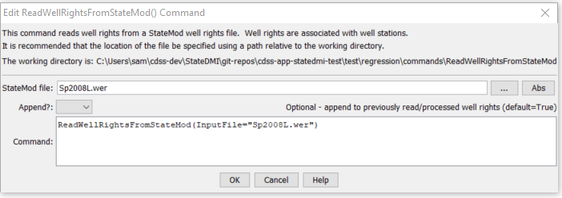

# StateDMI / Command / ReadWellRightsFromStateMod #

* [Overview](#overview)
* [Command Editor](#command-editor)
* [Command Syntax](#command-syntax)
* [Examples](#examples)
* [Troubleshooting](#troubleshooting)
* [See Also](#see-also)

-------------------------

## Overview ##

The `ReadWellRightsFromStateMod` command (from StateCU and StateMod)
reads well rights from a StateMod well rights file.
The well rights can then be manipulated and output with other commands.
Current procedures for processing some data files involve utilizing StateMod
well rights file(s) as input rather than rereading well rights from HydroBase.
This ensures that the content and quality of the well rights file can be
verified and is used consistently when processing various model files.
For example, StateMod well rights files may be used for the following purposes:

1. Turning off groundwater only parcels irrigated lands (crop pattern and irrigation
practice acreage time series) prior to a specific year of parcel data.
Parcels that do not have a well right in a year are estimated to not be irrigated for the year (and prior years).
This step typically uses a well rights file that has NOT had water rights
for various parcel years merged – data for a single parcel year will be used.
See the [`WriteWellRightsToStateMod(...,WriteDataComments=True,...)`](../WriteWellRightsToStateMod/WriteWellRightsToStateMod.md) command.
2. Setting the pumping maximum in the irrigation practice time series.
This step typically uses a well rights file that includes well rights for different parcel years that have been merged.
For example, well rights from 1998 parcels and those from 2002
parcels are merged to not double count rights.
See the
[`MergeWellRights`](../MergeWellRights/MergeWellRights.md) command.
3. Setting the well station capacity to the total of the well rights.
This step may use a merged rights file or one that has been aggregated
(well rights summed into administration number classes).
Aggregation is used in some data sets to decrease the complexity of the model.
However, aggregation is generally NOT performed in data sets such as the
South Platte where augmentation plans reference individual well rights.  See the
[`AggregateWellRights`](../AggregateWellRights/AggregateWellRights.md) command.

The well rights files mentioned above are typically written to separate files with unique names.
To support cases 1 and 2 above, the StateMod file should include “data comments” on the far right,
which include the well to parcel matching data (parcel year, class, parcel ID).
An excerpt from a well rights file with this information is shown below:

```
#>   ID               Name             Struct          Admin #   Decree  On/Off  PYr--Cls--PID
#>---------eb----------------------eb----------eb--------------eb------eb------exb--exb--exb----e
#>
#>
2005001     W0006 WELL NO 01        200812           31592.00000    2.34    1936 1936    1   3107
2005001     W0006 WELL NO 01        200812           38836.00000    1.23    1956 1936    1   3107
2005001     W0006 WELL NO 01        200812           31592.00000    2.34    1936 1998    2  11016
2005001     W0006 WELL NO 01        200812           38836.00000    1.23    1956 1998    2  11016
2005001     W0006 WELL NO 01        200812           31592.00000    1.19    1936 2002    2  20901
2005001     W0006 WELL NO 01        200812           38836.00000    0.62    1956 2002    2  20901
2005001     W0006 WELL NO 01        200812           31592.00000    1.15    1936 2002    5  20902
2005001     W0006 WELL NO 01        200812           38836.00000    0.61    1956 2002    5  20902
```

## Command Editor ##

The following dialog is used to edit the command and illustrates the command syntax.

**<p style="text-align: center;">

</p>**

**<p style="text-align: center;">
`ReadWellRightsFromStateMod` Command Editor (<a href="../ReadWellRightsFromStateMod.png">see also the full-size image</a>)
</p>**

## Command Syntax ##

The command syntax is as follows:

```text
ReadWellRightsFromStateMod(Parameter="Value",...)
```
**<p style="text-align: center;">
Command Parameters
</p>**

| **Parameter**&nbsp;&nbsp;&nbsp;&nbsp;&nbsp;&nbsp;&nbsp;&nbsp;&nbsp;&nbsp;&nbsp;&nbsp; | **Description** | **Default**&nbsp;&nbsp;&nbsp;&nbsp;&nbsp;&nbsp;&nbsp;&nbsp;&nbsp;&nbsp; |
| --------------|-----------------|----------------- |
| `Parameter` | Description | Default |
| `InputFile`<br>**required** | The name of the StateMod well rights file to be read. | None – must be specified. |
| `Appen` | Indicate whether the data should be appended to in-memory well rights.  Specify `False` if processing well rights for independent tasks and the current task should not be influenced by previously read well rights. | `True` |


## Examples ##

See the [automated tests](https://github.com/OpenCDSS/cdss-app-statedmi-test/tree/master/test/regression/commands/ReadWellRightsFromStateMod).

## Troubleshooting ##

[See the main troubleshooting documentation](../../troubleshooting/troubleshooting.md)

## See Also ##

* [`AggregateWellRights`](../AggregateWellRights/AggregateWellRights.md) command
* [`MergeWellRights`](../MergeWellRights/MergeWellRights.md) command
* [`ReadWellRightsFromStateMod`](../ReadWellRightsFromStateMod/ReadWellRightsFromStateMod.md) command
* [`WriteWellRightsToStateMod`](../WriteWellRightsToStateMod/WriteWellRightsToStateMod.md) command
