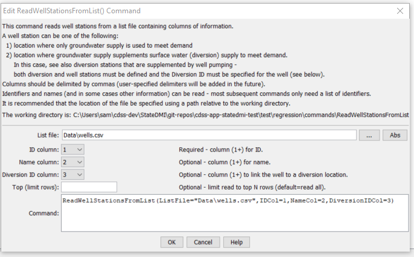

# StateDMI / Command / ReadWellStationsFromList #

* [Overview](#overview)
* [Command Editor](#command-editor)
* [Command Syntax](#command-syntax)
* [Examples](#examples)
* [Troubleshooting](#troubleshooting)
* [See Also](#see-also)

-------------------------

## Overview ##

The `ReadWellStationsFromList` command (for StateCU and StateMod)
reads a list of well stations from a delimited list file and defines well stations in memory.
The well stations can then be manipulated and output with other commands.
Reading from a list is more general than reading from a StateMod file.

## Command Editor ##

The following dialog is used to edit the command and illustrates the command syntax.

**<p style="text-align: center;">

</p>**

**<p style="text-align: center;">
`ReadWellStationsFromList` Command Editor (<a href="../ReadWellStationsFromList.png">see also the full-size image</a>)
</p>**

## Command Syntax ##

The command syntax is as follows:

```text
ReadWellStationsFromList(Parameter="Value",...)
```
**<p style="text-align: center;">
Command Parameters
</p>**

| **Parameter**&nbsp;&nbsp;&nbsp;&nbsp;&nbsp;&nbsp;&nbsp;&nbsp;&nbsp;&nbsp;&nbsp;&nbsp; | **Description** | **Default**&nbsp;&nbsp;&nbsp;&nbsp;&nbsp;&nbsp;&nbsp;&nbsp;&nbsp;&nbsp; |
| --------------|-----------------|----------------- |
| `ListFile`<br>**required** | The name of the list file to be read. | None – must be specified. |
| `IDCol`<br>**required** | The column number (1+) containing the well station identifiers. | None – must be specified. |
| `NameCol` | The column number (1+) containing the well station names. | Name will be initialized to blank. |
| `DiversionIDCol` | The column number (1+) containing the diversion identifiers associated with the well stations.  This is needed in some cases to determine when a location is a diversion with supplemental well supply, for example, when processing well rights. | None – optional (diversion ID will be initialized to blank). |
| `Top` | Specify the number of rows to read, useful for testing. | Read all rows. |

## Examples ##

See the [automated tests](https://github.com/OpenCDSS/cdss-app-statedmi-test/tree/master/test/regression/commands/ReadWellStationsFromStateMod).

At a minimum, the list file must contain a column with well station identifiers.
Lines starting with the `#` character are treated as comments.
If the first line’s values are surrounded by double quotes, the line is assumed to indicate column headings.

A sample list file is shown below:

```
#
# sp2007L_AugRchWells.csv
# _______________________________________________________
#
# rrb Augmentation and recharge wells from SmOpr
#        SmOpr
#        State of Colorado
#        Version:  1.00
#        Last revision date: 2006/10/27
#
# rrb 2008/10/08 count = 17 + 4 21
# _______________________________________________________
#
0102522_AuW ,"RIVERSIDE AUG           ",' ', ' ', ' ', ' ', ' ','NA'
0102528_AuW ,"FT MORGAN CNL AUG PLAN  ",' ', ' ', ' ', ' ', ' ','NA'
0102529_AuW ,"UPPER PLATTE BEAVER AUG ",' ', ' ', ' ', ' ', ' ','NA'
0102535_ReW ,"LOWER PLATTE BEAVER AUG ",' ', ' ', ' ', ' ', ' ','NA'
0102535_AuW ,"LOWER PLATTE BEAVER AUG ",' ', ' ', ' ', ' ', ' ','NA'
6402015_ReW ,"TAMARAK                 ",' ', ' ', ' ', ' ', ' ','NA'
6402027_ReW ,"OVERLAND                ",' ', ' ', ' ', ' ', ' ','NA'
6402518_AuW ,"HARMONY Aug Well        ",' ', ' ', ' ', ' ', ' ','NA'
6402519_ReW ,"DINSDALE AUG            ",' ', ' ', ' ', ' ', ' ','NA'
...
```

## Troubleshooting ##

## See Also ##

* [`ReadWellStationsFromNetwork`](../ReadWellStationsFromNetwork/ReadWellStationsFromNetwork.md) command
* [`ReadWellStationsFromStateMod`](../ReadWellStationsFromStateMod/ReadWellStationsFromStateMod.md) command
* [`WriteWellStationsToStateMod`](../WriteWellStationsToStateMod/WriteWellStationsToStateMod.md) command
