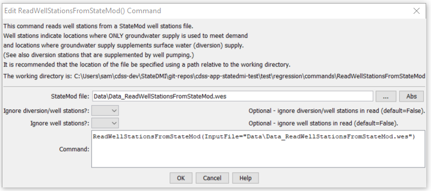

# StateDMI / Command / ReadWellStationsFromStateMod #

* [Overview](#overview)
* [Command Editor](#command-editor)
* [Command Syntax](#command-syntax)
* [Examples](#examples)
* [Troubleshooting](#troubleshooting)
* [See Also](#see-also)

-------------------------

## Overview ##

The `ReadWellStationsFromStateMod` command (for StateCU and StateMod)
reads a list of well stations from a StateMod well stations file and defines well stations in memory.
The well stations can then be manipulated and output with other commands.
The StateMod well stations file contains stations for which only groundwater supply
is available and stations for which groundwater supply supplements surface water supply
of a diversion station (in this case the well station data includes the diversion station identifier).
For some data (e.g., demands), StateMod accepts data from multiple files.
For example, diversion and diversion+well stations may read total demands from the
diversion demands file and well (groundwater only) stations may read demands from the well demands file.
Parameters are available in this command to read all well stations or only a subset,
to allow flexibility in data processing.  Other commands may also process a subset, regardless of what is read.

## Command Editor ##

The following dialog is used to edit the command and illustrates the command syntax.

**<p style="text-align: center;">

</p>**

**<p style="text-align: center;">
`ReadWellStationsFromStateMod` Command Editor (<a href="../ReadWellStationsFromStateMod.png">see also the full-size image</a>)
</p>**

## Command Syntax ##

The command syntax is as follows:

```text
ReadWellStationsFromStateMod(Parameter="Value",...)
```
**<p style="text-align: center;">
Command Parameters
</p>**

| **Parameter**&nbsp;&nbsp;&nbsp;&nbsp;&nbsp;&nbsp;&nbsp;&nbsp;&nbsp;&nbsp;&nbsp;&nbsp; | **Description** | **Default**&nbsp;&nbsp;&nbsp;&nbsp;&nbsp;&nbsp;&nbsp;&nbsp;&nbsp;&nbsp; |
| --------------|-----------------|----------------- |
| `InputFile`<br>**required** | The name of the StateMod well stations file to be read. | None – must be specified. |
| `IgnoreDWs` | Indicate whether the D&W well nodes should be ignored.  These are locations where well supply supplements surface water (diversion) supply. | `False` |
| `IgnoreWells` | Indicate whether the well nodes should be ignored.  These are locations where only well supply is used. | `False` |

## Examples ##

See the [automated tests](https://github.com/OpenCDSS/cdss-app-statedmi-test/tree/master/test/regression/commands/ReadWellStationsFromStateMod).

## Troubleshooting ##

[See the main troubleshooting documentation](../../troubleshooting/troubleshooting.md)

## See Also ##

* [`ReadWellStationsFromNetwork`](../ReadWellStationsFromNetwork/ReadWellStationsFromNetwork.md) command
* [`ReadWellStationsFromStateMod`](../ReadWellStationsFromStateMod/ReadWellStationsFromStateMod.md) command
* [`WriteWellStationsToStateMod`](../WriteWellStationsToStateMod/WriteWellStationsToStateMod.md) command
