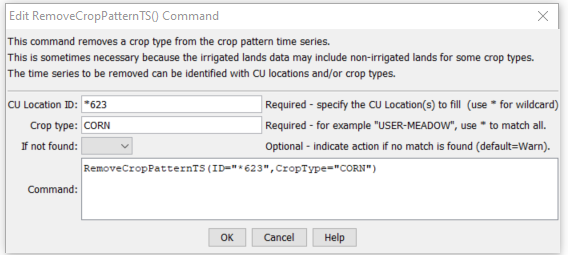

# StateDMI / Command / RemoveCropPatternTS #

* [Overview](#overview)
* [Command Editor](#command-editor)
* [Command Syntax](#command-syntax)
* [Examples](#examples)
* [Troubleshooting](#troubleshooting)
* [See Also](#see-also)

-------------------------

## Overview ##

The `RemoveCropPatternTS` command (for StateCU)
command removes crop pattern time series data.
This is useful when inappropriate crop types have been processed into the
crop pattern time series (e.g., unirrigated parcels),
which may be the case during when using preliminary data.

## Command Editor ##

The following dialog is used to edit the command and illustrates the command syntax.

**<p style="text-align: center;">

</p>**

**<p style="text-align: center;">
`RemoveCropPatternTS` Command Editor (<a href="../RemoveCropPatternTS.png">see also the full-size image</a>)
</p>**

## Command Syntax ##

The command syntax is as follows:

```text
RemoveCropPatternTS(Parameter="Value",...)
```
**<p style="text-align: center;">
Command Parameters
</p>**

| **Parameter**&nbsp;&nbsp;&nbsp;&nbsp;&nbsp;&nbsp;&nbsp;&nbsp;&nbsp;&nbsp;&nbsp;&nbsp; | **Description** | **Default**&nbsp;&nbsp;&nbsp;&nbsp;&nbsp;&nbsp;&nbsp;&nbsp;&nbsp;&nbsp; |
| --------------|-----------------|----------------- |
| `ID` | A single CU Location identifier or pattern to match (e.g., `20*`). | None – must be specified. |
| `CropType` | A single crop type identifier to match. | None – must be specified. |
| `IfNotFound` | Used for error handling, one of the following:<ul><li>`Fail` – generate a failure message if the ID is not matched</li><li>`Ignore` – ignore (don’t add and don’t generate a message) if the ID is not matched</li><li>`Warn` – generate a warning message if the ID is not matched</li></ul> | `Warn` |

## Examples ##

See the [automated tests](https://github.com/OpenCDSS/cdss-app-statedmi-test/tree/master/test/regression/commands/RemoveCropPatternTS).

## Troubleshooting ##

## See Also ##

* [`TranslateCropPatternTS`](../TranslateCropPatternTS/TranslateCropPatternTS.md) command
