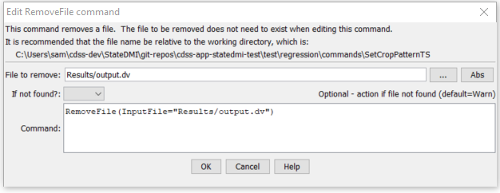

# StateDMI / Command / RemoveFile #

* [Overview](#overview)
* [Command Editor](#command-editor)
* [Command Syntax](#command-syntax)
* [Examples](#examples)
* [Troubleshooting](#troubleshooting)
* [See Also](#see-also)

-------------------------

## Overview ##

The `RemoveFile` command
removes a file from the file system.  This command is used in testing software to remove results files before attempting to regenerate the results.

A failure will be generated if the file exists and cannot be removed (e.g., due to file permissions or being locked by another process).

Even read-only files may be removed by this command, depending on how the operating system and computer environment handle access permissions.


## Command Editor ##

The following dialog is used to edit the command and illustrates the command syntax.

**<p style="text-align: center;">

</p>**

**<p style="text-align: center;">
`RemoveFile` Command Editor (<a href="../RemoveFile.png">see also the full-size image</a>)
</p>**

## Command Syntax ##

The command syntax is as follows:

```text
RemoveFile(Parameter="Value",...)
```
**<p style="text-align: center;">
Command Parameters
</p>**

| **Parameter**&nbsp;&nbsp;&nbsp;&nbsp;&nbsp;&nbsp;&nbsp;&nbsp;&nbsp;&nbsp;&nbsp;&nbsp; | **Description** | **Default**&nbsp;&nbsp;&nbsp;&nbsp;&nbsp;&nbsp;&nbsp;&nbsp;&nbsp;&nbsp; |
| --------------|-----------------|----------------- |
| `InputFile`<br>**required** | The name of the file to delete. | None – must be specified. |
| `IfNotFound` | Indicate action if the file is not found, one of:<ul><li>`Ignore` – ignore the missing file (do not warn).</li><li>`Warn` – generate a warning (use this if the file truly is expected and a missing file is a cause for concern).</li><li>`Fail` – generate a failure (use this if the file truly is expected and a missing file is a cause for concern).</li></ul> | `Ignore` |

## Examples ##

See the [automated tests](https://github.com/OpenCDSS/cdss-app-statedmi-test/tree/master/test/regression/commands/RemoveFile).

## Troubleshooting ##

## See Also ##

