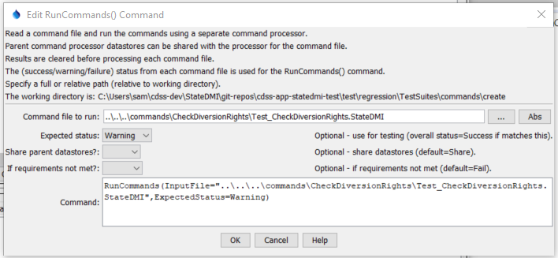

# StateDMI / Command / RunCommands #

* [Overview](#overview)
* [Command Editor](#command-editor)
* [Command Syntax](#command-syntax)
* [Examples](#examples)
* [Troubleshooting](#troubleshooting)
* [See Also](#see-also)

-------------------------

## Overview ##

The `RunCommands` command (for StateMod and StateCU) runs a command file.
This command can be used to:

1. Manage workflow where multiple commands files are run, such as a "super command file" to create an entire dataset.
2. Run automated tests where a test suite consists of running multiple related test case command files.
	1. The [`CreateRegressionTestCommandFile`](../CreateRegressionTestCommandFile/CreateRegressionTestCommandFile.md) command
	can be used to create a command file for automated testing,
	which contains a `RunCommands` command for each matched command file.
	2. `RunCommands` commands can be configured to compare model files created with different
	versions of StateDMI.

Command files that are run can themselves include `RunCommands` commands.
Each command file that is run has knowledge if its initial working
directory and relative paths referenced in the command file are relative to this directory.
This allows a master command file to reside in a different location
than the individual command files that are being run.
The current working directory is reset to that of the command file being run.

Currently the properties from the parent command file are NOT applied
to the initial conditions when running the command file.
Therefore, global properties like input and output period are
reset to defaults before running the command file.
A future enhancement may implement a property to indicate whether to inherit the properties.
The output from the command is also not added to the parent processor.
Again, a future enhancement may be to append output so that one final set of output is generated.

There is currently no special handling of log files; consequently, if the main command file
opens a log file and then a command file is run that opens a new log file,
the main log file will be closed.  This behavior is being evaluated.

[`#` comment](../Comment/Comment.md) annotations can be used to control whether and how
the command file referenced by a `RunCommands` command is run.
For example, comments can be used to indicate the expected status and indicate
software and datastore version requirements in order run the command file.

## Command Editor ##

The following dialog is used to edit the command and illustrates the command syntax.

**<p style="text-align: center;">

</p>**

**<p style="text-align: center;">
`RunCommands` Command Editor (<a href="../RunCommands.png">see also the full-size image</a>)
</p>**

## Command Syntax ##

The command syntax is as follows:

```text
RunCommands(Parameter="Value",...)
```
**<p style="text-align: center;">
Command Parameters
</p>**

| **Parameter**&nbsp;&nbsp;&nbsp;&nbsp;&nbsp;&nbsp;&nbsp;&nbsp;&nbsp;&nbsp;&nbsp;&nbsp;&nbsp;&nbsp;&nbsp;&nbsp;&nbsp;&nbsp;&nbsp;&nbsp;&nbsp;&nbsp;&nbsp;&nbsp; | **Description** | **Default**&nbsp;&nbsp;&nbsp;&nbsp;&nbsp;&nbsp;&nbsp;&nbsp;&nbsp;&nbsp; |
| --------------|-----------------|----------------- |
| `InputFile`<br>**required** | The name of the command file to run, enclosed in double quotes if the file contains spaces or other special characters.  A path relative to the master command file can be specified. | None – must be specified. |
| `ExpectedStatus` | Used for testing – indicates the expected most severe status from the command file, one of:<ul><li>`Unknown`</li><li>`Success`</li><li>`Warning`</li><li>`Failure`</li></ul> This allows a test to pass even if a warning or failure resulted from running the command file, such as in cases where software is being tested to properly implement error-handling. | `Success` |
| `ShareDataStores` | Indicate whether to share datastores from the parent processor (processor used to process the command file that includes `RunCommands`) are shared with the temporary processor created to run the command file. | Currently always `True`. |
| `IfRequirementsNotMet` | Action to take if the `#@require` comments in the command file are not met.  Typically this should be set as follows:<ul><li>`Fail` - Normal use and full dataset testing, because requirements indicate conditions that needed to successfully run the command file.</li><li>`Ignore` - Automated testing for a test suite containing individual tests, because the test suite is being run for a test environment and tests that do not match the environment should not be run in order to avoid false test failures.  The test results will indicate any command files that are ignored.  The [`CreateRegressionTestCommandFile`](../CreateRegressionTestCommandFile/CreateRegressionTestCommandFile.md) command automatically uses `Ignore`.</li></ul> | `Fail` |
| `AppendResults` | **Envisioned for implementation in the future.**  Indicate whether time series results from each command file should be appended to the overall time series results.  This parameter currently always defaults to `False`, but support for `True` may be implemented in the future.  Consequently, only the time series results from the last command file that is run will be displayed. | Currently always `False`. |

## Examples ##

See the [automated tests](https://github.com/OpenCDSS/cdss-app-statedmi-test/tree/master/test/regression/commands/RunCommands).

The following example illustrates how the RunCommands() command can be used to test software
(or any implementation of commands that represent a standard process).
First, individual command files are implemented to test specific functionality,
which will result in warnings if a test fails:

```
# Test check diversion rights data where each checked value is in error
# The set command won't let invalid data be set from parameters so read bad data
# to trigger the check warnings.
# Compare the data csv to make sure the data are being produced as expected
# and the check file csv to make sure the checks are working.
# The expected status is Warning because the check will detect the missing values.
#@expectedStatus Warning
StartLog(LogFile="Results/Test_CheckDiversionRights.StateDMI.log")
RemoveFile(InputFile="Results\Test_CheckDiversionRights_out.csv",IfNotFound=Ignore)
RemoveFile(InputFile="Results\Test_CheckDiversionRights_out_check.csv",IfNotFound=Ignore)
RemoveFile(InputFile="Results\Test_CheckDiversionRights_out_check.html",IfNotFound=Ignore)
# Define a diversion station to trigger the check of stations
SetDiversionStation(ID="Diversion1",IfNotFound=Add)
SetDiversionRight(ID="Location1",IfNotFound=Add)
# Also read some bad data...
ReadDiversionRightsFromStateMod(InputFile="Data\simple.ddr")
# Uncomment the following command to regenerate the expected results.
# WriteDiversionRightsToList(OutputFile="ExpectedResults/Test_CheckDiversionRights_out.csv")
WriteDiversionRightsToList(OutputFile="Results/Test_CheckDiversionRights_out.csv")
CompareFiles(InputFile1="ExpectedResults/Test_CheckDiversionRights_out.csv",InputFile2="Results/Test_CheckDiversionRights_out.csv",WarnIfDifferent=True)
#
# Check the data and create the check file.
CheckDiversionRights(ID="*")
# Uncomment the following command to regenerate the expected results.
# WriteCheckFile(OutputFile="ExpectedResults/Test_CheckDiversionRights_out_check.csv")
WriteCheckFile(OutputFile="Results/Test_CheckDiversionRights_out_check.csv")
WriteCheckFile(OutputFile="Results/Test_CheckDiversionRights_out_check.html")
CompareFiles(InputFile1="ExpectedResults/Test_CheckDiversionRights_out_check.csv",InputFile2="Results/Test_CheckDiversionRights_out_check.csv",WarnIfDifferent=True)
```

## Troubleshooting ##

## See Also ##

* [`#` comment](../Comment/Comment.md) command
* [`CreateRegressionTestCommandFile`](../CreateRegressionTestCommandFile/CreateRegressionTestCommandFile.md) command
* [`RunProgram`](../RunProgram/RunProgram.md) command
* [`RunPython`](../RunPython/RunPython.md) command
