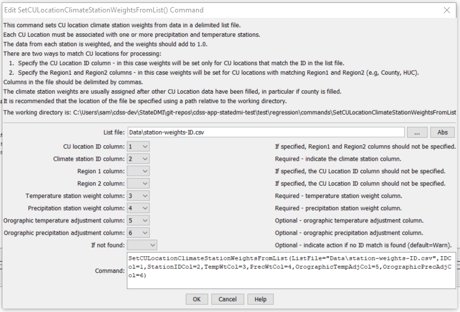

# StateDMI / Command / SetCULocationClimateStationWeightsFromList #

* [Overview](#overview)
* [Command Editor](#command-editor)
* [Command Syntax](#command-syntax)
* [Examples](#examples)
* [Troubleshooting](#troubleshooting)
* [See Also](#see-also)

-------------------------

## Overview ##

The `SetCULocationClimateStationWeightsFromList` command (for StateCU)
reads climate station weights from a list file and sets the information for CU Locations.

## Command Editor ##

The following dialog is used to edit the command and illustrates the command syntax.

**<p style="text-align: center;">

</p>**

**<p style="text-align: center;">
`SetCULocationClimateStationWeightsFromList` Command Editor (<a href="../SetCULocationClimateStationWeightsFromList.png">see also the full-size image</a>)
</p>**

## Command Syntax ##

The command syntax is as follows:

```text
SetCULocationClimateStationWeightsFromList(Parameter="Value",...)
```
**<p style="text-align: center;">
Command Parameters
</p>**

| **Parameter**&nbsp;&nbsp;&nbsp;&nbsp;&nbsp;&nbsp;&nbsp;&nbsp;&nbsp;&nbsp;&nbsp;&nbsp; | **Description** | **Default**&nbsp;&nbsp;&nbsp;&nbsp;&nbsp;&nbsp;&nbsp;&nbsp;&nbsp;&nbsp; |
| --------------|-----------------|----------------- |
| `ListFile`<br>**required** | The name of the input file to read, surrounded by double quotes. | None – must be specified. |
| `IDCol` | The column number (1+) containing the climate station identifier. | None – must be specified.  If specified, `Region1Col` and `Region2Col` should not be specified. |
| `Region1Col` | The column number (1+) containing the `Region1` identifier. | If specified, the ID column should not be specified. |
| `Region2Col` | The column number (1+) containing the `Region2` identifier. | If specified, the ID column should not be specified. |
| `TempWtCol` | The column number (1+) containing the temperature station weights.| If not specified, the original values remain. |
| `PrecWtCol` | The column number (1+) containing the precipitation station weights.| If not specified, the original values remain. |
| `OrographicTempAdjCol` | The column number (1+) containing the orographic temperature adjustment factor (DEGF/1000 FT).| If not specified, the original values remain. |
| `OrographicPrecAdjCol` | The column number (1+) containing the orographic precipitation adjustment factor (fraction).| If not specified, the original values remain. |
| `IfNotFound` | Used for error handling, one of the following:<ul><li>`Fail` – generate a failure message if the ID pattern is not matched</li><li>`Ignore` – ignore (don’t generate a message) if the ID pattern is not matched</li><li>`Warn` – generate a warning message if the ID pattern is not matched</li></ul> | `Warn` |

## Examples ##

See the [automated tests](https://github.com/OpenCDSS/cdss-app-statedmi-test/tree/master/test/regression/commands/SetCULocationClimateStationWeightsFromList).

An example list file for setting data using Region1 (county) is shown below:

```
# RGDSS.WTS - Hand built climate weights file for the RGDSS analysis
#             Base on Climate Assignment memo prepared 9/21/99
# ID, Lat, County, HUC, TempWt, PrecWt
3951,37.7667,SAN JUAN,13010001,1.000,1.000
3951,37.7667,HINSDALE,13010001,1.000,1.000
2184,37.6833,RIO GRANDE,13010001,0.700,0.700
...
```

An example list file for setting data by CU location ID is shown below:

```
#Date and Time |Thu May 03 11:31:37 2007
#Input Polygon Theme |2001_Acreage_CW
#Polygon ID Field |PARCEL_ID
#Climate Weights Workspace |S:\CDSS\GIS\Climate_Wts
#Orographic Grids Workspace |#
0200552,2220,0.19,1
0200552,3553,0.39,1
0200552,5116,0.42,1
0200805,1179,0.39,1
0200805,2220,0.1,1
0200805,3553,0.51,1
```

## Troubleshooting ##

[See the main troubleshooting documentation](../../troubleshooting/troubleshooting.md)

## See Also ##

* [`FillCULocation`](../FillCULocation/FillCULocation.md) command
* [`FillCULocationClimateStationWeights`](../FillCULocationClimateStationWeights/FillCULocationClimateStationWeights.md) command
* [`FillCULocationsFromHydroBase`](../FillCULocationsFromHydroBase/FillCULocationsFromHydroBase.md) command
* [`FillCULocationsFromList`](../FillCULocationsFromList/FillCULocationsFromList.md) command
* [`SetCULocation`](../SetCULocation/SetCULocation.md) command
* [`SetCULocationClimateStationWeights`](../SetCULocationClimateStationWeights/SetCULocationClimateStationWeights.md) command
* [`SetCULocationClimateStationWeightsFromHydroBase`](../SetCULocationClimateStationWeightsFromHydroBase/SetCULocationClimateStationWeightsFromHydroBase.md) command
* [`SetCULocationsFromList`](../SetCULocationsFromList/SetCULocationsFromList.md) command
