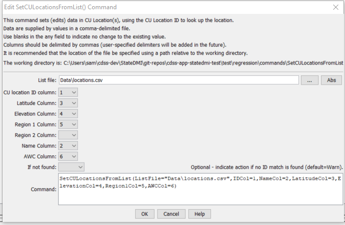

# StateDMI / Command / SetCULocationsFromList #

* [Overview](#overview)
* [Command Editor](#command-editor)
* [Command Syntax](#command-syntax)
* [Examples](#examples)
* [Troubleshooting](#troubleshooting)
* [See Also](#see-also)

-------------------------

## Overview ##

The `SetCULocationsFromList` command (for StateCU)
sets data in existing CU Locations by reading information from a delimited file.  New locations are not added.

## Command Editor ##

The following dialog is used to edit the command and illustrates the command syntax.

**<p style="text-align: center;">

</p>**

**<p style="text-align: center;">
`SetCULocationsFromList` Command Editor (<a href="../SetCULocationsFromList.png">see also the full-size image</a>)
</p>**

## Command Syntax ##

The command syntax is as follows:

```text
SetCULocationsFromList(Parameter="Value",...)
```
**<p style="text-align: center;">
Command Parameters
</p>**

| **Parameter**&nbsp;&nbsp;&nbsp;&nbsp;&nbsp;&nbsp;&nbsp;&nbsp;&nbsp;&nbsp;&nbsp;&nbsp; | **Description** | **Default**&nbsp;&nbsp;&nbsp;&nbsp;&nbsp;&nbsp;&nbsp;&nbsp;&nbsp;&nbsp; |
| --------------|-----------------|----------------- |
| `ListFile`<br>**required** | Path to the delimited list file to read. | None – must be specified. |
| `IDCol`<br>**required** | The column number (1+) containing the CU Location identifiers. | None – must be specified. |
| `LatitudeCol` | The column number (1+) containing the CU Location latitude. | If not specified, the previous value will remain. |
| `ElevationCol` | The column number (1+) containing the CU Location elevation. | If not specified, the previous value will remain. |
| `Region1Col` | The column number (1+) containing the CU Location Region1. | If not specified, the previous value will remain. |
| `Region2Col` | The column number (1+) containing the CU Location Region2. | If not specified, the previous value will remain. |
| `NameCol` | The column number (1+) containing the CU Location name. | If not specified, the previous value will remain. |
| `AWCCol` | The column number (1+) containing the CU Location AWC. | If not specified, the previous value will remain. |
| `IfNotFound` | Used for error handling, one of the following:<ul><li>`Fail` – generate a failure message if the climate station is not found</li><li>`Ignore` – ignore (don’t add and don’t generate a message) if the climate station is not found</li><li>`Warn` – generate a warning message if the climate station is not found</li></ul> | `Warn` |

## Examples ##

See the [automated tests](https://github.com/OpenCDSS/cdss-app-statedmi-test/tree/master/test/regression/commands/SetCULocationsFromList).

Lines starting with the `#` character are treated as comments.  If the first line’s values are surrounded by double quotes, the line is assumed to indicate column headings.

An example list file is shown below:
```
72_ADC064,MESA2
72_ADC063,MESA2
72_ARC010,MESA2
950030,MESA2
720766,MESA2
720731,MESA2
720514,MESA2
720933,MESA2
72_ADC062,MESA2
721339,MESA2
720580,MESA2
```

## Troubleshooting ##

## See Also ##

* [`FillCULocation`](../FillCULocation/FillCULocation.md) command
* [`FillCULocationClimateStationWeights`](../FillCULocationClimateStationWeights/FillCULocationClimateStationWeights.md) command
* [`FillCULocationsFromHydroBase`](../FillCULocationsFromHydroBase/FillCULocationsFromHydroBase.md) command
* [`FillCULocationsFromList`](../FillCULocationsFromList/FillCULocationsFromList.md) command
* [`SetCULocation`](../SetCULocation/SetCULocation.md) command
* [`SetCULocationClimateStationWeights`](../SetCULocationClimateStationWeights/SetCULocationClimateStationWeights.md) command
* [`SetCULocationClimateStationWeightsFromHydroBase`](../SetCULocationClimateStationWeightsFromHydroBase/SetCULocationClimateStationWeightsFromHydroBase.md) command
* [`SetCULocationClimateStationWeightsFromList`](../SetCULocationClimateStationWeightsFromList/SetCULocationClimateStationWeightsFromList.md) command
