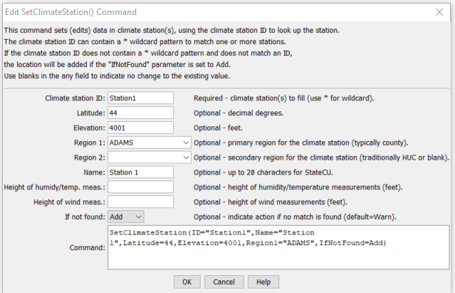

# StateDMI / Command / SetClimateStation #

* [Overview](#overview)
* [Command Editor](#command-editor)
* [Command Syntax](#command-syntax)
* [Examples](#examples)
* [Troubleshooting](#troubleshooting)
* [See Also](#see-also)

-------------------------

## Overview ##

The `SetClimateStation` command (for StateCU)
sets data in existing climate stations or adds a new climate station.

## Command Editor ##

The following dialog is used to edit the command and illustrates the command syntax.

**<p style="text-align: center;">

</p>**

**<p style="text-align: center;">
`SetClimateStation` Command Editor (<a href="../SetClimateStation.png">see also the full-size image</a>)
</p>**

## Command Syntax ##

The command syntax is as follows:

```text
SetClimateStation(Parameter="Value",...)
```
**<p style="text-align: center;">
Command Parameters
</p>**

| **Parameter**&nbsp;&nbsp;&nbsp;&nbsp;&nbsp;&nbsp;&nbsp;&nbsp;&nbsp;&nbsp;&nbsp;&nbsp; | **Description** | **Default**&nbsp;&nbsp;&nbsp;&nbsp;&nbsp;&nbsp;&nbsp;&nbsp;&nbsp;&nbsp; |
| --------------|-----------------|----------------- |
| `ID`<br>**required** | A single climate station identifier to match or a pattern using wildcards (e.g., `20*`). | None – must be specified. |
| `Latitude` | The climate station latitude to be assigned for all matching climate stations. | If not specified, the original value will remain. |
| `Elevation` | The climate station elevation to be assigned for all matching climate stations. | If not specified, the original value will remain. |
| `Region1` | The climate station `Region1` (typically county) to be assigned for all matching climate stations. | If not specified, the original value will remain. |
| `Region2` | The climate station `Region2` (typically the HUC basin) to be assigned for all matching climate stations. | If not specified, the original value will remain. |
| `Name` | The climate station name to be assigned for all matching climate stations. | If not specified, the original value will remain. |
| `HeightHumidityMeas` | The height of humidity and temperature measurements (feet), only used with daily analysis. | If not specified, the original value will remain. |
| `HeightWindMeas` | The height of wind measurements (feet), only used with daily analysis. | If not specified, the original value will remain. |
| `IfNotFound` | Used for error handling, one of the following:<ul><li>`Add` – add the climate station if the ID is not matched and is not a wildcard</li><li>`Fail` – generate a failure message if the ID is not matched</li><li>`Ignore` – ignore (don’t add and don’t generate a message) if the ID is not matched</li><li>`Warn` – generate a warning message if the ID is not matched</li></ul> | `Warn` |

## Examples ##

See the [automated tests](https://github.com/OpenCDSS/cdss-app-statedmi-test/tree/master/test/regression/commands/SetClimateStation).

The following example command file illustrates how climate stations can be defined and written to a StateCU file:

```
ReadClimateStationsFromList(ListFile="climsta.lst",IDCol=1)
FillClimateStationsFromHydroBase(ID="*")
SetClimateStation(ID="3016",Region2="14080106",IfNotFound=Warn)
SetClimateStation(ID="1018",Region2="14040106",IfNotFound=Warn)
SetClimateStation(ID="1928",Elevation=6440,IfNotFound=Warn)
SetClimateStation(ID="0484",Region1="MOFFAT",IfNotFound=Add)
WriteClimateStationsToStateCU(OutputFile="COclim2006.cli")
```

## Troubleshooting ##

[See the main troubleshooting documentation](../../troubleshooting/troubleshooting.md)

## See Also ##

* [`FillClimateStation`](../FillClimateStation/FillClimateStation.md) command
* [`FillClimateStationsFromHydroBase`](../FillClimateStationsFromHydroBase/FillClimateStationsFromHydroBase.md) command
