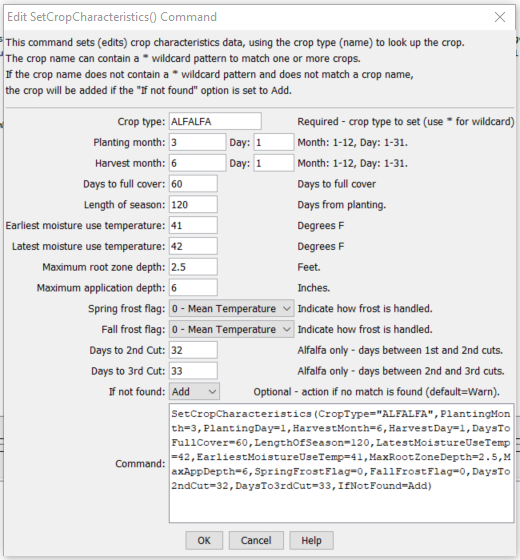

# StateDMI / Command / SetCropCharacteristics #

* [Overview](#overview)
* [Command Editor](#command-editor)
* [Command Syntax](#command-syntax)
* [Examples](#examples)
* [Troubleshooting](#troubleshooting)
* [See Also](#see-also)

-------------------------

## Overview ##

The `SetCropCharacteristics` command (for StateCU)
sets data in existing crop characteristics or adds a new crop type with crop characteristics.

## Command Editor ##

The following dialog is used to edit the command and illustrates the command syntax.

**<p style="text-align: center;">

</p>**

**<p style="text-align: center;">
`SetCropCharacteristics` Command Editor (<a href="../SetCropCharacteristics.png">see also the full-size image</a>)
</p>**

## Command Syntax ##

The command syntax is as follows:

```text
SetCropCharacteristics(Parameter="Value",...)
```
**<p style="text-align: center;">
Command Parameters
</p>**

| **Parameter**&nbsp;&nbsp;&nbsp;&nbsp;&nbsp;&nbsp;&nbsp;&nbsp;&nbsp;&nbsp;&nbsp;&nbsp;&nbsp;&nbsp;&nbsp;&nbsp;&nbsp;&nbsp;&nbsp;&nbsp;&nbsp;&nbsp;&nbsp;&nbsp;&nbsp;&nbsp;&nbsp;&nbsp;&nbsp;&nbsp;&nbsp;&nbsp; | **Description** | **Default**&nbsp;&nbsp;&nbsp;&nbsp;&nbsp;&nbsp;&nbsp;&nbsp;&nbsp;&nbsp; |
| --------------|-----------------|----------------- |
| `CropType`<br>**required** | A crop type to match or a pattern using wildcards (e.g., `ALFALFA*`). | None – must be specified. |
| `PlantingMonth` | The planting month for the crop, as an integer (`1`=January). | If not specified, the original value will remain. |
| `PlantingDay` | The planting day of month for the crop, for the planning month. | If not specified, the original value will remain. |
| `HarvestMonth` | The harvest month for the crop, as an integer (`1`=January). | If not specified, the original value will remain. |
| `HarvestDay` | The harvest day of month for the crop, for the planning month. | If not specified, the original value will remain. |
| `DaysToFullCover` | Days to full cover. | If not specified, the original value will remain. |
| `LengthOfSeason` | Length of growing season, days. | If not specified, the original value will remain. |
| `EarliestMoistureUseTemp` | Earliest moisture use temperature, F. | If not specified, the original value will remain. |
| `LatestMoistureUseTemp` | Latest moisture use temperature, F. | If not specified, the original value will remain. |
| `MaxRootZoneDepth` | Maximum root zone depth. | If not specified, the original value will remain. |
| `MaxAppDepth` | Maximum application depth. | If not specified, the original value will remain. |
| `SpringFrostFlag` | Spring frost flag. | `0` (mean) |
| `FallFrostFlag` | Fall frost flag. | `0` (mean) |
| `DaysTo2ndCut` | Days between first and second cuts (alfalfa). | If not specified, the original value will remain. |
| `DaysTo3rdCut` | Days between second and third cuts (alfalfa). | If not specified, the original value will remain. |
| `IfNotFound` | Used for error handling, one of the following:<ul><li>`Add` – add the climate station if not found using the provided information</li><li>`Fail` – generate a failure message if the climate station is not found</li><li>`Ignore` – ignore (don’t add and don’t generate a message) if the climate station is not found</li><li>`Warn` – generate a warning message if the climate station is not found</li></ul> | `Warn` |

## Examples ##

See the [automated tests](https://github.com/OpenCDSS/cdss-app-statedmi-test/tree/master/test/regression/commands/SetCropCharacteristics).

## Troubleshooting ##

[See the main troubleshooting documentation](../../troubleshooting/troubleshooting.md)

## See Also ##

There are no additional related commands.