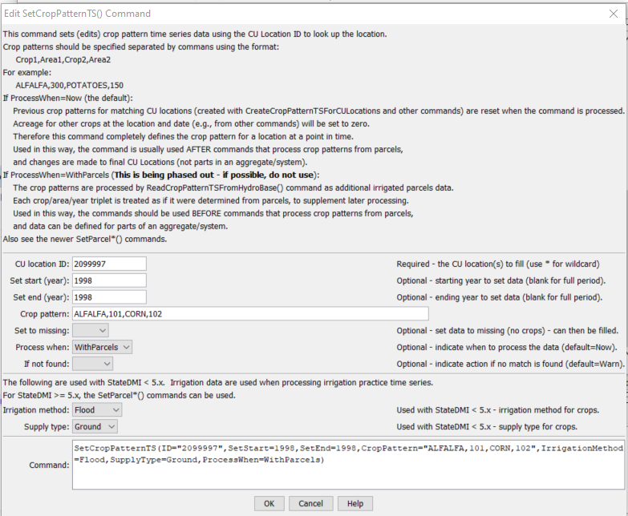

# StateDMI / Command / SetCropPatternTS #

* [Overview](#overview)
* [Command Editor](#command-editor)
	+ [Use Case 1: Specify crop data to override (or supply) crop pattern data for a structure](#use-case-1-specify-crop-data-to-override-or-supply-crop-pattern-data-for-a-structure)
	+ [Use Case 2: Specify crop data for a location, to be processed with parcel data](#use-case-2-specify-crop-data-for-a-location-to-be-processed-with-parcel-data)
* [Command Syntax](#command-syntax)
* [Examples](#examples)
* [Troubleshooting](#troubleshooting)
* [See Also](#see-also)

-------------------------

## Overview ##

The `SetCropPatternTS` command (for StateCU)
sets crop pattern time series data for a CU Location.
The combination of location ID, crop type, and year identify the data.
It is recommended that the
[`SetCropPatternTSFromList`](../SetCropPatternTSFromList/SetCropPatternTSFromList.md)
command be used if many values are set, which also allows sharing the data file with
[`SetIrrigationPracticeTSFromList`](../SetIrrigationPracticeTSFromList/SetIrrigationPracticeTSFromList.md) commands.

## Command Editor ##

There have historically been two use cases for this command, as described below.
As of StateDMI version 5, only the first use is recommended because irrigated area can now be
processed using parcel data.

### Use Case 1: Specify crop data to override (or supply) crop pattern data for a structure

In this case, the specified data will be visible as the final data values in output
(and will not be considered when irrigated lands parcels are processed).
The `ProcessWhen` parameter should be blank or `Now`, which is the default value.
In this case, the `SetCropPatternTS` commands should be specified after
[`ReadCropPatternTSFromParcels`](../ReadCropPatternTSFromParcels/ReadCropPatternTSFromParcels.md),
[`ReadCropPatternTSFromHydroBase`](../ReadCropPatternTSFromHydroBase/ReadCropPatternTSFromHydroBase.md) or other similar commands.
It is recommended that for StateDMI 5.x and later that parcel data issues
are corrected using the
[`SetParcel`](../SetParcel/SetParcel.md) command so that resulting corrected data is used in the processing workflow
as if the data were read from input sources.

**<p style="text-align: center;">

</p>**

**<p style="text-align: center;">
`SetCropPatternTS` Command Editor (to edit crop pattern time series) (<a href="../SetCropPatternTS.png">see also the full-size image</a>)
</p>**

### Use Case 2: Specify crop data for a location, to be processed with parcel data ###

**For StateDMI 5.x it is recommended to use the
[`SetParcel`](../SetParcel/SetParcel.md) command.
This command was used to set parcel data but setting parcel data directly is more appropriate
because parcel data are used to create multiple model files.**

For example, an irrigated lands assessment using GIS might show zero acreage
for a ditch but other information indicates that the ditch irrigates lands.
The ditch may be an individual (key) structure or may be part of an aggregate/system.
In this case, the specified data values contribute to the final data values in output.
The following dialog is used to edit the command and illustrates the syntax of the command.
The years typically agree with an irrigated lands assessment and the
`ProcessWhen` value must be specified as `WithParcels`.
In this case, the
`SetCropPatternTS` commands should be specified before
[`ReadCropPatternTSFromHydroBase`](../ReadCropPatternTSFromHydroBase/ReadCropPatternTSFromHydroBase.md) or other similar commands.
The data will be processed as if they were read from HydroBase.

**<p style="text-align: center;">

</p>**

**<p style="text-align: center;">
`SetCropPatternTS` Command Editor (to specify parcel information) (<a href="../SetCropPatternTS_WithParcels.png">see also the full-size image</a>)
</p>**

## Command Syntax ##

The command syntax is as follows:

```text
SetCropPatternTS(Parameter="Value",...)
```
**<p style="text-align: center;">
Command Parameters
</p>**

| **Parameter**&nbsp;&nbsp;&nbsp;&nbsp;&nbsp;&nbsp;&nbsp;&nbsp;&nbsp;&nbsp;&nbsp;&nbsp;&nbsp;&nbsp;&nbsp;&nbsp; | **Description** | **Default**&nbsp;&nbsp;&nbsp;&nbsp;&nbsp;&nbsp;&nbsp;&nbsp;&nbsp;&nbsp;&nbsp;&nbsp;&nbsp;&nbsp;&nbsp;&nbsp;&nbsp;&nbsp;&nbsp;&nbsp; |
| --------------|-----------------|----------------- |
| `ID` | A single CU Location identifier to match or a pattern using wildcards (e.g., `20*`). | None – must be specified. |
| `SetStart` | The first year to set data values. | If not specified, data are set for the full output period. |
| `SetEnd` | The last year to set data values. | If not specified, data are set for the full output period. |
| `CropPattern` | A sequence of crop type and area values, to set as data for the specified period. | None – must be specified. |
| `SetToMissing` | Indicate whether the crop pattern for the specified years should be set to missing, instead of supplying data values.  This was used in the Río Grande as follows:  Read 1936, 1998, and 2002 data, resulting in crop pattern time series.  It is necessary to include all years in order to get a complete list of crops over the period, even if zero or missing in some years.  After reading all years, 2002 is set to missing using this command and a standard filling approach is used for the full period.  Then, 2002 is read at the end.  The overall result is that 2002’s crops are listed in the full period but only have non-zero observations in 2002. | `False` |
| `ProcessWhen` | Indicates when the specified data values should be processed.  If the parameter value is `WithParcels`, then the values will be considered when irrigated lands data are processed with later [`ReadCropPatternTSFromHydroBase`](../ReadCropPatternTSFromHydroBase/ReadCropPatternTSFromHydroBase.md). | `Now`, indicating that the acreage should be set when the command is processed (not when later read commands are processed). |
| `IfNotFound` | Used for error handling, one of the following:<ul><li>`Fail` – generate a failure message if the ID is not matched</li><li>`Ignore` – ignore (don’t add and don’t generate a message) if the ID is not matched</li><li>`Warn` – generate a warning message if the ID is not matched</li></ul> | `Warn` |
| `IrrigationMethod` | Used with use case 2 (described above). The irrigation method for specified crops:<ul><li>`Flood` - flood irrigation</li><li>`Sprinkler` - sprinkler irrigation</li></ul> Because the irrigation method is associated with supply, StateDMI 5.x+ [`SetParcel`](../SetParcel/SetParcel.md), [`SetParcelSurfaceWaterSupply`](../SetParcelSurfaceWaterSupply/SetParcelSurfaceWaterSupply.md), and [`SetParcelGroundWaterSupply`](../SetParcelGroundWaterSupply/SetParcelGroundWaterSupply.md) are more appropriate to set supply data. | |
| `SupplyType` | Used with use case 2 (described above). The supply type for specified crops:<ul><li>`Ground` - groundwater (well) supply</li><li>`Surface` - surface water (ditch) supply</li></ul> Because the irrigation method is associated with supply, StateDMI 5.x+ [`SetParcel`](../SetParcel/SetParcel.md), [`SetParcelSurfaceWaterSupply`](../SetParcelSurfaceWaterSupply/SetParcelSurfaceWaterSupply.md), and [`SetParcelGroundWaterSupply`](../SetParcelGroundWaterSupply/SetParcelGroundWaterSupply.md) are more appropriate to set supply data. | |

## Examples ##

See the [automated tests](https://github.com/OpenCDSS/cdss-app-statedmi-test/tree/master/test/regression/commands/SetCropPatternTS).

## Troubleshooting ##

[See the main troubleshooting documentation](../../troubleshooting/troubleshooting.md)

## See Also ##

* [`FillCropPatternTSConstant`](../FillCropPatternTSConstant/FillCropPatternTSConstant.md) command
* [`FillCropPatternTSInterpolate`](../FillCropPatternTSInterpolate/FillCropPatternTSInterpolate.md) command
* [`FillCropPatternTSRepeat`](../FillCropPatternTSRepeat/FillCropPatternTSRepeat.md) command
* [`FillCropPatternTSUsingWellRights`](../FillCropPatternTSUsingWellRights/FillCropPatternTSUsingWellRights.md) command
* [`ReadCropPatternTSFromHydroBase`](../ReadCropPatternTSFromHydroBase/ReadCropPatternTSFromHydroBase.md) command
* [`SetCropPatternTSFromList`](../SetCropPatternTSFromList/SetCropPatternTSFromList.md) command
* [`SetParcel`](../SetParcel/SetParcel.md) command
* [`SetParcelGroundWaterSupply`](../SetParcelGroundWaterSupply/SetParcelGroundWaterSupply.md) command
* [`SetParcelSurfaceWaterSupply`](../SetParcelSurfaceWaterSupply/SetParcelSurfaceWaterSupply.md) command
