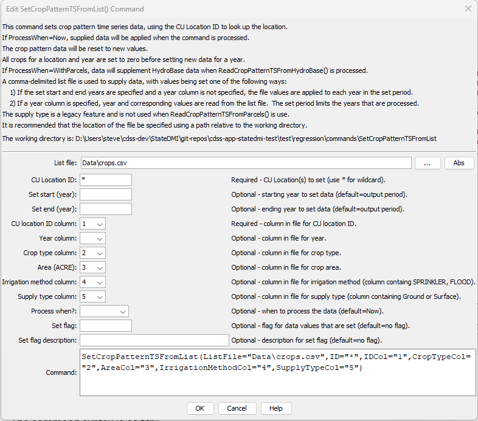

# StateDMI / Command / SetCropPatternTSFromList #

*   [Overview](#overview)
*   [Command Editor](#command-editor)
*   [Command Syntax](#command-syntax)
*   [Examples](#examples)
*   [Troubleshooting](#troubleshooting)
*   [See Also](#see-also)

-------------------------

## Overview ##

The `SetCropPatternTSFromList` command (for StateCU)
command sets crop pattern data for existing CU Locations by reading information from a delimited file.
New locations are not added.
The data are set to zero for a year being reset, and then values are applied for the year (acreage does not add to previous values).
The command can be used to set values over a period of 1+ years as follows:

1.  If the `SetStart` and `SetEnd` parameters are specified and the year column is not specified,
    then repeat the values from the file for each year in the set period.
    For example, this can be used to provide acreage data not in HydroBase,
    for a specific year (set `SetStart` and `SetEnd` to the same value).
2.  If the year column is provided, use the year in the file to specify the year for the set.
    In this case, `SetStart` and `SetEnd` control the period of data that will be processed from the file.

The command provides irrigated parcel acreage for two data processing situations:

1.  **Supplement HydroBase Acreage**.  If the `ProcessWhen=WithParcels`,
    the supplied data will be processed when parcel data are read from HydroBase with
    [`ReadCropPatternTSFromHydroBase`](../ReadCropPatternTSFromHydroBase/ReadCropPatternTSFromHydroBase.md).
    HydroBase may not contain all irrigated lands data.
    For example, additional lands may have been identified after HydroBase was populated or
    acreage must be set for a model identifier that is not a structure WDID in HydroBase (e.g., out of state lands).
    In this case, the command can be used to provide additional data to supplement HydroBase.
    For example, this may be appropriate for diversion aggregates where part of the data are in HydroBase for a year,
    but some parts of the aggregate require data to be provided by this command.
    Therefore, it is important that the data are processed when reading from HydroBase (otherwise a reset of HydroBase data might occur).
    Specifying the supply type allows the
    [`FillCropPatternTSUsingWellRights`](../FillCropPatternTSUsingWellRights/FillCropPatternTSUsingWellRights.md)
    command to determine that a parcel has groundwater only supply.
2.  **Provide Acreage Independent of HydroBase**.  If `ProcessWhen=Now`,
    the provided information will be applied as the command is processed.
    This may be appropriate to explicitly set data values, in the following cases:
    1.  Set acreage before processing HydroBase data are processed (where no data exist in HydroBase).
    2.  Override values after HydroBase data have been processed (where HydroBase data are inappropriate).
    3.  Supply acreage values independent of HydroBase.

For clarity in data management, it may be appropriate to use separate
[`SetCropPatternTSFromList`](../SetCropPatternTSFromList/SetCropPatternTSFromList.md) commands for each year of data.
However, the command does allow multiple years of data to be included in a single list file.

## Command Editor ##

The following dialog is used to edit the command and illustrates the syntax of the
command for providing acreage data that are not in HydroBase.
The data will be processed when HydroBase data are read.
The file that is used is the same one used with the
[`SetIrrigationPracticeTSFromList`](../SetIrrigationPracticeTSFromList/SetIrrigationPracticeTSFromList.md)
and the crop type and area should be specified (irrigation method and supply
type are shown for consistency with irrigation practice time series processing).

**<p style="text-align: center;">

</p>**

**<p style="text-align: center;">
`SetCropPatternTSFromList` Command Editor (<a href="../SetCropPatternTSFromList.png">see full-size image</a>)
</p>**

## Command Syntax ##

The command syntax is as follows:

```text
SetCropPatternTSFromList(Parameter="Value",...)
```
**<p style="text-align: center;">
Command Parameters
</p>**

| **Parameter**&nbsp;&nbsp;&nbsp;&nbsp;&nbsp;&nbsp;&nbsp;&nbsp;&nbsp;&nbsp;&nbsp;&nbsp;&nbsp;&nbsp;&nbsp;&nbsp;&nbsp;&nbsp;&nbsp;&nbsp;&nbsp;&nbsp; | **Description** | **Default**&nbsp;&nbsp;&nbsp;&nbsp;&nbsp;&nbsp;&nbsp;&nbsp;&nbsp;&nbsp; |
| --------------|-----------------|----------------- |
| `ListFile`<br>**required** | Path to the delimited list file to read. | None – must be specified. |
| `ID`<br>**required** | A single CU location identifier to match or a pattern using wildcards (e.g., `20*`). | None – must be specified. |
| `SetStart` | The first year to set data values. | If not specified, data are set for the full output period. |
| `SetEnd` | The last year to set data values. | If not specified, data are set for the full output period. |
| `IDCol` | The column number (1+) containing the CU Location identifiers.  These values are matched against CU Location identifiers in the existing irrigation practice data. | None – must be specified. |
| `YearCol` | The column number (1+) containing the year for data. | The file values are applied to each year in the data set. |
| `CropTypeCol` | The column number (1+) containing the crop type. | If not specified, the previous data values will remain. |
| `AreaCol` | The column number (1+) containing the crop area. | If not specified, the previous data values will remain. |
| `IrrigationMethodCol` | The column number (1+) containing the irrigation method, consistent with HydroBase (e.g., `SPRINKLER`, `FLOOD`). | If not specified, the previous data values will remain. |
| `SupplyTypeCol` | The column number (1+) containing the supply type (Surface or Ground). | If not specified, the previous data values will remain. |
| `ProcessWhen` | When to process the data, one of:<ul><li>`Now` – set the values in the time series when the command is encountered</li><li>`WithParcels` – treat the data as raw parcel data that should be processed when parcels are read from HydroBase (see the [`ReadCropPatternTSFromHydroBase`](../ReadCropPatternTSFromHydroBase/ReadCropPatternTSFromHydroBase.md) command).</li></ul> | `Now` |
| `SetFlag` | A string to set as the time series data flag for set values. | No flag is set. |
| `SetFlagDescription` | The description for the data flag, used in legends. | No flag is set. |

## Examples ##

See the [automated tests](https://github.com/OpenCDSS/cdss-app-statedmi-test/tree/master/test/regression/commands/SetCropPatternTSFromList).

Data file lines starting with the # character are treated as comments.
If the first line’s values are surrounded by double quotes,
the line is assumed to indicate column headings.
An example list file for specifying acreage data (not in HydroBase) is shown below.
Currently, supplemental acreage data can have only a single irrigation method and supply type,
to support irrigation practice time series processing.
Therefore, break supplemental acreage into multiple “parcels” if necessary.

```
# The following data provide acreage for structures that did not have GIS data
# and consequently no data in HydroBase.  The data are specific to 1998 and are
# used to set the CDS and IPY acres.  The crop is used to provide CDS data.  The
# irrigation method and source are used to provide IPY data.
"ID","Crop","Acres","IrrigationMethod","SupplySource"
200500,GRASS_PASTURE,0,Flood,Surface
200506,GRASS_PASTURE,100,Flood,Surface
200507,GRASS_PASTURE,50,Flood,Surface
200508,GRASS_PASTURE,40,Flood,Surface
200522,GRASS_PASTURE,40,Flood,Surface
200523,GRASS_PASTURE,50,Flood,Surface
200526,GRASS_PASTURE,40,Flood,Surface
200529,GRASS_PASTURE,5,Flood,Surface
... etc...
```

## Troubleshooting ##

[See the main troubleshooting documentation](../../troubleshooting/troubleshooting.md).

## See Also ##

*   [`FillCropPatternTSConstant`](../FillCropPatternTSConstant/FillCropPatternTSConstant.md) command
*   [`FillCropPatternTSInterpolate`](../FillCropPatternTSInterpolate/FillCropPatternTSInterpolate.md) command
*   [`FillCropPatternTSRepeat`](../FillCropPatternTSRepeat/FillCropPatternTSRepeat.md) command
*   [`FillCropPatternTSUsingWellRights`](../FillCropPatternTSUsingWellRights/FillCropPatternTSUsingWellRights.md) command
*   [`ReadCropPatternTSFromHydroBase`](../ReadCropPatternTSFromHydroBase/ReadCropPatternTSFromHydroBase.md) command
*   [`SetCropPatternTS`](../SetCropPatternTS/SetCropPatternTS.md) command
