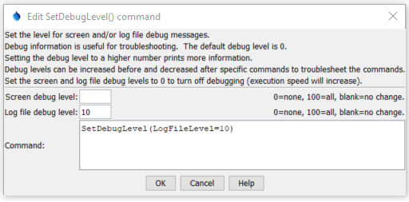

# StateDMI / Command / SetDebugLevel #

* [Overview](#overview)
* [Command Editor](#command-editor)
* [Command Syntax](#command-syntax)
* [Examples](#examples)
* [Troubleshooting](#troubleshooting)
* [See Also](#see-also)

-------------------------

## Overview ##

The `SetDebugLevel` command
is used to set debug levels for the screen and log file.

Debug messages are useful during troubleshooting.
A general guideline is that a debug level of `1` prints basic messages,
`30` prints detailed information about processing,
and `100` prints very low-level messages about input/output.  Intermediate values will result in more or less output.

This command is useful for troubleshooting and can be specified multiple times to increase debug output for a specific command, if necessary.

## Command Editor ##

The following dialog is used to edit the command and illustrates the command syntax.

**<p style="text-align: center;">

</p>**

**<p style="text-align: center;">
`SetDebugLevel` Command Editor (<a href="../SetDebugLevel.png">see also the full-size image</a>)
</p>**

## Command Syntax ##

The command syntax is as follows:

```text
SetDebugLevel(Parameter="Value",...)
```
**<p style="text-align: center;">
Command Parameters
</p>**

| **Parameter**&nbsp;&nbsp;&nbsp;&nbsp;&nbsp;&nbsp;&nbsp;&nbsp;&nbsp;&nbsp;&nbsp;&nbsp; | **Description** | **Default**&nbsp;&nbsp;&nbsp;&nbsp;&nbsp;&nbsp;&nbsp;&nbsp;&nbsp;&nbsp; |
| --------------|-----------------|----------------- |
|`ScreenLevel`| Level for screen (user interface) messages.| Only important messages will be shown.|
|`LogFileLevel`| Level for log file messages. | Only important messages will be printed to the log file.|

## Examples ##

See the [automated tests](https://github.com/OpenCDSS/cdss-app-statedmi-test/tree/master/test/regression/commands/SetDebugLevel).

## Troubleshooting ##

[See the main troubleshooting documentation](../../troubleshooting/troubleshooting.md)

## See Also ##

* [`SetWarningLevel`](../SetWarningLevel/SetWarningLevel.md) command
