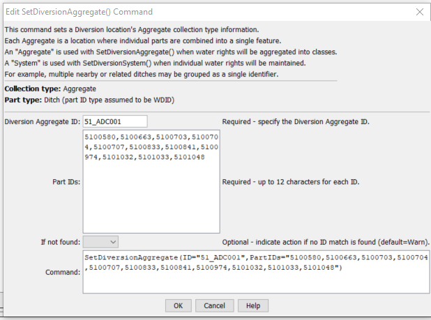

# StateDMI / Command / SetDiversionAggregate #

* [Overview](#overview)
* [Command Editor](#command-editor)
* [Command Syntax](#command-syntax)
* [Examples](#examples)
* [Troubleshooting](#troubleshooting)
* [See Also](#see-also)

-------------------------

## Overview ##

The `SetDiversionAggregate` command (for StateCU and StateMod)
sets diversion aggregate part identifier data for a diversion:

* a CU Location that corresponds to a diversion or D&W node
* a StateMod diversion station

Diversion aggregates are specified using a list of ditch identifiers,
and the aggregation information applies for the full model period (does not vary by year).
To facilitate processing, it is often best to use list files to specific aggregates
(see [`SetDiversionAggregateFromList`](../SetDiversionAggregateFromList/SetDiversionAggregateFromList.md)).
Aggregates by convention have their water rights grouped into classes.
Alternatively, to represent all water rights at a location, use a system
(see the similar [`SetDiversionSystem`](../SetDiversionSystem/SetDiversionSystem.md)) command.
See also the StateDMI Introduction chapter,
which provides additional information about aggregates and other modeling conventions.
Aggregate information should be specified after diversion locations are
defined and before their use in other processing, such as reading data from HydroBase.

## Command Editor ##

The following dialog is used to edit the command and illustrates the command syntax.

**<p style="text-align: center;">

</p>**

**<p style="text-align: center;">
`SetDiversionAggregate` Command Editor (<a href="../SetDiversionAggregate.png">see also the full-size image</a>)
</p>**

## Command Syntax ##

The command syntax is as follows:

```text
SetDiversionAggregate(Parameter="Value",...)
```
**<p style="text-align: center;">
Command Parameters
</p>**

| **Parameter**&nbsp;&nbsp;&nbsp;&nbsp;&nbsp;&nbsp;&nbsp;&nbsp;&nbsp;&nbsp;&nbsp;&nbsp; | **Description** | **Default**&nbsp;&nbsp;&nbsp;&nbsp;&nbsp;&nbsp;&nbsp;&nbsp;&nbsp;&nbsp; |
| --------------|-----------------|----------------- |
|`ID`<br>**required** | The diversion identifier to associate with the collection of individual diversions. | None – must be specified. |
|`PartIDs`<br>**required** | The list of part identifiers to comprise the aggregate, for example ditch WDIDs that will be found in HydroBase.  The part identifiers are by default of type Ditch. | None – must be specified. |
|`IfNotFound` | Used for error handling, one of the following:<ul><li>`Fail` – generate a failure message if the identifier is not matched</li><li>`Ignore` – ignore (don’t add and don’t generate a message) if the identifier is not matched</li><li>`Warn` – generate a warning message if the identifier is not matched</li></ul>| Warn |

## Examples ##

See the [automated tests](https://github.com/OpenCDSS/cdss-app-statedmi-test/tree/master/test/regression/commands/SetDiversionAggregate).

## Troubleshooting ##

## See Also ##

* [`SetDiversionAggregateFromList`](../SetDiversionAggregateFromList/SetDiversionAggregateFromList.md) command
* [`SetDiversionMultiStruct`](../SetDiversionMultiStruct/SetDiversionMultiStruct.md) command
* [`SetDiversionMultiStructFromList`](../SetDiversionMultiStructFromList/SetDiversionMultiStructFromList.md) command
* [`SetDiversionSystem`](../SetDiversionSystem/SetDiversionSystem.md) command
* [`SetDiversionSystemFromList`](../SetDiversionSystemFromList/SetDiversionSystemFromList.md) command
