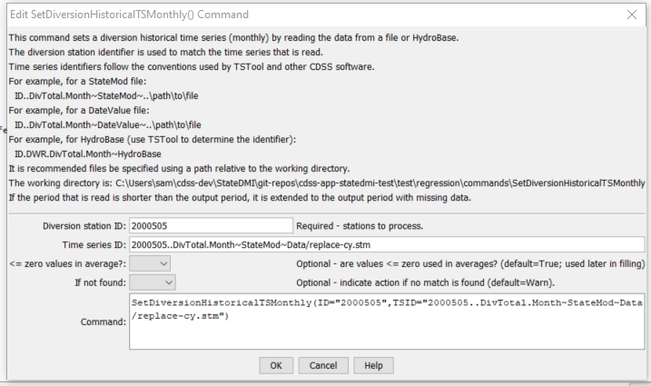

# StateDMI / Command / SetDiversionHistoricalTSMonthly #

* [Overview](#overview)
* [Command Editor](#command-editor)
* [Command Syntax](#command-syntax)
* [Examples](#examples)
* [Troubleshooting](#troubleshooting)
* [See Also](#see-also)

-------------------------

## Overview ##

The `SetDiversionHistoricalTSMonthly` command (for StateMod)
sets the diversion historical time series (monthly) for a specific diversion, by reading another time series from HydroBase,
or a StateMod or DateValue file.
This command is useful if data do not exist in the HydroBase database or are saved using a different identifier
(e.g., diversion records for transbasin structures may be saved as a gaged streamflow time series).
If data already exist, the previous time series is discarded.
If a time series is not found, a new time series can be added at the end of the time series list (use the
[`SortDiversionHistoricalTSMonthly`](../SortDiversionHistoricalTSMonthly/SortDiversionHistoricalTSMonthly.md) command
if necessary before writing).  The period of the time series that is read is the output period from the
[`SetOutputPeriod`](../SetOutputPeriod/SetOutputPeriod.md) command.
The time series are treated the same as those read from HydroBase with the
[`ReadDiversionHistoricalTSMonthlyFromHydroBase`](../ReadDiversionHistoricalTSMonthlyFromHydroBase/ReadDiversionHistoricalTSMonthlyFromHydroBase.md) command.
For example, the
[`LimitDiversionHistoricalTSMonthlyToRights`](../LimitDiversionHistoricalTSMonthlyToRights/LimitDiversionHistoricalTSMonthlyToRights.md) command
will not modify the observations in the time series.
If necessary, to ensure that set values remain for output, use the `SetDiversionHistoricalTSMonthly` command after other commands that may modify the time series.

If time series are read from HydroBase, it is useful to use TSTool to first verify the time series identifier.
For example, for the Streamflow data type, the data source may be USGS, DWR, or other.
Diversion comments will be applied by default if available, resulting in additional zero values for diversions.
Non-fatal warnings will be generated in the log file for HydroBase time series that do not have diversion comments (e.g., streamflow time series).
Warnings are generated because it can be difficult to differentiate a stream gate identifier from a diversion WDID.

## Command Editor ##

The following dialog is used to edit the command and illustrates the command syntax.

**<p style="text-align: center;">

</p>**

**<p style="text-align: center;">
`SetDiversionHistoricalTSMonthly` Command Editor (<a href="../SetDiversionHistoricalTSMonthly.png">see also the full-size image</a>)
</p>**

## Command Syntax ##

The command syntax is as follows:

```text
SetDiversionHistoricalTSMonthly(Parameter="Value",...)
```
**<p style="text-align: center;">
Command Parameters
</p>**

| **Parameter**&nbsp;&nbsp;&nbsp;&nbsp;&nbsp;&nbsp;&nbsp;&nbsp;&nbsp;&nbsp;&nbsp;&nbsp;&nbsp;&nbsp; | **Description** | **Default**&nbsp;&nbsp;&nbsp;&nbsp;&nbsp;&nbsp;&nbsp;&nbsp;&nbsp;&nbsp; |
| --------------|-----------------|----------------- |
| `ID` | A single diversion station identifier to match or a pattern using wildcards (e.g., `20*`). | None – must be specified. |
| `TSID` | The full time series identifier, which is used to locate and read the time series.  Currently time series from the following:  HydroBase, StateMod file, DateValue file.  See the TSTool input type appendices for the formats of these files.  Other input types can be enabled if necessary. | None – must be specified. |
| `LEZeroInAverage` | Indicates whether values <= 0 should be considered when computing historical averages.  These averages are used later with the [`FillDiversionHistoricalTSMonthlyAverage`](../FillDiversionHistoricalTSMonthlyAverage/FillDiversionHistoricalTSMonthlyAverage.md) and [`FillDiversionHistoricalTSMonthlyPattern`](../FillDiversionHistoricalTSMonthlyPattern/FillDiversionHistoricalTSMonthlyPattern.md) commands. | `True` |
| `IfNotFound` | Used for error handling, one of the following:<ul><li>`Add` – add the time series if the ID is not matched and is not a wildcard</li><li>`Fail` – generate a failure message if the ID is not matched</li><li>`Ignore` – ignore (don’t add and don’t generate a message) if the ID is not matched</li><li>`Warn` – generate a warning message if the ID is not matched</li></ul> | `Warn` |

## Examples ##

See the [automated tests](https://github.com/OpenCDSS/cdss-app-statedmi-test/tree/master/test/regression/commands/SetDiversionHistoricalTSMonthly).

## Troubleshooting ##

## See Also ##

* [`FillDiversionDemandTSMonthlyAverage`](../FillDiversionDemandTSMonthlyAverage/FillDiversionDemandTSMonthlyAverage.md) command
* [`FillDiversionDemandTSMonthlyConstant`](../FillDiversionDemandTSMonthlyConstant/FillDiversionDemandTSMonthlyConstant.md) command
* [`FillDiversionDemandTSMonthlyPattern`](../FillDiversionDemandTSMonthlyPattern/FillDiversionDemandTSMonthlyPattern.md) command
* [`LimitDiversionHistoricalTSMonthlyToRights`](../LimitDiversionHistoricalTSMonthlyToRights/LimitDiversionHistoricalTSMonthlyToRights.md) command
* [`ReadDiversionHistoricalTSMonthlyFromHydroBase`](../ReadDiversionHistoricalTSMonthlyFromHydroBase/ReadDiversionHistoricalTSMonthlyFromHydroBase.md) command
* [`SetDiversionDemandTSMonthlyConstant`](../SetDiversionDemandTSMonthlyConstant/SetDiversionDemandTSMonthlyConstant.md) command
* [`SetOutputPeriod`](../SetOutputPeriod/SetOutputPeriod.md) command
* [`SortDiversionHistoricalTSMonthly`](../SortDiversionHistoricalTSMonthly/SortDiversionHistoricalTSMonthly.md) command
