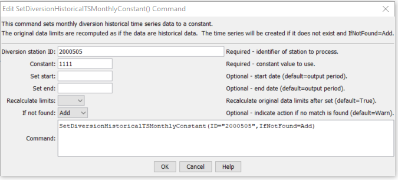

# StateDMI / Command / SetDiversionHistoricalTSMonthlyConstant #

* [Overview](#overview)
* [Command Editor](#command-editor)
* [Command Syntax](#command-syntax)
* [Examples](#examples)
* [Troubleshooting](#troubleshooting)
* [See Also](#see-also)

-------------------------

## Overview ##

The `SetDiversionHistoricalTSMonthlyConstant` command (for StateMod)
sets diversion historical time series (monthly) data to a constant value.
The output period can be set or will default to that defined by the most recent
[`SetOutputPeriod`](../SetOutputPeriod/SetOutputPeriod.md) command.
If a matching time series is not found, it can be added to the list of time series (at the end).
The values that are set are treated the same as observations from HydroBase.
To ensure that set values remain, use the `SetDiversionHistoricalTSMonthlyConstant` command after other commands that may modify the time series.

## Command Editor ##

The following dialog is used to edit the command and illustrates the command syntax.

**<p style="text-align: center;">

</p>**

**<p style="text-align: center;">
`SetDiversionHistoricalTSMonthlyConstant` Command Editor (<a href="../SetDiversionHistoricalTSMonthlyConstant.png">see also the full-size image</a>)
</p>**

## Command Syntax ##

The command syntax is as follows:

```text
SetDiversionHistoricalTSMonthlyConstant(Parameter="Value",...)
```
**<p style="text-align: center;">
Command Parameters
</p>**

| **Parameter**&nbsp;&nbsp;&nbsp;&nbsp;&nbsp;&nbsp;&nbsp;&nbsp;&nbsp;&nbsp;&nbsp;&nbsp; | **Description** | **Default**&nbsp;&nbsp;&nbsp;&nbsp;&nbsp;&nbsp;&nbsp;&nbsp;&nbsp;&nbsp; |
| --------------|-----------------|----------------- |
| `ID` | A single diversion station identifier to match or a pattern using wildcards (e.g., `20*`). | None – must be specified. |
| `Constant` | A constant historical diversion value. | None – must be specified. |
| `SetStart` | The start of the period for the set, in a standard date/time format for monthly data (e.g., `YYYY-MM` or `MM/YYYY`). | The output period start. |
| `SetEnd` | The end of the period for the set, in a standard date/time format for monthly data (e.g., `YYYY-MM` or `MM/YYYY`). | The output period end. |
| `RecalcLimits` | If `True`, then the constant values will be treated as observations and the historical averages will be recalculated with the values.  `False` will result in the time series being set but the previous averages remaining.  The averages are used with fill commands. | `True` |
| `IfNotFound` | Used for error handling, one of the following:<ul><li>`Add` – add the time series if the ID is not matched and is not a wildcard</li><li>`Fail` – generate a failure message if the ID is not matched</li><li>`Ignore` – ignore (don’t add and don’t generate a message) if the ID is not matched</li><li>`Warn` – generate a warning message if the ID is not matched</li><ul> | `Warn` |

## Examples ##

See the [automated tests](https://github.com/OpenCDSS/cdss-app-statedmi-test/tree/master/test/regression/commands/SetDiversionHistoricalTSMonthlyConstant).

## Troubleshooting ##

## See Also ##

* [`FillDiversionDemandTSMonthlyAverage`](../FillDiversionDemandTSMonthlyAverage/FillDiversionDemandTSMonthlyAverage.md) command
* [`FillDiversionDemandTSMonthlyConstant`](../FillDiversionDemandTSMonthlyConstant/FillDiversionDemandTSMonthlyConstant.md) command
* [`FillDiversionDemandTSMonthlyPattern`](../FillDiversionDemandTSMonthlyPattern/FillDiversionDemandTSMonthlyPattern.md) command
* [`SetDiversionDemandTSMonthly`](../SetDiversionDemandTSMonthly/SetDiversionDemandTSMonthly.md) command
* [`SetOutputPeriod`](../SetOutputPeriod/SetOutputPeriod.md) command
