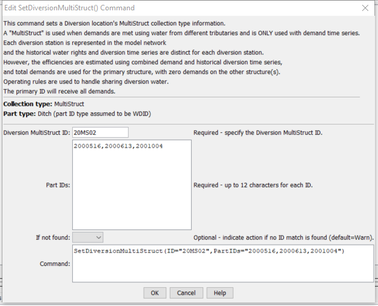

# StateDMI / Command / SetDiversionMultiStruct #

* [Overview](#overview)
* [Command Editor](#command-editor)
* [Command Syntax](#command-syntax)
* [Examples](#examples)
* [Troubleshooting](#troubleshooting)
* [See Also](#see-also)

-------------------------

## Overview ##

The `SetDiversionMultiStruct` command (for StateMod) sets diversion MultiStruct part identifier
data for:

* a StateMod diversion station

A diversion MultiStruct indicates that multiple diversion stations take water from more than one tributary but irrigate the same lands.
Each diversion station is included in the model network and retains its normal capacity and historical diversions;
however, average efficiencies are calculated using the combined demand and historical diversion time series.
The demands for the primary structure (the first listed) are set to the total demands,
with demands for secondary stations being set to zero.
MultiStruct information should be specified after diversion stations are
defined and before their use in other processing, such as reading data from HydroBase.

**Diversion MultiStruct definition commands are required only when processing the demand time series.**

## Command Editor ##

The following dialog is used to edit the command and illustrates the command syntax.

**<p style="text-align: center;">

</p>**

**<p style="text-align: center;">
`SetDiversionMultiStruct` Command Editor (<a href="../SetDiversionMultiStruct.png">see also the full-size image</a>)
</p>**

## Command Syntax ##

The command syntax is as follows:

```text
SetDiversionMultiStruct(Parameter="Value",...)
```
**<p style="text-align: center;">
Command Parameters
</p>**

| **Parameter**&nbsp;&nbsp;&nbsp;&nbsp;&nbsp;&nbsp;&nbsp;&nbsp;&nbsp;&nbsp;&nbsp;&nbsp; | **Description** | **Default**&nbsp;&nbsp;&nbsp;&nbsp;&nbsp;&nbsp;&nbsp;&nbsp;&nbsp;&nbsp; |
| --------------|-----------------|----------------- |
| `ID` <br>**required** | The diversion identifier to associate with the MultiStruct part identifiers. | None – must be specified. |
| `PartIDs` <br>**required** | The list of part identifiers to comprise the MultiStruct, separated by commas and/or spaces.  The first identifier is the primary diversion station, and the others are secondary stations. | None – must be specified. |
| `IfNotFound` | Used for error handling, one of the following:<ul><li>`Fail` – generate a failure message if the MultiStruct identifier is not matched</li><li>`Ignore` – ignore (don’t add and don’t generate a message) if the aggregate identifier is not matched</li><li>`Warn` – generate a warning message if the aggregate identifier is not matched</li></ul> | `Warn` |

## Examples ##

See the [automated tests](https://github.com/OpenCDSS/cdss-app-statedmi-test/tree/master/test/regression/commands/SetDiversionMultiStruct).

## Troubleshooting ##

## See Also ##

* [`SetDiversionAggregate`](../SetDiversionAggregate/SetDiversionAggregate.md) command
* [`SetDiversionMultiStructFromList`](../SetDiversionMultiStructFromList/SetDiversionMultiStructFromList.md) command
* [`SetDiversionSystem`](../SetDiversionSystem/SetDiversionSystem.md) command
