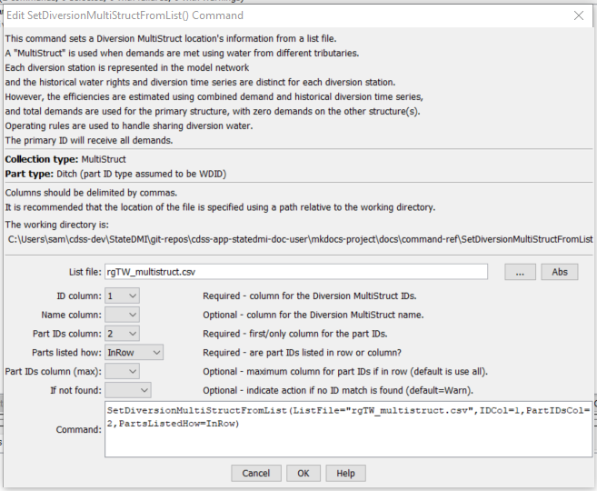

# StateDMI / Command / SetDiversionMultiStructFromList #

* [Overview](#overview)
* [Command Editor](#command-editor)
* [Command Syntax](#command-syntax)
* [Examples](#examples)
* [Troubleshooting](#troubleshooting)
* [See Also](#see-also)

-------------------------

## Overview ##

The `SetDiversionMultiStructFromList` command (for StateMod) reads diversion MultiStruct part
identifier data from a list file and saves the information for:

* a StateMod diversion station

A diversion MultiStruct indicates that multiple diversion stations take water from more
than one tributary but irrigate the same lands.
Each diversion station is included in the model network and retains its normal capacity and historical diversions;
however, average efficiencies are calculated using the combined demand and historical diversion time series.
The demands for the primary structure (the first listed) are set to the total demands,
with demands for secondary stations being set to zero.
MultiStruct information should be specified after diversion stations are
defined and before their use in other processing, such as reading data from HydroBase.

**Diversion MultiStruct definition commands are required only when processing the demand time series.**

## Command Editor ##

The following dialog is used to edit the command and illustrates the command syntax.

**<p style="text-align: center;">

</p>**

**<p style="text-align: center;">
`SetDiversionMultiStructFromList` Command Editor (<a href="../SetDiversionMultiStructFromList.png">see also the full-size image</a>)
</p>**

## Command Syntax ##

The command syntax is as follows:

```text
SetDiversionMultiStructFromList(Parameter="Value",...)
```
**<p style="text-align: center;">
Command Parameters
</p>**

| **Parameter**&nbsp;&nbsp;&nbsp;&nbsp;&nbsp;&nbsp;&nbsp;&nbsp;&nbsp;&nbsp;&nbsp;&nbsp; | **Description** | **Default**&nbsp;&nbsp;&nbsp;&nbsp;&nbsp;&nbsp;&nbsp;&nbsp;&nbsp;&nbsp; |
| --------------|-----------------|----------------- |
| `ListFile` | The name of the input file to read, surrounded by double quotes. | None – must be specified. |
| `IDCol` | The column number (1+) containing the diversion MultiStruct primary station identifiers. | None – must be specified. |
| `NameCol` | The column number (1+) containing the diversion MultiStruct name. | None – optional (if not specified the name will not be changed). |
| `PartIDsCol` | The column number (1+) for the first column having part identifiers. | None – must be specified. |
| `PartIDsColMax` | The column number (1+) for the last column having part identifiers. | Use all available columns. |
| `PartsListedHow` | If `InRow`, it is expected that all parts defining a system are listed in the same row.  If `InColumn`, it is expected that the parts defining a system are listed one per row, with multiple rows defining the full system (`PartIDsColMax` is ignored in this case). | None – must be specified. |
| `IfNotFound` | Used for error handling, one of the following:<ul><li>`Fail` – generate a failure message if the MultiStruct identifier is not matched</li><li>`Ignore` – ignore (don’t add and don’t generate a message) if the aggregate identifier is not matched</li><li>`Warn` – generate a warning message if the aggregate identifier is not matched</li></ul> | `Warn` |

## Examples ##

See the [automated tests](https://github.com/OpenCDSS/cdss-app-statedmi-test/tree/master/test/regression/commands/SetDiversionMultiStructFromList).

An example list file is shown below:

```
#AggID,Ditch,Ditch,Ditch,Ditch,Ditch,Ditch,Ditch,Ditch,Ditch,Ditch,Ditch,
20MS01,200516,200613,201004
20MS02,200623,201060,210521,210522
20MS03,200706,200784
20MS04,200814,200815
20MS05,200683,200775
...
```

## Troubleshooting ##

## See Also ##

* [`SetDiversionMultiStruct`](../SetDiversionMultiStruct/SetDiversionMultiStruct.md) command
* [`SetDiversionAggregate`](../SetDiversionAggregate/SetDiversionAggregate.md) command
* [`SetDiversionSystem`](../SetDiversionSystem/SetDiversionSystem.md) command
