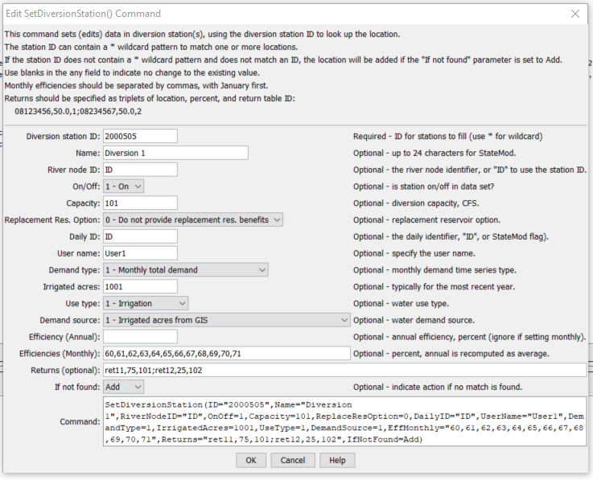

# StateDMI / Command / SetDiversionStation #

* [Overview](#overview)
* [Command Editor](#command-editor)
* [Command Syntax](#command-syntax)
* [Examples](#examples)
* [Troubleshooting](#troubleshooting)
* [See Also](#see-also)

-------------------------

## Overview ##

The `SetDiversionStation` command (for StateMod)
command sets data in existing diversion stations or adds a new diversion station.

## Command Editor ##

The following dialog is used to edit the command and illustrates the command syntax.

**<p style="text-align: center;">

</p>**

**<p style="text-align: center;">
`SetDiversionStation` Command Editor (<a href="../SetDiversionStation.png">see also the full-size image</a>)
</p>**

## Command Syntax ##

The command syntax is as follows:

```text
SetDiversionStation(Parameter="Value",...)
```
**<p style="text-align: center;">
Command Parameters
</p>**

| **Parameter**&nbsp;&nbsp;&nbsp;&nbsp;&nbsp;&nbsp;&nbsp;&nbsp;&nbsp;&nbsp;&nbsp;&nbsp;&nbsp;&nbsp;&nbsp;&nbsp;&nbsp;&nbsp; | **Description** | **Default**&nbsp;&nbsp;&nbsp;&nbsp;&nbsp;&nbsp;&nbsp;&nbsp;&nbsp;&nbsp;&nbsp;&nbsp;&nbsp;&nbsp;&nbsp;&nbsp;&nbsp;&nbsp;&nbsp;&nbsp; |
| --------------|-----------------|----------------- |
| `ID`<br>**required** | A single diversion station identifier to match or a pattern using wildcards (e.g., `20*`). | None – must be specified. |
| `Name` | The name to be assigned for all matching diversion stations. | If not specified, the original value will remain. |
| `RiverNodeID` | The river node identifier to be assigned for all matching diversion stations.  Specify ID to assign to the diversion station identifier. | If not specified, the original value will remain. |
| `OnOff` | The on/off switch value to be assigned for all matching diversion stations, either `1` for on or `0` for off. | If not specified, the original value will remain. |
| `Capacity` | The diversion station capacity, CFS. | If not specified, the original value will remain. |
| `ReplaceResOption` | The replacement reservoir option, as per the StateMod documentation. | If not specified, the original value will remain. |
| `DailyID` | The daily identifier to be assigned for all matching diversion stations. | If not specified, the original value will remain. |
| `UserName` | The diversion user name (owner). | If not specified, the original value will remain. |
| `DemandType` | The demand type to be assigned for all matching diversion stations (see StateMod documentation). | If not specified, the original value will remain. |
| `IrrigatedAcres` | The irrigated acres to be assigned for all matching diversion stations. | If not specified, the original value will remain. |
| `UseType` | The use type to be assigned for all matching diversion stations (see StateMod documentation). | If not specified, the original value will remain. |
| `DemandSource` | The demand source to be assigned for all matching diversion stations (see StateMod documentation). | If not specified, the original value will remain. |
| `EffAnnual` | The annual efficiency (percent, 0  - 100) to be assigned for all matching diversion stations (see StateMod documentation).  Monthly efficiencies will be set to the same value (but not used). | If not specified, the original value will remain. |
| `EffMonthly` | The monthly efficiencies (percent, 0 – 100) to be assigned for all matching diversion stations, specified as 12 comma-separated values, January to December.  The annual efficiency will be set to the average value.  The order of the values in the output file will be according to the output year type set by SetOutputYearType(), or calendar by default. | If not specified, the original value will remain. |
| `Returns` | The return flows to be assigned for all matching diversion stations.  Specify as StationID,Percent,DelayTableID;StationID,Percent,DelayTableID; etc. | If not specified, the original value will remain. |
| `IfNotFound` | Used for error handling, one of the following:<ul><li>`Add` – add the diversion station if the ID is not matched and is not a wildcard</li><li>`Fail` – generate a failure message if the ID is not matched</li><li>`Ignore` – ignore (don’t add and don’t generate a message) if the ID is not matched</li><li>`Warn` – generate a warning message if the ID is not matched</li></ul> | `Warn` |

## Examples ##

See the [automated tests](https://github.com/OpenCDSS/cdss-app-statedmi-test/tree/master/test/regression/commands/SetDiversionStation).

## Troubleshooting ##

[See the main troubleshooting documentation](../../troubleshooting/troubleshooting.md)

## See Also ##

* [`FillDiversionStation`](../FillDiversionStation/FillDiversionStation.md) command
* [`SetDiversionStationCapacitiesFromTS`](../SetDiversionStationCapacitiesFromTS/SetDiversionStationCapacitiesFromTS.md) command
* [`SetDiversionStationsDelayTablesFromNetwork`](../SetDiversionStationDelayTablesFromNetwork/SetDiversionStationDelayTablesFromNetwork.md) command
* [`SetDiversionStationsDelayTablesFromRTN`](../SetDiversionStationDelayTablesFromRTN/SetDiversionStationDelayTablesFromRTN.md) command
* [`SetDiversionStationsFromList`](../SetDiversionStationsFromList/SetDiversionStationsFromList.md) command
