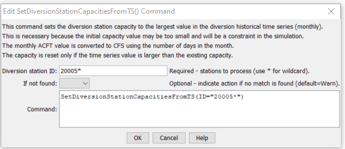

# StateDMI / Command / SetDiversionStationCapacitiesFromTS #

* [Overview](#overview)
* [Command Editor](#command-editor)
* [Command Syntax](#command-syntax)
* [Examples](#examples)
* [Troubleshooting](#troubleshooting)
* [See Also](#see-also)

-------------------------

## Overview ##

The `SetDiversionStationCapacitiesFromTS` command (for StateMod)
sets diversion station capacities to the maximum historical time series (monthly) value.
The historical time series must have been previously read or calculated with other commands.
Monthly ACFT values are converted to CFS units by applying the conversion:

```
CFS = X ACFT/(1.9835*DaysInMonth)
```

## Command Editor ##

The following dialog is used to edit the command and illustrates the command syntax.

**<p style="text-align: center;">

</p>**

**<p style="text-align: center;">
`SetDiversionStationCapacitiesFromTS` Command Editor (<a href="../SetDiversionStationCapacitiesFromTS.png">see also the full-size image</a>)
</p>**

## Command Syntax ##

The command syntax is as follows:

```text
SetDiversionStationCapacitiesFromTS(Parameter="Value",...)
```
**<p style="text-align: center;">
Command Parameters
</p>**

| **Parameter**&nbsp;&nbsp;&nbsp;&nbsp;&nbsp;&nbsp;&nbsp;&nbsp;&nbsp;&nbsp;&nbsp;&nbsp; | **Description** | **Default**&nbsp;&nbsp;&nbsp;&nbsp;&nbsp;&nbsp;&nbsp;&nbsp;&nbsp;&nbsp; |
| --------------|-----------------|----------------- |
| `ID`<br>**required** | A single diversion station identifier to match or a pattern using wildcards (e.g., `20*`). | None – must be specified. |
| `IfNotFound` | Used for error handling, one of the following:<ul><li>`Fail` – generate a failure message if the ID is not matched</li><li>`Ignore` – ignore (don’t add and don’t generate a message) if the ID is not matched</li><li>`Warn` – generate a warning message if the ID is not matched</li></ul> | `Warn` |

## Examples ##

See the [automated tests](https://github.com/OpenCDSS/cdss-app-statedmi-test/tree/master/test/regression/commands/SetDiversionStationCapacitiesFromTS).

The following command file excerpt illustrates how time series can be limited to rights prior to writing the StateMod time series file.  Note that the original diversion stations file is read and a new one is written.

```
#
#  Step 2 - read structure list from preliminary direct diversion structure file
#
ReadDiversionStationsFromStateMod(InputFile="cm2005_dds.dds")
...steps omitted...
#
#  Step 8 - fill historical diversion using pattern approach
#
FillDiversionHistoricalTSMonthlyPattern(ID="36*",PatternID="09034500")
...similar commands omitted...
#
#   Step 9 - Fill remaining missing with month average
#
FillDiversionHistoricalTSMonthlyAverage(ID="*")
#
#   Step 10 - Limit filled diversion to water rights. Exceptions include structure
#             receiving significant reservoir supply, carrier structures, etc.
#
LimitDiversionHistoricalTSMonthlyToRights(InputFile="..\statemod\cm2005.ddr",ID="*",IgnoreID="954683,952001,950010,950011")
#
#   Step 11 - sort structures and create historical diversion file
#
SortDiversionHistoricalTSMonthly(Order=Ascending)
WriteDiversionHistoricalTSMonthlyToStateMod(OutputFile="..\StateMod\cm2005.ddh")
#
#  Step 12 - update capacities and create final direct diversion station file
#
SetDiversionStationCapacitiesFromTS(ID="*")
WriteDiversionStationsToStateMod(OutputFile="..\statemod\cm2005.dds")
#
# Check the results.
CheckDiversionHistoricalTSMonthly(ID="*")
WriteCheckFile(OutputFile="ddh.commands.StateDMI.check.html")
```

## Troubleshooting ##

## See Also ##

* [`FillDiversionStation`](../FillDiversionStation/FillDiversionStation.md) command
* [`SetDiversionStation`](../SetDiversionStation/SetDiversionStation.md) command
* [`SetDiversionStationsDelayTablesFromNetwork`](../SetDiversionStationDelayTablesFromNetwork/SetDiversionStationDelayTablesFromNetwork.md) command
* [`SetDiversionStationsDelayTablesFromRTN`](../SetDiversionStationDelayTablesFromRTN/SetDiversionStationDelayTablesFromRTN.md) command
* [`SetDiversionStationsFromList`](../SetDiversionStationsFromList/SetDiversionStationsFromList.md) command
