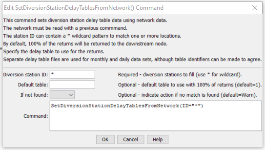

# StateDMI / Command / SetDiversionStationDelayTablesFromNetwork #

* [Overview](#overview)
* [Command Editor](#command-editor)
* [Command Syntax](#command-syntax)
* [Examples](#examples)
* [Troubleshooting](#troubleshooting)
* [See Also](#see-also)

-------------------------

## Overview ##

The `SetDiversionStationDelayTablesFromNetwork` command (for StateMod)
sets delay table data in existing diversion stations using network information.
A default delay table is used to assign 100% of the returns to the downstream node in the network.
This command is often used to set a default before more specific delay table information is set with the
[`SetDiversionStationDelayTablesFromRTN`](../SetDiversionStationDelayTablesFromRTN/SetDiversionStationDelayTablesFromRTN.md) command.

## Command Editor ##

The following dialog is used to edit the command and illustrates the command syntax.

**<p style="text-align: center;">

</p>**

**<p style="text-align: center;">
`SetDiversionStationDelayTablesFromNetwork` Command Editor (<a href="../SetDiversionStationDelayTablesFromNetwork.png">see also the full-size image</a>)
</p>**

## Command Syntax ##

The command syntax is as follows:

```text
SetDiversionStationDelayTablesFromNetwork(Parameter="Value",...)
```
**<p style="text-align: center;">
Command Parameters
</p>**

| **Parameter**&nbsp;&nbsp;&nbsp;&nbsp;&nbsp;&nbsp;&nbsp;&nbsp;&nbsp;&nbsp;&nbsp;&nbsp; | **Description** | **Default**&nbsp;&nbsp;&nbsp;&nbsp;&nbsp;&nbsp;&nbsp;&nbsp;&nbsp;&nbsp; |
| --------------|-----------------|----------------- |
| `ID`<br>**required** | A single diversion station identifier to match or a pattern using wildcards (e.g., `20*`). | None – must be specified. |
| `DefaultTable`<br>**required** | The default delay table to use when assigning the delay tables. | None – must be specified. |
| `IfNotFound` | Used for error handling, one of the following:<ul><li>`Fail` – generate a failure message if the ID is not matched</li><li>`Ignore` – ignore (don’t add and don’t generate a message) if the ID is not matched</li><li>`Warn` – generate a warning message if the ID is not matched</li></ul> | `Warn` |

## Examples ##

See the [automated tests](https://github.com/OpenCDSS/cdss-app-statedmi-test/tree/master/test/regression/commands/SetDiversionStationDelayTablesFromNetwork).

## Troubleshooting ##

## See Also ##

* [`SetDiversionStationDelayTablesFromRTN`](../SetDiversionStationDelayTablesFromRTN/SetDiversionStationDelayTablesFromRTN.md) command
