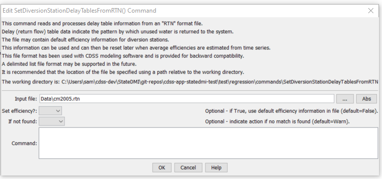

# StateDMI / Command / SetDiversionStationDelayTablesFromRTN #

* [Overview](#overview)
* [Command Editor](#command-editor)
* [Command Syntax](#command-syntax)
* [Examples](#examples)
* [Troubleshooting](#troubleshooting)
* [See Also](#see-also)

-------------------------

## Overview ##

The `SetDiversionStationDelayTablesFromRTN` does something...

This documentation is a placeholder that will be updated as Word documentation is translated into Markdown.
Until that time, see the PDF documentation that is distributed with the software and can be accessed
from the ***Help*** menu.

## Command Editor ##

The following dialog is used to edit the command and illustrates the command syntax.



**<p style="text-align: center;">
`SetDiversionStationDelayTablesFromRTN` Command Editor (<a href="../SetDiversionStationDelayTablesFromRTN.png">see also the full-size image</a>)
</p>**

## Command Syntax ##

The command syntax is as follows:

```text
SetDiversionStationDelayTablesFromRTN(Parameter="Value",...)
```
**<p style="text-align: center;">
Command Parameters
</p>**

| **Parameter**&nbsp;&nbsp;&nbsp;&nbsp;&nbsp;&nbsp;&nbsp;&nbsp;&nbsp;&nbsp;&nbsp;&nbsp; | **Description** | **Default**&nbsp;&nbsp;&nbsp;&nbsp;&nbsp;&nbsp;&nbsp;&nbsp;&nbsp;&nbsp; |
| --------------|-----------------|----------------- |
|`SomeParameter`<br>**required**|Parameter description.|None – must be specified.|

## Examples ##

See the [automated tests](https://github.com/OpenWaterFoundation/cdss-app-statedmi-main/tree/master/test/regression/commands/SetDiversionStationDelayTablesFromRTN).

## Troubleshooting ##

## See Also ##

* [`SomeOtherCommand`](../SomeOtherCommand/SomeOtherCommand) command
