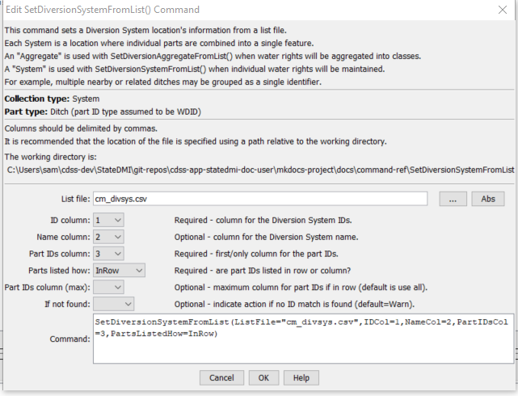

# StateDMI / Command / SetDiversionSystemFromList #

* [Overview](#overview)
* [Command Editor](#command-editor)
* [Command Syntax](#command-syntax)
* [Examples](#examples)
* [Troubleshooting](#troubleshooting)
* [See Also](#see-also)

-------------------------

## Overview ##

The `SetDiversionSystemFromList` command (for StateCU and StateMod) sets diversion system part identifier data for:

* a CU Location that corresponds to a diversion or D&W node
* or a StateMod diversion station

Diversion systems are specified using a list of ditch identifiers,
and the system information applies for the full model period (does not vary by year).
To facilitate processing, the list of parts is specified in a delimited list file.
Systems by convention have their water rights fully represented in output.
To aggregate water rights at a location, use an aggregate
(see the similar [`SetDiversionAggregate`](../SetDiversionAggregate/SetDiversionAggregate.md) command).
See also the StateDMI Introduction chapter,
which provides additional information about systems and other modeling conventions.
System information should be specified after diversion locations are defined and
before their use in other processing, such as reading data from HydroBase.

## Command Editor ##

The following dialog is used to edit the command and illustrates the command syntax.

**<p style="text-align: center;">

</p>**

**<p style="text-align: center;">
`SetDiversionSystemFromList` Command Editor (<a href="../SetDiversionSystemFromList.png">see also the full-size image</a>)
</p>**

## Command Syntax ##

The command syntax is as follows:

```text
SetDiversionSystemFromList(Parameter="Value",...)
```
**<p style="text-align: center;">
Command Parameters
</p>**

| **Parameter**&nbsp;&nbsp;&nbsp;&nbsp;&nbsp;&nbsp;&nbsp;&nbsp;&nbsp;&nbsp;&nbsp;&nbsp; | **Description** | **Default**&nbsp;&nbsp;&nbsp;&nbsp;&nbsp;&nbsp;&nbsp;&nbsp;&nbsp;&nbsp; |
| --------------|-----------------|----------------- |
| `ListFile` <br>**required** | The name of the input file to read, surrounded by double quotes. | None – must be specified. |
| `IDCol` <br>**required** | The column number (1+) containing the diversion system identifiers. | None – must be specified. |
| `NameCol` | The column number (1+) containing the diversion system name. | None – optional (name will remain as previously defined). |
| `PartIDsCol` <br>**required** | The column number (1+) for the first column having part identifiers.  The identifiers are ditch WDIDs that will be found in HydroBase.  The part identifiers are by default of type Ditch. | None – must be specified. |
| `PartsListedHow` | If `InRow`, it is expected that all parts defining a system are listed in the same row (as shown in the example below).  If `InColumn`, it is expected that the parts defining a system are listed one per row, with multiple rows defining the full system (`PartIDsColMax` is ignored in this case). | None – must be specified. |
| `PartIDsColMax` | The column number (1+) for the last column having part identifiers.  Use if extra columns on the right need to be excluded from the list. | Use all available non-blank columns starting with `PartIDsCol`. |
| `IfNotFound` | Used for error handling, one of the following:<ul><li>`Fail` – generate a failure message if the system identifier is not matched</li><li>`Ignore` – ignore (don’t add and don’t generate a message) if the system identifier is not matched</li><li>`Warn` – generate a warning message if the system identifier is not matched</li></ul> | `Warn` |

## Examples ##

See the [automated tests](https://github.com/OpenCDSS/cdss-app-statedmi-test/tree/master/test/regression/commands/SetDiversionSystemFromList).

An example list file is shown below:

```
#the following are all divsystems
360649,Hamilton Davidson Div Sys,360649,360541
360662,Hoagland Div Sys,360662,360946,361018,361047,361020,361019,360945,361048,361049
380880,Mt. Sopris Div Sys,380880,381633
394725,Vulcan Ditch Div Sys,394725,390685
500734,Deberard Div Sys,500734,500548
510529,Big Lake Div Sys,510529,510584
510941,Vail Irr Div Sys,510941,511231
511309,FRASER RIVER DIVR PROJ,511309,510593
530555,Derby Div Sys,530555,530519,530521
720512,Arbogast Pump Div Sys,721072,720512
720852,RMG Div Sys,720852,720555
950050,Redlands Power Canal Irr,724713
720766,Ute WCD Carver Ranch,720766,721334
721329,Rapid Creek PP DivSys,721329,721235
720820,Park Creek DivSys,720820,720819
```

The following command file illustrates how diversion systems are defined with this command:

```
# ddr.commands.StateDMI
#
#  StateDMI command file to create the direct diversion rights file for the Colorado model
#
#  Step 1 - read structures from preliminary direct diversion station file
#
ReadDiversionStationsFromStateMod(InputFile="cm2005_dds.dds")
#
#  Step 2 - read aggregate and diversion system structure assignments.  Note that
#        want to combine water rights for aggs and diversion systems, but
#        water rights are assigned to primary and secondary components of multistructures
#
SetDiversionAggregateFromList(ListFile="cm_agg.csv",IDCol=1,NameCol=2,PartIDsCol=3,
  PartsListedHow=InRow)
SetDiversionSystemFromList(ListFile="cm_divsys.csv",IDCol=1,NameCol=2,PartIDsCol=3,
  PartsListedHow=InRow)
#
#  Step 3 - read diversion rights from HydroBase and define water rights classes
#           used for aggregate structures - but NOT for diversion systems
#
ReadDiversionRightsFromHydroBase(ID="*",OnOffDefault=1,
  AdminNumClasses="14854.00000,20427.18999,22729.21241,30895.21241,31258.00000,
  32023.28989,39095.38998,43621.42906,46674.00000,48966.00000,99999.")
#
#  Step 4 - set water rights for structure IDs different from or not included in HydroBase
#
# Grand Valley Area - many rights obtain water through operations
SetDiversionRight(ID="720646.02",Name="Orchard Mesa Irr Dist Sys",StationID="ID",OnOff=1,IfNotFound=Add,IfFound=Set)
SetDiversionRight(ID="720646.05",Name="USA Power Plant",StationID="ID",Decree=800.0,OnOff=1,IfNotFound=Add,IfFound=Set)
SetDiversionRight(ID="720646.07",Name="Grand Valley Proj",StationID="ID",AdministrationNumber=22729.19544,Decree=40.0,OnOff=1,
  IfNotFound=Add,IfFound=Set)
… commands omitted
#
#  Step 7 - create direct diverison rights file
#
WriteDiversionRightsToStateMod(OutputFile="cm2005.ddr")
```

## Troubleshooting ##

[See the main troubleshooting documentation](../../troubleshooting/troubleshooting.md)

## See Also ##

* [`SetDiversionAggregate`](../SetDiversionAggregate/SetDiversionAggregate.md) command
* [`SetDiversionMultiStruct`](../SetDiversionMultiStruct/SetDiversionMultiStruct.md) command
* [`SetDiversionSystem`](../SetDiversionSystem/SetDiversionSystem.md) command
