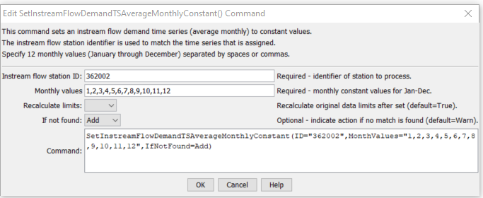

# StateDMI / Command / SetInstreamFlowDemandTSAverageMonthlyConstant #

* [Overview](#overview)
* [Command Editor](#command-editor)
* [Command Syntax](#command-syntax)
* [Examples](#examples)
* [Troubleshooting](#troubleshooting)
* [See Also](#see-also)

-------------------------

## Overview ##

The `SetInstreamFlowDemandTSAverageMonthlyConstant` command (for StateMod)
sets instream flow demand time series (average monthly) data to constant monthly values.
Typically this command is used to (re)set values after the
[`SetInstreamFlowDemandTSAverageMonthlyFromRights`](../SetInstreamFlowDemandTSAverageMonthlyFromRights/SetInstreamFlowDemandTSAverageMonthlyFromRights.md) command is used.

## Command Editor ##

The following dialog is used to edit the command and illustrates the command syntax.

**<p style="text-align: center;">

</p>**

**<p style="text-align: center;">
`SetInstreamFlowDemandTSAverageMonthlyConstant` Command Editor (<a href="../SetInstreamFlowDemandTSAverageMonthlyConstant.png">see also the full-size image</a>)
</p>**

## Command Syntax ##

The command syntax is as follows:

```text
SetInstreamFlowDemandTSAverageMonthlyConstant(Parameter="Value",...)
```
**<p style="text-align: center;">
Command Parameters
</p>**

| **Parameter**&nbsp;&nbsp;&nbsp;&nbsp;&nbsp;&nbsp;&nbsp;&nbsp;&nbsp;&nbsp;&nbsp;&nbsp; | **Description** | **Default**&nbsp;&nbsp;&nbsp;&nbsp;&nbsp;&nbsp;&nbsp;&nbsp;&nbsp;&nbsp; |
| --------------|-----------------|----------------- |
| `ID`<br>**required** | A single instream flow station identifier to match or a pattern using wildcards (e.g., `20*`). | None – must be specified. |
| `MonthValues`<br>**required** | Twelve monthly instream flow demand time series values for January through December. | None – must be specified. |
| `RecalcLimits` | If `True`, then the time series average limits will be recalculated.  If `False`, the limits from previously set data will be used (not typically used). | `True` |
| `IfNotFound` | Used for error handling, one of the following:<ul></li>`Add` – add the instream flow demand time series if the ID is not matched and is not a wildcard</li><li>`Fail` – generate a failure message if the ID is not matched</li><li>`Ignore` – ignore (don’t add and don’t generate a message) if the ID is not matched</li><li>`Warn – generate a warning message if the ID is not matched</li></ul> | `Warn` |

## Examples ##

See the [automated tests](https://github.com/OpenCDSS/cdss-app-statedmi-test/tree/master/test/regression/commands/SetInstreamFlowDemandTSAverageMonthlyConstant).

## Troubleshooting ##

## See Also ##

* [`SetInstreamFlowDemandTSAverageMonthlyFromRights`](../SetInstreamFlowDemandTSAverageMonthlyFromRights/SetInstreamFlowDemandTSAverageMonthlyFromRights.md) command
