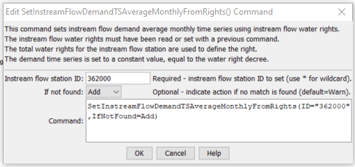

# StateDMI / Command / SetInstreamFlowDemandTSAverageMonthlyFromRights #

* [Overview](#overview)
* [Command Editor](#command-editor)
* [Command Syntax](#command-syntax)
* [Examples](#examples)
* [Troubleshooting](#troubleshooting)
* [See Also](#see-also)

-------------------------

## Overview ##

The `SetInstreamFlowDemandTSAverageMonthlyFromRights` command (for StateMod)
sets instream flow demand time series (average monthly) data using instream flow water
rights data that have been previously read (e.g., from a
[`ReadInstreamFlowRightsFromStateMod`](../ReadInstreamFlowRightsFromStateMod/ReadInstreamFlowRightsFromStateMod.md) command).
The resulting time series at each instream flow station represents the total water rights for the specified station.
The output year type is set to that defined by the most recent
[`SetOutputYearType`](../SetOutputYearType/SetOutputYearType.md) command.
For average time series, it is only important that a sequence of months be specified in the time series.
If water year is used, then the data span two calendar years in memory.
Incorrectly specifying the year type may result in missing data in the output.

If necessary, the constant values determined from water rights can be reset using the
[`SetInstreamFlowDemandTSAverageMonthlyConstant`](../SetInstreamFlowDemandTSAverageMonthlyConstant/SetInstreamFlowDemandTSAverageMonthlyConstant.md) command.

## Command Editor ##

The following dialog is used to edit the command and illustrates the command syntax.

**<p style="text-align: center;">

</p>**

**<p style="text-align: center;">
`SetInstreamFlowDemandTSAverageMonthlyFromRights` Command Editor (<a href="../SetInstreamFlowDemandTSAverageMonthlyFromRights.png">see also the full-size image</a>)
</p>**

## Command Syntax ##

The command syntax is as follows:

```text
SetInstreamFlowDemandTSAverageMonthlyFromRights(Parameter="Value",...)
```
**<p style="text-align: center;">
Command Parameters
</p>**

| **Parameter**&nbsp;&nbsp;&nbsp;&nbsp;&nbsp;&nbsp;&nbsp;&nbsp;&nbsp;&nbsp;&nbsp;&nbsp; | **Description** | **Default**&nbsp;&nbsp;&nbsp;&nbsp;&nbsp;&nbsp;&nbsp;&nbsp;&nbsp;&nbsp; |
| --------------|-----------------|----------------- |
| `ID` | A single instream flow station identifier to match or a pattern using wildcards (e.g., `20*`). | None – must be specified. |
| `IfNotFound` | Used for error handling, one of the following: <ul><li>`Add` – add the instream flow demand time series if the ID is not matched and is not a wildcard</li><li>`Fail` – generate a failure message if the ID is not matched</li><li>`Ignore` – ignore (don’t add and don’t generate a message) if the ID is not matched</li><li>`Warn` – generate a warning message if the ID is not matched</li></ul> | `Warn` |

## Examples ##

See the [automated tests](https://github.com/OpenCDSS/cdss-app-statedmi-test/tree/master/test/regression/commands/SetInstreamFlowDemandTSAverageMonthlyFromRights).

## Troubleshooting ##

## See Also ##

* [`ReadInstreamFlowRightsFromStateMod`](../ReadInstreamFlowRightsFromStateMod/ReadInstreamFlowRightsFromStateMod.md) command)
* [`SetInstreamFlowDemandTSAverageMonthlyConstant`](../SetInstreamFlowDemandTSAverageMonthlyConstant/SetInstreamFlowDemandTSAverageMonthlyConstant.md) command)
* [`SetOutputYearType`](../SetOutputYearType/SetOutputYearType.md) command
