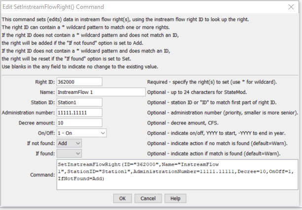

# StateDMI / Command / SetInstreamFlowRight #

* [Overview](#overview)
* [Command Editor](#command-editor)
* [Command Syntax](#command-syntax)
* [Examples](#examples)
* [Troubleshooting](#troubleshooting)
* [See Also](#see-also)

-------------------------

## Overview ##

The `SetInstreamFlowRight` command (for StateMod)
sets data in existing instream flow rights or adds a new instream flow right.
If a new right is added, it is added in alphabetical order according to the right identifier.
Instream flow rights may be defined for a variety of reasons for modeling purposes where a flow needs to be ensured.

## Command Editor ##

The following dialog is used to edit the command and illustrates the command syntax.

**<p style="text-align: center;">

</p>**

**<p style="text-align: center;">
`SetInstreamFlowRight` Command Editor (<a href="../SetInstreamFlowRight.png">see also the full-size image</a>)
</p>**

## Command Syntax ##

The command syntax is as follows:

```text
SetInstreamFlowRight(Parameter="Value",...)
```
**<p style="text-align: center;">
Command Parameters
</p>**

| **Parameter**&nbsp;&nbsp;&nbsp;&nbsp;&nbsp;&nbsp;&nbsp;&nbsp;&nbsp;&nbsp;&nbsp;&nbsp;&nbsp;&nbsp;&nbsp;&nbsp;&nbsp;&nbsp;&nbsp;&nbsp;&nbsp;&nbsp;&nbsp;&nbsp;&nbsp;&nbsp; | **Description** | **Default**&nbsp;&nbsp;&nbsp;&nbsp;&nbsp;&nbsp;&nbsp;&nbsp;&nbsp;&nbsp;&nbsp;&nbsp;&nbsp;&nbsp;&nbsp;&nbsp;&nbsp;&nbsp;&nbsp;&nbsp; |
| --------------|-----------------|----------------- |
| `ID`<br>**required** | A single instream flow right identifier to match or a pattern using wildcards (e.g., `20*`). | None – must be specified. |
| `Name` | The name to be assigned for all matching instream flow Stations. | If not specified, the original value will remain. |
| `StationID` | The instream flow station identifier to be assigned for all matching instream flow Stations. | If not specified, the original value will remain. |
| `AdministrationNumber` | The administration number to be assigned for all matching instream flow Stations. | If not specified, the original value will remain. |
| `Decree` | The water right decree to be assigned for all matching instream flow Stations. | If not specified, the original value will remain. |
| `OnOff` | The on/off switch value to be assigned for all matching instream flow Stations, either `1` for on or `0` for off, a positive 4-digit year to turn the right on starting in the year, or a negative 4-digit year to turn the right off starting in the year. | If not specified, the original value will remain. |
| `IfNotFound` | Used for error handling, one of the following:<ul><li>`Add` – add the instream flow right if the ID is not matched and is not a wildcard</li><li>`Fail` – generate a failure message if the ID is not matched</li><li>`Ignore` – ignore (don’t add and don’t generate a message) if the ID is not matched</li><li>`Warn` – generate a warning message if the ID is not matched</li></ul> | `Warn` |
| `IfFound` | Used for error handling, one of the following:<ul><li>`Set` – set the instream flow right, overwriting previous values if the ID is matched</li><li>`Fail` – generate a failure message if the ID is matched</li><li>`Ignore` – ignore (don’t add and don’t generate a message) if the ID is matched</li><li>`Warn` – generate a warning message if the ID is matched</li></ul> | `Warn` |

## Examples ##

See the [automated tests](https://github.com/OpenCDSS/cdss-app-statedmi-test/tree/master/test/regression/commands/SetInstreamFlowRight).

## Troubleshooting ##

[See the main troubleshooting documentation](../../troubleshooting/troubleshooting.md)

## See Also ##

* [`FillInstreamFlowRight`](../FillInstreamFlowRight/FillInstreamFlowRight.md) command
