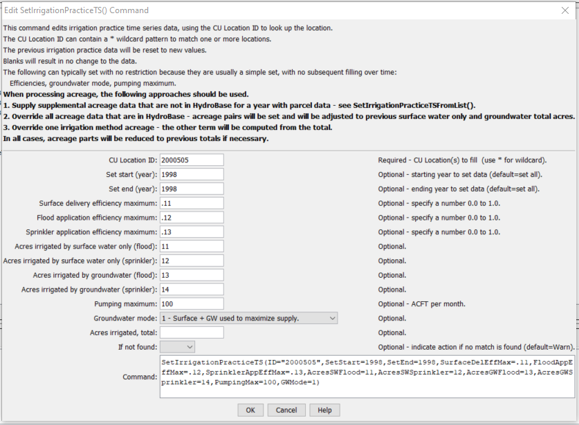

# StateDMI / Command / SetIrrigationPracticeTS #

* [Overview](#overview)
* [Command Editor](#command-editor)
* [Command Syntax](#command-syntax)
* [Examples](#examples)
* [Troubleshooting](#troubleshooting)
* [See Also](#see-also)

-------------------------

## Overview ##

The `SetIrrigationPracticeTS` command (for StateCU)
sets irrigation practice time series data for a CU Location.
Setting acreage values results in a cascade of adjustments to maintain sums, and will be noted in the log file.
Preference is given to maintaining the total acreage, then groundwater acreage, and then surface water acreage.
Irrigation method within groundwater will agree with the total and the sprinkler and
flood acreage will be prorated based on previous values if necessary to adjust to the total.
Similar adjustments are made to surface water acreage.

## Command Editor ##

The following dialog is used to edit the command and illustrates the command syntax.

**<p style="text-align: center;">

</p>**

**<p style="text-align: center;">
`SetIrrigationPracticeTS` Command Editor (<a href="../SetIrrigationPracticeTS.png">see also the full-size image</a>)
</p>**

## Command Syntax ##

The command syntax is as follows:

```text
SetIrrigationPracticeTS(Parameter="Value",...)
```
**<p style="text-align: center;">
Command Parameters
</p>**

| **Parameter**&nbsp;&nbsp;&nbsp;&nbsp;&nbsp;&nbsp;&nbsp;&nbsp;&nbsp;&nbsp;&nbsp;&nbsp;&nbsp;&nbsp;&nbsp;&nbsp;&nbsp;&nbsp;&nbsp;&nbsp; | **Description** | **Default**&nbsp;&nbsp;&nbsp;&nbsp;&nbsp;&nbsp;&nbsp;&nbsp;&nbsp;&nbsp; |
| --------------|-----------------|----------------- |
| `ID`<br>**required** | A single CU Location identifier to match or a pattern using wildcards (e.g., `20*`). | None – must be specified. |
| `SetStart` | The first year to set data values. | If not specified, data are set for the full output period. |
| `SetEnd` | The last year to set data values. | If not specified, data are set for the full output period. |
| `SurfaceDelEffMax` | Surface water delivery efficiency maximum (`0.0` to `1.0`). | If not specified, the original value will remain. |
| `FloodAppEffMax` | Flood application efficiency maximum (0.0 to 1.0). | If not specified, the original value will remain. |
| `SprinklerAppEffMax` | Sprinkler application efficiency maximum (`0.0` to `1.0`). | If not specified, the original value will remain. |
| `AcresSWFlood` | Acres irrigated by surface water, flood irrigation. | If not specified, the original value will remain, or will recompute based on other set values. |
| `AcresSWSprinkler` | Acres irrigated by surface water, sprinkler irrigation. | If not specified, the original value will remain, or will recompute based on other set values. |
| `AcresGWFlood` | Acres irrigated by groundwater, flood irrigation. | If not specified, the original value will remain, or will recompute based on other set values. |
| `AcresGWSprinkler` | Acres irrigated by groundwater, sprinkler irrigation. | If not specified, the original value will remain, or will recompute based on other set values. |
| `PumpingMax` | Maximum pumping, AF/M. | If not specified, the original value will remain. |
| `GWMode` | Groundwater mode (see StateCU documentation). | If not specified, the original value will remain. |
| `AcresTotal` | Total acres for location.  This is normally set from the crop pattern time series data. | If not specified, the original value will remain. |
| `IfNotFound` | Used for error handling, one of the following:<ul><li>`Fail` – generate a failure message if the ID is not matched</li><li>`Ignore` – ignore (don’t add and don’t generate a message) if the ID is not matched</li><li>`Warn` – generate a warning message if the ID is not matched</li></ul> | `Warn` |

## Examples ##

See the [automated tests](https://github.com/OpenCDSS/cdss-app-statedmi-test/tree/master/test/regression/commands/SetIrrigationPracticeTS).

The following command file illustrates how to process the irrigation practice time series file where groundwater supply is used:

```
#
# Sp2008L_DDH.StateDMI
# _____________________________________________________________________________
#
# StartLog(LogFile="SP_IPY.log")
SetOutputPeriod(OutputStart="01/1950",OutputEnd="12/2006")
# Step 1 - Read CU Locations from list
#
ReadCULocationsFromList(ListFile="..\Sp2008L_StructList.csv",IDCol=1)
#
# Step 2 - Read SW aggregates, GW aggregates, and divsystems
#
SetDiversionAggregateFromList(ListFile="..\Sp2008L_SWAgg.csv",IDCol=1,NameCol=2,PartIDsCol=3,PartsListedHow=InColumn)
SetDiversionSystemFromList(ListFile="..\Sp2008L_DivSys_CDS.csv",IDCol=1,NameCol=2,PartIDsCol=3,PartsListedHow=InRow)
#
SetWellSystemFromList(ListFile="..\SP_GWAgg_1956.csv",Year=1956,Div=1,PartType=Parcel,IDCol=1,PartIDsCol=2,PartsListedHow=InColumn)
SetWellSystemFromList(ListFile="..\SP_GWAgg_1976.csv",Year=1976,Div=1,PartType=Parcel,IDCol=1,PartIDsCol=2,PartsListedHow=InColumn)
SetWellSystemFromList(ListFile="..\SP_GWAgg_1987.csv",Year=1987,Div=1,PartType=Parcel,IDCol=1,PartIDsCol=2,PartsListedHow=InColumn)
SetWellSystemFromList(ListFile="..\SP_GWAgg_2001.csv",Year=2001,Div=1,PartType=Parcel,IDCol=1,PartIDsCol=2,PartsListedHow=InColumn)
SetWellSystemFromList(ListFile="..\SP_GWAgg_2005.csv",Year=2005,Div=1,PartType=Parcel,IDCol=1,PartIDsCol=2,PartsListedHow=InColumn)
#
# Step 3 - Create form for *.ipy file
CreateIrrigationPracticeTSForCULocations(ID="*")
#
# Step 4 - Set conveyance efficiencies from file for key and sw aggregate structures - NOT in HydroBase
SetIrrigationPracticeTSFromList(ListFile="Sp2008L_Eff.csv",ID="*",SetStart=1950,SetEnd=2006,IDCol="1",SurfaceDelEffMaxCol="3")
#
# Step 5 - set max flood and surface water efficiencies and GWmode - NOT in HydroBase
SetIrrigationPracticeTS(ID="*",SetStart=1950,SetEnd=2006,FloodAppEffMax=.6,SprinklerAppEffMax=.8,GWMode=2)
#
# Step 6 - Read well rights file and Set Max pumping (use merged *.wer file)
ReadWellRightsFromStateMod(InputFile="..\Wells\Sp2008L.wer")
SetIrrigationPracticeTSPumpingMaxUsingWellRights(ID="*",IncludeSurfaceWaterSupply=True,IncludeGroundwaterOnlySupply="True",NumberOfDaysInMonth=30.4)
# Step 7 - Read category acreage from HydroBase
ReadIrrigationPracticeTSFromHydroBase(ID="*",Div="1")
#
# Step 8 - Read total acreage from *.cds file and Set total for *.ipy file
ReadCropPatternTSFromStateCU(InputFile="Sp2008L.cds")
SetIrrigationPracticeTSTotalAcreageToCropPatternTSTotalAcreage(ID="*")
#
# Step 9 - Estimate 1950 ground water acreage based on active wells as defined in the non-merged *.wer file
#
ReadWellRightsFromStateMod(InputFile="..\Wells\Sp2008L_NotMerged.wer",Append=False)
FillIrrigationPracticeTSAcreageUsingWellRights(ID="*",IncludeSurfaceWaterSupply=True,IncludeGroundwaterOnlySupply="True",FillStart=1950,FillEnd=1955,ParcelYear=1956)
#
# Step 10 - Fill Interpolate Acreage Type (SW and GW) 1956-2006
# Step 11a - estimate total GW and total SW
FillIrrigationPracticeTSInterpolate(ID="*",DataType="CropArea-GroundWater",FillStart="1956",FillEnd="1976")
FillIrrigationPracticeTSInterpolate(ID="*",DataType="CropArea-GroundWater",FillStart="1976",FillEnd="1987")
FillIrrigationPracticeTSInterpolate(ID="*",DataType="CropArea-GroundWater",FillStart="1987",FillEnd="2001")
FillIrrigationPracticeTSInterpolate(ID="*",DataType="CropArea-GroundWater",FillStart="2001",FillEnd="2005")
FillIrrigationPracticeTSRepeat(ID="*",DataType="CropArea-GroundWater",FillStart="2005",FillEnd="2006",FillDirection="Forward")
#
# Step 11b - set sprinkler to zero in early period
SetIrrigationPracticeTS(ID="*",SetStart=1950,SetEnd=1969,AcresSWSprinkler=0,AcresGWSprinkler=0)
#
# Step 11c - fill remaining irrigation method values
FillIrrigationPracticeTSInterpolate(ID="*",DataType="CropArea-SurfaceWaterOnlySprinkler",FillStart="1969",FillEnd="1976")
FillIrrigationPracticeTSInterpolate(ID="*",DataType="CropArea-SurfaceWaterOnlySprinkler",FillStart="1976",FillEnd="1987")
FillIrrigationPracticeTSInterpolate(ID="*",DataType="CropArea-SurfaceWaterOnlySprinkler",FillStart="1987",FillEnd="2001")
FillIrrigationPracticeTSInterpolate(ID="*",DataType="CropArea-SurfaceWaterOnlySprinkler",FillStart="2001",FillEnd="2005")
FillIrrigationPracticeTSRepeat(ID="*",DataType="CropArea-SurfaceWaterOnlySprinkler",FillStart="2005",FillEnd="2006",FillDirection="Forward")
FillIrrigationPracticeTSInterpolate(ID="*",DataType="CropArea-GroundWaterSprinkler",FillStart="1969",FillEnd="1976")
FillIrrigationPracticeTSInterpolate(ID="*",DataType="CropArea-GroundWaterSprinkler",FillStart="1976",FillEnd="1987")
FillIrrigationPracticeTSInterpolate(ID="*",DataType="CropArea-GroundWaterSprinkler",FillStart="1987",FillEnd="2001")
FillIrrigationPracticeTSInterpolate(ID="*",DataType="CropArea-GroundWaterSprinkler",FillStart="2001",FillEnd="2005")
FillIrrigationPracticeTSRepeat(ID="*",DataType="CropArea-GroundWaterSprinkler",FillStart="2005",FillEnd="2006",FillDirection="Forward")
#
# Step 12 - Set Acreage = 0 for structures that are in diversion systems, so acreage is not double accounted
SetIrrigationPracticeTS(ID="0100503_D",SetStart=1950,SetEnd=2006,AcresSWFlood=0,AcresSWSprinkler=0,AcresGWFlood=0,AcresGWSprinkler=0,PumpingMax=0,AcresTotal=0)
SetIrrigationPracticeTS(ID="0100507_D",SetStart=1950,SetEnd=2006,AcresSWFlood=0,AcresSWSprinkler=0,AcresGWFlood=0,AcresGWSprinkler=0,PumpingMax=0,AcresTotal=0)
SetIrrigationPracticeTS(ID="0100687",SetStart=1950,SetEnd=2006,AcresSWFlood=0,AcresSWSprinkler=0,AcresGWFlood=0,AcresGWSprinkler=0,PumpingMax=0,AcresTotal=0)
#
SetIrrigationPracticeTS(ID="0200834",SetStart=1950,SetEnd=2006,AcresSWFlood=0,AcresSWSprinkler=0,AcresGWFlood=0,AcresGWSprinkler=0,PumpingMax=0,AcresTotal=0)
#
SetIrrigationPracticeTS(ID="6400511_D",SetStart=1950,SetEnd=2006,AcresSWFlood=0,AcresSWSprinkler=0,AcresGWFlood=0,AcresGWSprinkler=0,PumpingMax=0,AcresTotal=0)
#
# Step 13 - Set Acreage = 0,  1950-2006
SetIrrigationPracticeTS(ID="0100501",SetStart=1950,SetEnd=2006,AcresSWFlood=0,AcresSWSprinkler=0,AcresGWFlood=0,AcresGWSprinkler=0,PumpingMax=0,AcresTotal=0)
SetIrrigationPracticeTS(ID="0100513",SetStart=1950,SetEnd=2006,AcresSWFlood=0,AcresSWSprinkler=0,AcresGWFlood=0,AcresGWSprinkler=0,PumpingMax=0,AcresTotal=0)
SetIrrigationPracticeTS(ID="0100829",SetStart=1950,SetEnd=2006,AcresSWFlood=0,AcresSWSprinkler=0,AcresGWFlood=0,AcresGWSprinkler=0,PumpingMax=0,AcresTotal=0)
#
SetIrrigationPracticeTS(ID="6400519",SetStart=1950,SetEnd=2006,AcresSWFlood=0,AcresSWSprinkler=0,AcresGWFlood=0,AcresGWSprinkler=0,PumpingMax=0,AcresTotal=0)
#
# Step 14 - Write final ipy file
#
WriteIrrigationPracticeTSToStateCU(OutputFile="Sp2008L.ipy",WriteHow=OverwriteFile)
WriteIrrigationPracticeTSToStateCU(OutputFile="..\StateCU\Historic\Sp2008L.ipy",WriteHow=OverwriteFile)
WriteIrrigationPracticeTSToStateCU(OutputFile="..\StateMod\Historic\Sp2008L.ipy",WriteHow=OverwriteFile)
```

## Troubleshooting ##

## See Also ##

* [`FillIrrigationPracticeTSAcreageUsingWellRights`](../FillIrrigationPracticeTSAcreageUsingWellRights/FillIrrigationPracticeTSAcreageUsingWellRights.md) command
* [`FillIrrigationPracticeTSInterpolate`](../FillIrrigationPracticeTSInterpolate/FillIrrigationPracticeTSInterpolate.md) command
* [`FillIrrigationPracticeTSRepeat`](../FillIrrigationPracticeTSRepeat/FillIrrigationPracticeTSRepeat.md) command
* [`SetIrrigationPracticeTSFromList`](../SetIrrigationPracticeTSFromList/SetIrrigationPracticeTSFromList.md) command
* [`SetIrrigationPracticeTSFromStateCU`](../SetIrrigationPracticeTSFromStateCU/SetIrrigationPracticeTSFromStateCU.md) command
* [`SetIrrigationPracticeTSPumpingMaxUsingWellRights`](../SetIrrigationPracticeTSPumpingMaxUsingWellRights/SetIrrigationPracticeTSPumpingMaxUsingWellRights.md) command
* [`SetIrrigationPracticeTSSprinklerAcreageFromList`](../SetIrrigationPracticeTSSprinklerAcreageFromList/SetIrrigationPracticeTSSprinklerAcreageFromList.md) command
* [`SetIrrigationPracticeTSTotalAcreageToCropPatternTSTotalAcreage`](../SetIrrigationPracticeTSTotalAcreageToCropPatternTSTotalAcreage/SetIrrigationPracticeTSTotalAcreageToCropPatternTSTotalAcreage.md) command

### Legacy Commands ###

* [`SetIrrigationPracticeTSFromHydroBase`](../SetIrrigationPracticeTSFromHydroBase/SetIrrigationPracticeTSFromHydroBase.md) command
* [`SetIrrigationPracticeTSMaxPumpingToRights`](../SetIrrigationPracticeTSMaxPumpingToRights/SetIrrigationPracticeTSMaxPumpingToRights.md) command
* [`SetIrrigationPracticeTSSprinklerAreaFromList`](../SetIrrigationPracticeTSSprinklerAreaFromList/SetIrrigationPracticeTSSprinklerAreaFromList.md) command
