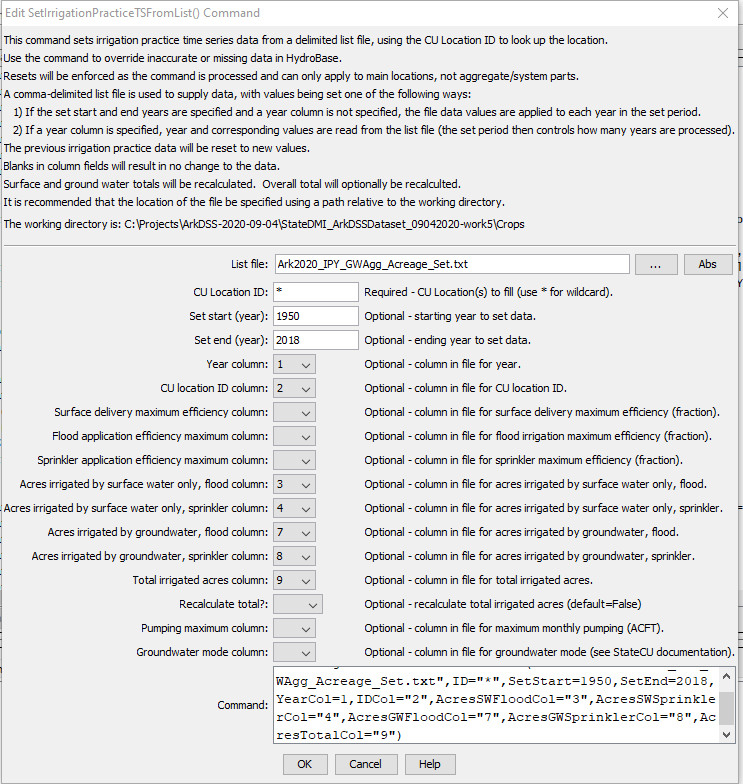

# StateDMI / Command / SetIrrigationPracticeTSFromList #

* [Overview](#overview)
* [Command Editor](#command-editor)
* [Command Syntax](#command-syntax)
* [Examples](#examples)
* [Troubleshooting](#troubleshooting)
* [See Also](#see-also)

-------------------------

## Overview ##

The `SetIrrigationPracticeTSFromList` command (for StateCU)
sets irrigation practice data for existing CU Locations by reading information from a delimited file.
New locations are not added.  The command can be used to set values over a period of 1+ years as follows:

1. If the `SetStart` and `SetEnd` parameters are specified and the year column is not specified,
then repeat the values from the file for each year in the set period.
For example, this can be used to repeat efficiency values through the period.
Or, it can be used to provide acreage data not in HydroBase,
for a specific year (set `SetStart` and `SetEnd` to the same value).
2. If the year column is provided, use the year in the file to specify the year for the set.
In this case, `SetStart` and `SetEnd` control the period of data that will be processed from the file.

HydroBase may not contain all irrigated lands data.
For example, additional lands may have been identified after HydroBase was populated or acreage
must be set for a model identifier that is not a structure WDID in HydroBase (e.g., out of state lands).
In this case, the command can be used to provide additional data to supplement HydroBase.

It is typical that separate `SetIrrigationPracticeTSFromList` commands are
used for different columns of data in the irrigation practice file.
For example, efficiencies may be set with one command and acreage with another command.

The information-only surface water total and groundwater total values will be updated to agree with the acreage parts.
However, no cascading adjustments will occur (as performed by
[`FillIrrigationPracticeTSInterpolate`](../FillIrrigationPracticeTSInterpolate/FillIrrigationPracticeTSInterpolate.md) and other commands).

## Command Editor ##

The following dialog is used to edit the command and illustrates the syntax of the command for repeating
values over the specified period,
with the values being set as the command is processed (omitting the year would repeat the values in all years):

**<p style="text-align: center;">

</p>**

**<p style="text-align: center;">
`SetIrrigationPracticeTSFromList` Command Editor - Repeat Values (<a href="../SetIrrigationPracticeTSFromList.png">see also the full-size image</a>)
</p>**

## Command Syntax ##

The command syntax is as follows:

```text
SetIrrigationPracticeTSFromList(Parameter="Value",...)
```
**<p style="text-align: center;">
Command Parameters
</p>**

| **Parameter**&nbsp;&nbsp;&nbsp;&nbsp;&nbsp;&nbsp;&nbsp;&nbsp;&nbsp;&nbsp;&nbsp;&nbsp;&nbsp;&nbsp;&nbsp;&nbsp;&nbsp;&nbsp;&nbsp;&nbsp;&nbsp;&nbsp;&nbsp;&nbsp;&nbsp;&nbsp;&nbsp;&nbsp; | **Description** | **Default**&nbsp;&nbsp;&nbsp;&nbsp;&nbsp;&nbsp;&nbsp;&nbsp;&nbsp;&nbsp; |
| --------------|-----------------|----------------- |
| `ListFile`<br>**required**| Path to the delimited list file to read. | None – must be specified. |
| `ID`<br>**required**| A single CU location identifier to match or a pattern using wildcards (e.g., `20*`). | None – must be specified. |
| `SetStart` | The first year to set data values. | If not specified, data are set for the full output period. |
| `SetEnd` | The last year to set data values. | If not specified, data are set for the full output period. |
| `YearCol` | The column number (1+) containing the year for data. | The file values are applied to each year in the data set. |
| `IDCol` | The column number (1+) containing the CU Location identifiers.  These values are matched against CU Location identifiers in the existing irrigation practice data. | None – must be specified. |
| `SurfaceDelEffMaxCol` | The column number (1+) containing the surface water delivery efficiency maximum. | If not specified, the previous data values will remain. |
| `FloodAppEffMaxCol` | The column number (1+) containing the flood application efficiency maximum. | If not specified, the previous data values will remain. |
| `SprinklerAppEffMaxCol` | The column number (1+) containing the sprinkler application efficiency maximum. | If not specified, the previous data values will remain. |
| `AcresSWFloodCol` | The column number (1+) containing the surface water flood acres. | If not specified, the previous data values will remain. |
| `AcresSWSprinklerCol` | The column number (1+) containing the surface water sprinkler acres. | If not specified, the previous data values will remain. |
| `AcresGWFloodCol` | The column number (1+) containing the groundwater flood acres. | If not specified, the previous data values will remain. |
| `AcresGWSprinklerCol` | The column number (1+) containing the groundwater sprinkler acres. | If not specified, the previous data values will remain. |
| `AcresTotalCol` | The column number (1+) containing the total acres. | If not specified, the previous data values will remain. |
| `RecalculateTotal` | Indicate whether the total area values should be recalculated from the parts (`False` or `True`).  This can be used if area parts are set but total is not set. | `False` |
| `PumpingMaxCol` | The column number (1+) containing the monthly maximum pumping rate. | If not specified, the previous data values will remain. |
| `GWModeCol` | The column number (1+) containing the groundwater mode value. | If not specified, the previous data values will remain. |

## Examples ##

See the [automated tests](https://github.com/OpenCDSS/cdss-app-statedmi-test/tree/master/test/regression/commands/SetIrrigationPracticeTSFromList).

Data file lines starting with the `#` character are treated as comments.
If the first line’s values are surrounded by double quotes, the line is assumed to indicate column headings.
An example list file for setting efficiencies is shown below (the year would be provided as a parameter and values would apply to all years):

```
200505,0.70,0.7,0.8
200511,0.82,0.7,0.8
200512,0.71,0.7,0.8
200513,0.73,0.7,0.8
20MS01,0.80,0.7,0.8
200517,0.71,0.7,0.8
200518,0.88,0.7,0.8
200528,0.71,0.7,0.8
... etc. ...
```

An example list file for specifying acreage data (not in HydroBase) is shown below
(the year column would be specified as a parameter and values would apply to the year in the list file).
Currently, supplemental acreage data can have only a single irrigation method and supply type.

```
# The following data provide acreage for structures that did not have GIS data
# and consequently no data in HydroBase.  The data are specific to 1998 and are
# used to set the CDS and IPY acres.  The crop is used to provide CDS data.  The
# irrigation method and source are used to provide IPY data.
"ID","Crop","Acres","IrrigationMethod","SupplySource"
200500,GRASS_PASTURE,0,Flood,Surface
200506,GRASS_PASTURE,100,Flood,Surface
200507,GRASS_PASTURE,50,Flood,Surface
200508,GRASS_PASTURE,40,Flood,Surface
200522,GRASS_PASTURE,40,Flood,Surface
200523,GRASS_PASTURE,50,Flood,Surface
200526,GRASS_PASTURE,40,Flood,Surface
200529,GRASS_PASTURE,5,Flood,Surface
200530,GRASS_PASTURE,42,Flood,Surface
200532,GRASS_PASTURE,25,Flood,Surface
200533,GRASS_PASTURE,40,Flood,Surface
... etc...
```

## Troubleshooting ##

[See the main troubleshooting documentation](../../troubleshooting/troubleshooting.md)

## See Also ##

* [`FillIrrigationPracticeTSAcreageUsingWellRights`](../FillIrrigationPracticeTSAcreageUsingWellRights/FillIrrigationPracticeTSAcreageUsingWellRights.md) command
* [`FillIrrigationPracticeTSInterpolate`](../FillIrrigationPracticeTSInterpolate/FillIrrigationPracticeTSInterpolate.md) command
* [`FillIrrigationPracticeTSRepeat`](../FillIrrigationPracticeTSRepeat/FillIrrigationPracticeTSRepeat.md) command
* [`SetIrrigationPracticeTS`](../SetIrrigationPracticeTS/SetIrrigationPracticeTS.md) command
* [`SetIrrigationPracticeTSFromStateCU`](../SetIrrigationPracticeTSFromStateCU/SetIrrigationPracticeTSFromStateCU.md) command
* [`SetIrrigationPracticeTSPumpingMaxUsingWellRights`](../SetIrrigationPracticeTSPumpingMaxUsingWellRights/SetIrrigationPracticeTSPumpingMaxUsingWellRights.md) command
* [`SetIrrigationPracticeTSSprinklerAcreageFromList`](../SetIrrigationPracticeTSSprinklerAcreageFromList/SetIrrigationPracticeTSSprinklerAcreageFromList.md) command
* [`SetIrrigationPracticeTSTotalAcreageToCropPatternTSTotalAcreage`](../SetIrrigationPracticeTSTotalAcreageToCropPatternTSTotalAcreage/SetIrrigationPracticeTSTotalAcreageToCropPatternTSTotalAcreage.md) command

### Legacy Commands ###

* [`SetIrrigationPracticeTSFromHydroBase`](../SetIrrigationPracticeTSFromHydroBase/SetIrrigationPracticeTSFromHydroBase.md) command
* [`SetIrrigationPracticeTSMaxPumpingToRights`](../SetIrrigationPracticeTSMaxPumpingToRights/SetIrrigationPracticeTSMaxPumpingToRights.md) command
* [`SetIrrigationPracticeTSSprinklerAreaFromList`](../SetIrrigationPracticeTSSprinklerAreaFromList/SetIrrigationPracticeTSSprinklerAreaFromList.md) command
