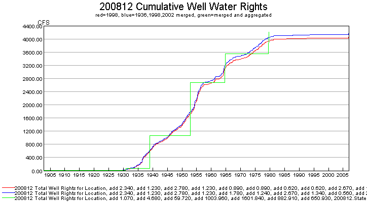
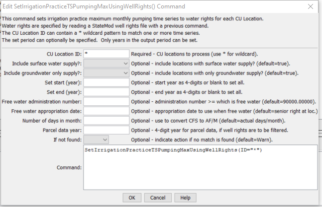

# StateDMI / Command / SetIrrigationPracticeTSPumpingMaxUsingWellRights #

* [Overview](#overview)
* [Command Editor](#command-editor)
* [Command Syntax](#command-syntax)
* [Examples](#examples)
* [Troubleshooting](#troubleshooting)
* [See Also](#see-also)

-------------------------

## Overview ##

The `SetIrrigationPracticeTSPumpingMaxUsingWellRights` command (for StateCU)
sets irrigation practice well pumping maximum time series (yearly)
values to the water rights that were in effect at each year in the period,
based on the appropriation date corresponding to water right administration numbers.
The functionality of this command is similar to the
[`LimitDiversionHistoricalTSMonthlyToRights`](../LimitDiversionHistoricalTSMonthlyToRights/LimitDiversionHistoricalTSMonthlyToRights.md) command;
however, the maximum pumping is simply set to the water rights.
For each CU location being processed that has water supply from one or more wells,
the cumulative rights are determined at each point in time, creating a step-function in CFS units.
Very junior water rights are currently handled similar to other rights;
however, a “free water” concept may be implemented in the future.
The water rights are expected to have been processed with a previous command, for example
[`ReadWellRightsFromStateMod`](../ReadWellRightsFromStateMod/ReadWellRightsFromStateMod.md).
In cases where multiple years of irrigated lands data are available,
it is typical to have merged the water rights from multiple years using the
[`MergeWellRights`](../MergeWellRights/MergeWellRights) command.
Water rights from a file may include the effects of set commands.
A zero flow condition is imposed at the start of the period (when no rights apply) and carried forward until a right is found.

The water rights on/off switch for each StateMod right is handled as follows:

* If the switch is `0` (zero), the water right is ignored in processing (it is not used to increment the decrees in the time series).
* If the switch is `1`, no adjustments are done to the appropriation date for the water right.
* If the switch is `+YYYY` (indicating that the right should turn on in the given year):
	+ If the switch is > the year from the appropriation date, set the right year to the switch.
	This ensures that the right is not turned on earlier than it was appropriated.
* If the switch is `-YYYY` (indicating that the right should turn off after the given year):
	+ This case is not currently handled (the right is ignored as if the switch were zero)
	because standard procedures result in rights that are increasing over time.
	Additional enhancements are needed for this case,
	for example to ensure that the right is present with a positive switch in the early period.

An example of the resulting time series of decrees is shown in the following figure
(this figure was generated by using TSTool to read three well rights files and graphing the rights at location 200812).
Merged rights, since they represent more than one year of well/parcel matching,
will typically result in slightly higher values.  Aggregated rights will result in “blocky” decree time series.

**<p style="text-align: center;">

</p>**

**<p style="text-align: center;">
Cumulative Well Rights (<a href="../SetIrrigationPracticeTSPumpingMaxUsingWellRights0.png">see also the full-size image</a>)
</p>**

A summary of the logic is as follows:

1. For each location, create a time series of decrees from the water rights,
with the result having a monthly time step (since the pumping maximum is AF/M):
	1. Determine the water rights for the CU location.
	If no rights are available, set the water right time series to zero and skip the remaining steps.
	2. Initialize the decree time series to zero for the period.
	3. For each right, convert the administration number to appropriation date.
	Use the same code as the ***Tools / Administration Number Calculator*** tool in StateDMI.
	The prior adjudication date associated with the administration number is ignored.
	4. Check the on/off switch.  See the explanation above for how the water rights switch is handled.
	5. Add the decree value from the appropriation date (year and month) to the end of the output period.
2. Determine the irrigation practice pumping maximum time series:
	1. If no irrigation practice time series is available, skip the remaining steps.
	2. Loop through each month in the period and get the decree value from the step 1 .above.
	Because the decrees are in CFS, convert to ACFT,
	considering the number of days in each month, to determine a maximum pumping ACFT per month:<br><br>
	*Pumping = Decree*1.9835*NumberOfDaysInMonth*<br><br>
	Because of the conversion from CSFS to ACFT, monthly values in the step function
	will vary unless the NumberOfDaysInMonth parameter is specified.
	3.Using the monthly maximum values (January through December),
	determine and set the maximum monthly pumping for a year.
	The step-function will then use dates with a yearly precision because the value in the
	irrigation practice time series is the maximum monthly pumping in each year.

## Command Editor ##

The following dialog is used to edit the command and illustrates the command syntax.

**<p style="text-align: center;">

</p>**

**<p style="text-align: center;">
`SetIrrigationPracticeTSPumpingMaxUsingWellRights` Command Editor (<a href="../SetIrrigationPracticeTSPumpingMaxUsingWellRights.png">see also the full-size image</a>)
</p>**

## Command Syntax ##

The command syntax is as follows:

```text
SetIrrigationPracticeTSPumpingMaxUsingWellRights(Parameter="Value",...)
```
**<p style="text-align: center;">
Command Parameters
</p>**

| **Parameter**&nbsp;&nbsp;&nbsp;&nbsp;&nbsp;&nbsp;&nbsp;&nbsp;&nbsp;&nbsp;&nbsp;&nbsp;&nbsp;&nbsp;&nbsp;&nbsp;&nbsp;&nbsp;&nbsp;&nbsp;&nbsp;&nbsp;&nbsp;&nbsp;&nbsp;&nbsp;&nbsp;&nbsp;&nbsp;&nbsp;&nbsp;&nbsp;&nbsp;&nbsp;&nbsp;&nbsp;&nbsp;&nbsp;&nbsp;&nbsp;&nbsp;&nbsp;&nbsp; | **Description** | **Default**&nbsp;&nbsp;&nbsp;&nbsp;&nbsp;&nbsp;&nbsp;&nbsp;&nbsp;&nbsp;&nbsp;&nbsp;&nbsp;&nbsp;&nbsp;&nbsp;&nbsp;&nbsp; |
| --------------|-----------------|----------------- |
| `ID` | A single CU location identifier to match or a pattern using wildcards (e.g., `20*`). | None – must be specified. |
| `IncludeSurfaceWaterSupply` | Indicate whether locations with surface water supply should be included in processing.  These locations are determined as being any other than groundwater only locations.  This parameter is included to facilitate evaluating the overall approach. | `True` |
| `IncludeGroundwaterOnlySupply` | Indicate whether locations with only groundwater supply should be included in processing.  These locations are determined as being systems or aggregates specified by a list of parcels.  This parameter is included to facilitate evaluating the overall approach. | `True` |
| `SetStart` | The starting year to set pumping maximum to water rights.  This is typically blank. | `OutputStart` set by the [`SetOutputPeriod`](../SetOutputPeriod/SetOutputPeriod.md) command. |
| `SetEnd` | The ending year to set pumping maximum to water rights.  This is typically blank. | `OutputEnd` set by the [`SetOutputPeriod`](../SetOutputPeriod/SetOutputPeriod.md) command. |
| `FreeWaterMethod` | This parameter has not been added but may be added in the future, to control how “free water rights” (those with very junior administration numbers, such as `90000.00000`) are handled.  In general, free water rights should not apply to well rights and this parameter may never be implemented.  Possible values are:<ul><li>`AlwaysOn` –Free water rights are always on for the full period.</li><li>`AsSpecified` – use the administration number for the water right as specified.  Typically this will result in the right only being in effect in the future and having no impact on the modeling period for this command.</li><li>`UseSeniorRightAppropriationDate` – use the appropriation date for the senior water right for the location.  Consequently, the water right is active for the full period that other water rights are active.</li></ul> | `AsSpecified` |
| `FreeWaterAdministrationNumber` | This parameter is currently not used since `FreeWaterMethod=AsSpecified` is the default.  The administration number >= to which the right is considered a “free water” right, typically `90000.00000` or higher. | None. |
| `FreeWaterAppropriationDate` | This parameter is currently not used since `FreeWaterMethod=AsSpecified` is the default.  A date to be used for the free water rights found in the rights file, when no other date can be determined (e.g., no senior water for `FreeWaterMethod=UseSeniorRightAppropriationDate`). | None. |
| `NumberOfDaysInMonth` | The number of days in a month when converting decree CFS to AF/M (acre-feet/month).  This is used when a constant value is needed.  For example, the StateCU model uses 30.4 days per month. | Use the number of days in the specific month. |
| `ParcelYear` | The year of parcel/well matching data to use for water rights.  This can be used if the StateMod well rights file was written with parcel year, for example with [`WriteWellRightsToStateMod(..., WriteDataComments=True,...)`](../WriteWellRightsToStateMod/WriteWellRightsToStateMod.md).  This is useful if evaluating the differences between rights determined with different years of parcel/well matching data, and rights from merged years. | Blank – use all water rights. |
| `IfNotFound` | Used for error handling, one of the following:<ul><li>Fail – generate a failure message if the ID is not matched</li><li>Ignore – ignore (don’t add and don’t generate a message) if the ID is not matched</li><li>Warn – generate a warning message if the ID is not matched</li></ul> | Warn |

## Examples ##

See the [automated tests](https://github.com/OpenCDSS/cdss-app-statedmi-test/tree/master/test/regression/commands/SetIrrigationPracticeTSPumpingMaxUsingWellRights).

The following command file illustrates how to process the irrigation practice time series file where groundwater supply is used:

```
# Sp2008L_DDH.StateDMI
StartLog(LogFile="SP_IPY.log")
SetOutputPeriod(OutputStart="01/1950",OutputEnd="12/2006")
# Step 1 - Read CU Locations from list
ReadCULocationsFromList(ListFile="..\Sp2008L_StructList.csv",IDCol=1)
# Step 2 - Read SW aggregates, GW aggregates, and divsystems
#
SetDiversionAggregateFromList(ListFile="..\Sp2008L_SWAgg.csv",IDCol=1,NameCol=2,PartIDsCol=3,PartsListedHow=InColumn)
SetDiversionSystemFromList(ListFile="..\Sp2008L_DivSys_CDS.csv",IDCol=1,NameCol=2,PartIDsCol=3,PartsListedHow=InRow)
#
SetWellSystemFromList(ListFile="..\SP_GWAgg_1956.csv",Year=1956,Div=1,PartType=Parcel,IDCol=1,PartIDsCol=2,PartsListedHow=InColumn)
SetWellSystemFromList(ListFile="..\SP_GWAgg_1976.csv",Year=1976,Div=1,PartType=Parcel,IDCol=1,PartIDsCol=2,PartsListedHow=InColumn)
SetWellSystemFromList(ListFile="..\SP_GWAgg_1987.csv",Year=1987,Div=1,PartType=Parcel,IDCol=1,PartIDsCol=2,PartsListedHow=InColumn)
SetWellSystemFromList(ListFile="..\SP_GWAgg_2001.csv",Year=2001,Div=1,PartType=Parcel,IDCol=1,PartIDsCol=2,PartsListedHow=InColumn)
SetWellSystemFromList(ListFile="..\SP_GWAgg_2005.csv",Year=2005,Div=1,PartType=Parcel,IDCol=1,PartIDsCol=2,PartsListedHow=InColumn)
# Step 3 - Create form for *.ipy file
CreateIrrigationPracticeTSForCULocations(ID="*")
#
# Step 4 - Set conveyance efficiencies from file for key and sw aggregate structures - NOT in HydroBase
SetIrrigationPracticeTSFromList(ListFile="Sp2008L_Eff.csv",ID="*",SetStart=1950,SetEnd=2006,IDCol="1",SurfaceDelEffMaxCol="3")
#
# Step 5 - set max flood and surface water efficiencies and GWmode - NOT in HydroBase
SetIrrigationPracticeTS(ID="*",SetStart=1950,SetEnd=2006,FloodAppEffMax=.6,SprinklerAppEffMax=.8,GWMode=2)
#
# Step 6 - Read well rights file and Set Max pumping (use merged *.wer file)
ReadWellRightsFromStateMod(InputFile="..\Wells\Sp2008L.wer")
SetIrrigationPracticeTSPumpingMaxUsingWellRights(ID="*",IncludeSurfaceWaterSupply=True,IncludeGroundwaterOnlySupply="True",NumberOfDaysInMonth=30.4)
# Step 7 - Read category acreage from HydroBase
ReadIrrigationPracticeTSFromHydroBase(ID="*",Div="1")
#
# Step 8 - Read total acreage from *.cds file and Set total for *.ipy file
ReadCropPatternTSFromStateCU(InputFile="Sp2008L.cds")
SetIrrigationPracticeTSTotalAcreageToCropPatternTSTotalAcreage(ID="*")
#
# Step 9 - Estimate 1950 ground water acreage based on active wells as defined in the non-merged *.wer file
#
ReadWellRightsFromStateMod(InputFile="..\Wells\Sp2008L_NotMerged.wer",Append=False)
FillIrrigationPracticeTSAcreageUsingWellRights(ID="*",IncludeSurfaceWaterSupply=True,IncludeGroundwaterOnlySupply="True",FillStart=1950,FillEnd=1955,ParcelYear=1956)
#
# Step 10 - Fill Interpolate Acreage Type (SW and GW) 1956-2006
# Step 11a - estimate total GW and total SW
FillIrrigationPracticeTSInterpolate(ID="*",DataType="CropArea-GroundWater",FillStart="1956",FillEnd="1976")
FillIrrigationPracticeTSInterpolate(ID="*",DataType="CropArea-GroundWater",FillStart="1976",FillEnd="1987")
FillIrrigationPracticeTSInterpolate(ID="*",DataType="CropArea-GroundWater",FillStart="1987",FillEnd="2001")
FillIrrigationPracticeTSInterpolate(ID="*",DataType="CropArea-GroundWater",FillStart="2001",FillEnd="2005")
FillIrrigationPracticeTSRepeat(ID="*",DataType="CropArea-GroundWater",FillStart="2005",FillEnd="2006",FillDirection="Forward")
#
# Step 11b - set sprinkler to zero in early period
SetIrrigationPracticeTS(ID="*",SetStart=1950,SetEnd=1969,AcresSWSprinkler=0,AcresGWSprinkler=0)
#
# Step 11c - fill remaining irrigation method values
FillIrrigationPracticeTSInterpolate(ID="*",DataType="CropArea-SurfaceWaterOnlySprinkler",FillStart="1969",FillEnd="1976")
FillIrrigationPracticeTSInterpolate(ID="*",DataType="CropArea-SurfaceWaterOnlySprinkler",FillStart="1976",FillEnd="1987")
FillIrrigationPracticeTSInterpolate(ID="*",DataType="CropArea-SurfaceWaterOnlySprinkler",FillStart="1987",FillEnd="2001")
FillIrrigationPracticeTSInterpolate(ID="*",DataType="CropArea-SurfaceWaterOnlySprinkler",FillStart="2001",FillEnd="2005")
FillIrrigationPracticeTSRepeat(ID="*",DataType="CropArea-SurfaceWaterOnlySprinkler",FillStart="2005",FillEnd="2006",FillDirection="Forward")
FillIrrigationPracticeTSInterpolate(ID="*",DataType="CropArea-GroundWaterSprinkler",FillStart="1969",FillEnd="1976")
FillIrrigationPracticeTSInterpolate(ID="*",DataType="CropArea-GroundWaterSprinkler",FillStart="1976",FillEnd="1987")
FillIrrigationPracticeTSInterpolate(ID="*",DataType="CropArea-GroundWaterSprinkler",FillStart="1987",FillEnd="2001")
FillIrrigationPracticeTSInterpolate(ID="*",DataType="CropArea-GroundWaterSprinkler",FillStart="2001",FillEnd="2005")
FillIrrigationPracticeTSRepeat(ID="*",DataType="CropArea-GroundWaterSprinkler",FillStart="2005",FillEnd="2006",FillDirection="Forward")
#
# Step 12 - Set Acreage = 0 for structures that are in diversion systems, so acreage is not double counted
SetIrrigationPracticeTS(ID="0100503_D",SetStart=1950,SetEnd=2006,AcresSWFlood=0,AcresSWSprinkler=0,AcresGWFlood=0,AcresGWSprinkler=0,PumpingMax=0,AcresTotal=0)
SetIrrigationPracticeTS(ID="0100507_D",SetStart=1950,SetEnd=2006,AcresSWFlood=0,AcresSWSprinkler=0,AcresGWFlood=0,AcresGWSprinkler=0,PumpingMax=0,AcresTotal=0)
SetIrrigationPracticeTS(ID="0100687",SetStart=1950,SetEnd=2006,AcresSWFlood=0,AcresSWSprinkler=0,AcresGWFlood=0,AcresGWSprinkler=0,PumpingMax=0,AcresTotal=0)
#
SetIrrigationPracticeTS(ID="0200834",SetStart=1950,SetEnd=2006,AcresSWFlood=0,AcresSWSprinkler=0,AcresGWFlood=0,AcresGWSprinkler=0,PumpingMax=0,AcresTotal=0)
#
SetIrrigationPracticeTS(ID="6400511_D",SetStart=1950,SetEnd=2006,AcresSWFlood=0,AcresSWSprinkler=0,AcresGWFlood=0,AcresGWSprinkler=0,PumpingMax=0,AcresTotal=0)
#
# Step 13 - Set Acreage = 0,  1950-2006
SetIrrigationPracticeTS(ID="0100501",SetStart=1950,SetEnd=2006,AcresSWFlood=0,AcresSWSprinkler=0,AcresGWFlood=0,AcresGWSprinkler=0,PumpingMax=0,AcresTotal=0)
SetIrrigationPracticeTS(ID="0100513",SetStart=1950,SetEnd=2006,AcresSWFlood=0,AcresSWSprinkler=0,AcresGWFlood=0,AcresGWSprinkler=0,PumpingMax=0,AcresTotal=0)
SetIrrigationPracticeTS(ID="0100829",SetStart=1950,SetEnd=2006,AcresSWFlood=0,AcresSWSprinkler=0,AcresGWFlood=0,AcresGWSprinkler=0,PumpingMax=0,AcresTotal=0)
#
SetIrrigationPracticeTS(ID="6400519",SetStart=1950,SetEnd=2006,AcresSWFlood=0,AcresSWSprinkler=0,AcresGWFlood=0,AcresGWSprinkler=0,PumpingMax=0,AcresTotal=0)
#
# Step 14 - Write final ipy file
#
WriteIrrigationPracticeTSToStateCU(OutputFile="Sp2008L.ipy",WriteHow=OverwriteFile)
```

## Troubleshooting ##

[See the main troubleshooting documentation](../../troubleshooting/troubleshooting.md)

## See Also ##

* [`FillIrrigationPracticeTSAcreageUsingWellRights`](../FillIrrigationPracticeTSAcreageUsingWellRights/FillIrrigationPracticeTSAcreageUsingWellRights.md) command
* [`FillIrrigationPracticeTSInterpolate`](../FillIrrigationPracticeTSInterpolate/FillIrrigationPracticeTSInterpolate.md) command
* [`FillIrrigationPracticeTSRepeat`](../FillIrrigationPracticeTSRepeat/FillIrrigationPracticeTSRepeat.md) command
* [`LimitDiversionHistoricalTSMonthlyToRights`](../LimitDiversionHistoricalTSMonthlyToRights/LimitDiversionHistoricalTSMonthlyToRights.md) command
* [`MergeWellRights`](../MergeWellRights/MergeWellRights) command
* [`ReadWellRightsFromStateMod`](../ReadWellRightsFromStateMod/ReadWellRightsFromStateMod.md) command
* [`SetIrrigationPracticeTS`](../SetIrrigationPracticeTS/SetIrrigationPracticeTS.md) command
* [`SetIrrigationPracticeTSFromList`](../SetIrrigationPracticeTSFromList/SetIrrigationPracticeTSFromList.md) command
* [`SetIrrigationPracticeTSFromStateCU`](../SetIrrigationPracticeTSFromStateCU/SetIrrigationPracticeTSFromStateCU.md) command
* [`SetIrrigationPracticeTSSprinklerAcreageFromList`](../SetIrrigationPracticeTSSprinklerAcreageFromList/SetIrrigationPracticeTSSprinklerAcreageFromList.md) command
* [`SetIrrigationPracticeTSTotalAcreageToCropPatternTSTotalAcreage`](../SetIrrigationPracticeTSTotalAcreageToCropPatternTSTotalAcreage/SetIrrigationPracticeTSTotalAcreageToCropPatternTSTotalAcreage.md) command
* [`SetOutputPeriod`](../SetOutputPeriod/SetOutputPeriod.md) command
* [`WriteWellRightsToStateMod`](../WriteWellRightsToStateMod/WriteWellRightsToStateMod.md) command

### Legacy Commands ###

* [`SetIrrigationPracticeTSFromHydroBase`](../SetIrrigationPracticeTSFromHydroBase/SetIrrigationPracticeTSFromHydroBase.md) command
* [`SetIrrigationPracticeTSMaxPumpingToRights`](../SetIrrigationPracticeTSMaxPumpingToRights/SetIrrigationPracticeTSMaxPumpingToRights.md) command
* [`SetIrrigationPracticeTSSprinklerAreaFromList`](../SetIrrigationPracticeTSSprinklerAreaFromList/SetIrrigationPracticeTSSprinklerAreaFromList.md) command
