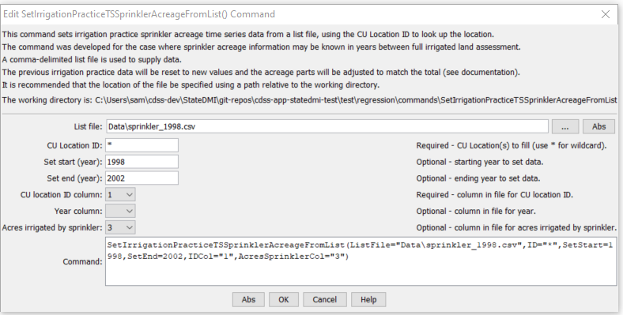

# StateDMI / Command / SetIrrigationPracticeTSSprinklerAcreageFromList #

* [Overview](#overview)
* [Command Editor](#command-editor)
* [Command Syntax](#command-syntax)
* [Examples](#examples)
* [Troubleshooting](#troubleshooting)
* [See Also](#see-also)

-------------------------

## Overview ##

The `SetIrrigationPracticeTSSprinklerAcreageFromList` command (for StateCU)
sets irrigation practice time series sprinkler acreage data for a CU Location, using data from a list file,
and adjusts other acreage terms accordingly to maintain the total acreage.
This command is typically applied after all other data read and filling occurs,
in order to utilize sprinkler acreage data that has been obtained for historical years.
For example, the command is used in the Río Grande because user supplied sprinkler data are available,
but may not be applied in the South Platte, where more years of irrigated lands data are in HydroBase.
The list file typically contains sprinkler acreage by model location for the full
period and may have been interpolated between observations and repeated on the ends of the period.

Prerequisites:

1. This command should be executed after the irrigation practice time series are read from HydroBase (see
[`ReadIrrigationPracticeTSFromHydroBase`](../ReadIrrigationPracticeTSFromHydroBase/ReadIrrigationPracticeTSFromHydroBase.md)).
2. Total acreage has been set to the crop pattern time series total (see
[`SetIrrigationPracticeTSTotalAcreageToCropPatternTSTotalAcreage`](../SetIrrigationPracticeTSTotalAcreageToCropPatternTSTotalAcreage/SetIrrigationPracticeTSTotalAcreageToCropPatternTSTotalAcreage.md)).
The total acres are needed for checks.
3. The groundwater acreage should also have been filled using well rights before the first year of observations using
[`FillIrrigationPracticeTSAcreageUsingWellRights`](../FillIrrigationPracticeTSAcreageUsingWellRights/FillIrrigationPracticeTSAcreageUsingWellRights.md).
4. The surface water acreage should have been filled during the early period using
[`FillIrrigationPracticeTSInterpolate`](../FillIrrigationPracticeTSInterpolate/FillIrrigationPracticeTSInterpolate.md).
5. The end of the period should have acreage filled using
[`FillIrrigationPracticeTSRepeat`](../FillIrrigationPracticeTSRepeat/FillIrrigationPracticeTSRepeat.md).

## Command Editor ##

The following dialog is used to edit the command and illustrates the command syntax.

**<p style="text-align: center;">

</p>**

**<p style="text-align: center;">
`SetIrrigationPracticeTSSprinklerAcreageFromList` Command Editor (<a href="../SetIrrigationPracticeTSSprinklerAcreageFromList.png">see also the full-size image</a>)
</p>**

The sprinkler list file is processed one record at a time.  The following check is done after setting the sprinkler acreage for a location and year:

1. Set the groundwater sprinkler acreage (`GWsprinkler`) to the minimum of the list file
sprinkler acreage (`ListFile`) and the previous groundwater sprinkler value (`GWprev`).
2. Set the surface water sprinkler acreage (`SWsprinkler` to `min((ListFile – GWsprinkler), SWprev)`.
Then ensures that a negative number does not result.
3. Set the groundwater flood acreage (`GWflood`) to the previous groundwater total minus the groundwater sprinkler (`GWsprinkler`) acreage.
This may result in a zero value based on previous adjustments.
4. Set the surface water flood acreage (`SWflood`) to the previous surface water total minus surface water sprinkler acres.
This may result in a zero value based on previous adjustments.

## Command Syntax ##

The command syntax is as follows:

```text
SetIrrigationPracticeTSSprinklerAcreageFromList(Parameter="Value",...)
```
**<p style="text-align: center;">
Command Parameters
</p>**

| **Parameter**&nbsp;&nbsp;&nbsp;&nbsp;&nbsp;&nbsp;&nbsp;&nbsp;&nbsp;&nbsp;&nbsp;&nbsp;&nbsp;&nbsp;&nbsp;&nbsp;&nbsp;&nbsp; | **Description** | **Default**&nbsp;&nbsp;&nbsp;&nbsp;&nbsp;&nbsp;&nbsp;&nbsp;&nbsp;&nbsp; |
| --------------|-----------------|----------------- |
| `ListFile`<br>**required**| Name of comma-delimited file containing sprinkler acreage for locations over time. | None – must be specified. |
| `ID`<br>**required**| A single CU Location identifier to match or a pattern using wildcards (e.g., `20*`). | None – must be specified. |
| `SetStart` | The first year to set data. | If not specified, set the full period, using all available data from the list file. |
| `SetEnd` | The last year to set data.  | If not specified, set the full period, using all available data from the list file. |
| `IDCol` | The column (1+) in the list file containing the location ID. | None – must be specified. |
| `YearCol` | The column (1+) in the list file containing the year. | None – must be specified. |
| `AcresSprinklerCol` | The column (1+) in the list file containing the sprinkler acres for the location and year. | None – must be specified. |

## Examples ##

See the [automated tests](https://github.com/OpenCDSS/cdss-app-statedmi-test/tree/master/test/regression/commands/SetIrrigationPracticeTSSprinklerAcreageFromList).

## Troubleshooting ##

## See Also ##

* [`FillIrrigationPracticeTSAcreageUsingWellRights`](../FillIrrigationPracticeTSAcreageUsingWellRights/FillIrrigationPracticeTSAcreageUsingWellRights.md) command
* [`FillIrrigationPracticeTSInterpolate`](../FillIrrigationPracticeTSInterpolate/FillIrrigationPracticeTSInterpolate.md) command
* [`FillIrrigationPracticeTSRepeat`](../FillIrrigationPracticeTSRepeat/FillIrrigationPracticeTSRepeat.md) command
* [`ReadIrrigationPracticeTSFromHydroBase`](../ReadIrrigationPracticeTSFromHydroBase/ReadIrrigationPracticeTSFromHydroBase.md) command`
* [`SetIrrigationPracticeTS`](../SetIrrigationPracticeTS/SetIrrigationPracticeTS.md) command
* [`SetIrrigationPracticeTSFromList`](../SetIrrigationPracticeTSFromList/SetIrrigationPracticeTSFromList.md) command
* [`SetIrrigationPracticeTSFromStateCU`](../SetIrrigationPracticeTSFromStateCU/SetIrrigationPracticeTSFromStateCU.md) command
* [`SetIrrigationPracticeTSPumpingMaxUsingWellRights`](../SetIrrigationPracticeTSPumpingMaxUsingWellRights/SetIrrigationPracticeTSPumpingMaxUsingWellRights.md) command
* [`SetIrrigationPracticeTSTotalAcreageToCropPatternTSTotalAcreage`](../SetIrrigationPracticeTSTotalAcreageToCropPatternTSTotalAcreage/SetIrrigationPracticeTSTotalAcreageToCropPatternTSTotalAcreage.md) command

### Legacy Commands ###

* [`SetIrrigationPracticeTSFromHydroBase`](../SetIrrigationPracticeTSFromHydroBase/SetIrrigationPracticeTSFromHydroBase.md) command
* [`SetIrrigationPracticeTSMaxPumpingToRights`](../SetIrrigationPracticeTSMaxPumpingToRights/SetIrrigationPracticeTSMaxPumpingToRights.md) command
* [`SetIrrigationPracticeTSSprinklerAreaFromList`](../SetIrrigationPracticeTSSprinklerAreaFromList/SetIrrigationPracticeTSSprinklerAreaFromList.md) command
