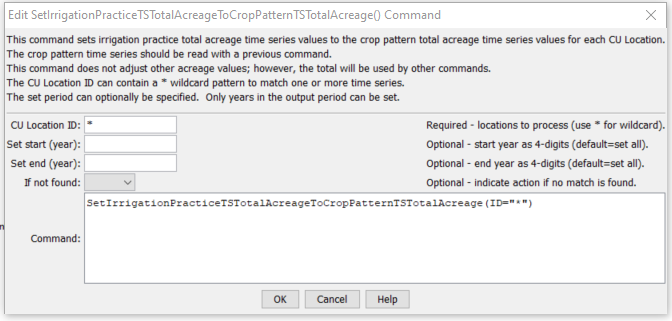

# StateDMI / Command / SetIrrigationPracticeTSTotalAcreageToCropPatternTSTotalAcreage #

* [Overview](#overview)
* [Command Editor](#command-editor)
* [Command Syntax](#command-syntax)
* [Examples](#examples)
* [Troubleshooting](#troubleshooting)
* [See Also](#see-also)

-------------------------

## Overview ##

The `SetIrrigationPracticeTSTotalAcreageToCropPatternTSTotalAcreage` command (for StateCU)
sets the total acreage data in the irrigation practice time series
(yearly) to the total for the crop pattern time series (yearly).
The crop pattern time series should have been previously filled so that
every year in the study period has observed or estimated values.
Subsequent processing of irrigation practice acreage with other commands will ensure that acreage components
(e.g., acres for irrigation sprinkler/flood method and ground/surface water source) add up to the total acres.
To use this command, irrigation practice and crop pattern time series must be available in memory from previous commands (see the
[`ReadIrrigationPracticeTSFromHydroBase`](../ReadIrrigationPracticeTSFromHydroBase/ReadIrrigationPracticeTSFromHydroBase.md) and
[`ReadCropPatternTSFromStateCU`](../ReadCropPatternTSFromStateCU/ReadCropPatternTSFromStateCU.md) command).
This command should be used after irrigation practice acreage time series are read from HydroBase,
but before other filling of other acreage values occurs.
This ensures that the total acreage controls when estimating acreage terms in the irrigation practice time series.

Currently, the command performs NO adjustments to any other acreage data in the irrigation practice time series.
For this reason, this command should be used before any other irrigation practice acreage filling occurs.

## Command Editor ##

The following dialog is used to edit the command and illustrates the command syntax.

**<p style="text-align: center;">

</p>**

**<p style="text-align: center;">
`SetIrrigationPracticeTSTotalAcreageToCropPatternTSTotalAcreage` Command Editor (<a href="../SetIrrigationPracticeTSTotalAcreageToCropPatternTSTotalAcreage.png">see also the full-size image</a>)
</p>**

## Command Syntax ##

The command syntax is as follows:

```text
SetIrrigationPracticeTSTotalAcreageToCropPatternTSTotalAcreage(Parameter="Value",...)
```
**<p style="text-align: center;">
Command Parameters
</p>**

| **Parameter**&nbsp;&nbsp;&nbsp;&nbsp;&nbsp;&nbsp;&nbsp;&nbsp;&nbsp;&nbsp;&nbsp;&nbsp; | **Description** | **Default**&nbsp;&nbsp;&nbsp;&nbsp;&nbsp;&nbsp;&nbsp;&nbsp;&nbsp;&nbsp; |
| --------------|-----------------|----------------- |
| `ID`<br>**required** | A single CU Location identifier to match or a pattern using wildcards (e.g., `20*`).  All matched locations in irrigation practice time series will be processed. | None – must be specified. |
| `SetStart` | The starting year to set the data. | Starting year set with [`SetOutputPeriod`](../SetOutputPeriod/SetOutputPeriod.md), or the start of the time series. |
| `SetEnd` | The ending year to set the data. | Ending year set with [`SetOutputPeriod`](../SetOutputPeriod/SetOutputPeriod.md), or the end of the time series. |
| `IfNotFound` | Used for error handling, one of the following:<ul><li>`Fail` – generate a failure message if the ID is not matched</li><li>`Ignore` – ignore (don’t add and don’t generate a message) if the ID is not matched</li><li>`Warn` – generate a warning message if the ID is not matched</li></ul> | `Warn` |

## Examples ##

See the [automated tests](https://github.com/OpenCDSS/cdss-app-statedmi-test/tree/master/test/regression/commands/SetIrrigationPracticeTSTotalAcreageToCropPatternTSTotalAcreage).

The following command file illustrates how this command can be used:

```
# Step 1 - Set output period and read CU locations from structure file
SetOutputPeriod(OutputStart="1950",OutputEnd="2006")
ReadCULocationsFromStateCU(InputFile="..\StateCU\cm2006.str")
# Step 2 - Read SW aggregates
SetDiversionSystemFromList(ListFile="colorado_divsys.csv",IDCol=1,NameCol=2,PartIDsCol=3,PartsListedHow=InRow)
SetDiversionAggregateFromList(ListFile="colorado_agg.csv",IDCol=1,NameCol=2,PartIDsCol=3,PartsListedHow=InRow)
# Step 3 - Create form for *.ipy file
CreateIrrigationPracticeTSForCULocations(ID="*")
# Step 5 - set max flood and surface water efficiencies and GWmode - NOT in HydroBase
# Set Max SW Eff = 1.0
SetIrrigationPracticeTS(ID="*",SurfaceDelEffMax=1.0,FloodAppEffMax=.60,SprinklerAppEffMax=.80,PumpingMax=0,GWMode=2)
SetIrrigationPracticeTSFromList(ListFile="cmstrlist.csv",ID="*",SetStart=1950,SetEnd=2006,IDCol="1",SurfaceDelEffMaxCol="7",FloodAppEffMaxCol="8",SprinklerAppEffMaxCol="9")
# Step 6 - Read category acreage from HydroBase
ReadIrrigationPracticeTSFromHydroBase(ID="*",Year="1993,2000",Div="5")
# Step 8 - Read total acreage from *.cds file and Set total for *.ipy file
ReadCropPatternTSFromStateCU(InputFile="..\StateCU\cm2006.cds")
SetIrrigationPracticeTSTotalAcreageToCropPatternTSTotalAcreage(ID="*")
# Step 9 - Fill all land use acreage
# Fill groundwater acreage first
# Fill surface water sprinkler and flood 1950-2006
# Fill ground water sprinkler and flood 1950-2006
# Step 9a - estimate total GW and total SW
FillIrrigationPracticeTSRepeat(ID="*",DataType="CropArea-GroundWater",FillStart="1950",FillEnd="1993",FillDirection="Backward")
FillIrrigationPracticeTSRepeat(ID="*",DataType="CropArea-GroundWater",FillStart="1993",FillEnd="1999",FillDirection="Forward")
FillIrrigationPracticeTSRepeat(ID="*",DataType="CropArea-GroundWater",FillStart="2000",FillEnd="2006",FillDirection="Forward")
# Step 9b - fill remaining irrigation method values
FillIrrigationPracticeTSRepeat(ID="*",DataType="CropArea-SurfaceWaterOnlySprinkler",FillStart="1950",FillEnd="1993",FillDirection="Backward")
FillIrrigationPracticeTSRepeat(ID="*",DataType="CropArea-SurfaceWaterOnlySprinkler",FillStart="1993",FillEnd="1999",FillDirection="Forward")
FillIrrigationPracticeTSRepeat(ID="*",DataType="CropArea-SurfaceWaterOnlySprinkler",FillStart="2000",FillEnd="2006",FillDirection="Forward")
FillIrrigationPracticeTSRepeat(ID="*",DataType="CropArea-GroundWaterSprinkler",FillStart="1950",FillEnd="1993",FillDirection="Backward")
FillIrrigationPracticeTSRepeat(ID="*",DataType="CropArea-GroundWaterSprinkler",FillStart="1993",FillEnd="1999",FillDirection="Forward")
FillIrrigationPracticeTSRepeat(ID="*",DataType="CropArea-GroundWaterSprinkler",FillStart="2000",FillEnd="2006",FillDirection="Forward")
# Step 10 - Write final ipy file
WriteIrrigationPracticeTSToStateCU(OutputFile="..\StateCU\cm2006.ipy")
# Check the results
CheckIrrigationPracticeTS(ID="*")
WriteCheckFile(OutputFile="cm2006.ipy.StateDMI.check.html")
```

## Troubleshooting ##

## See Also ##

* [`FillIrrigationPracticeTSAcreageUsingWellRights`](../FillIrrigationPracticeTSAcreageUsingWellRights/FillIrrigationPracticeTSAcreageUsingWellRights.md) command
* [`FillIrrigationPracticeTSInterpolate`](../FillIrrigationPracticeTSInterpolate/FillIrrigationPracticeTSInterpolate.md) command
* [`FillIrrigationPracticeTSRepeat`](../FillIrrigationPracticeTSRepeat/FillIrrigationPracticeTSRepeat.md) command
* [`ReadIrrigationPracticeTSFromHydroBase`](../ReadIrrigationPracticeTSFromHydroBase/ReadIrrigationPracticeTSFromHydroBase.md) command
* [`ReadCropPatternTSFromStateCU`](../ReadCropPatternTSFromStateCU/ReadCropPatternTSFromStateCU.md) command
* [`SetIrrigationPracticeTS`](../SetIrrigationPracticeTS/SetIrrigationPracticeTS.md) command
* [`SetIrrigationPracticeTSFromList`](../SetIrrigationPracticeTSFromList/SetIrrigationPracticeTSFromList.md) command
* [`SetIrrigationPracticeTSFromStateCU`](../SetIrrigationPracticeTSFromStateCU/SetIrrigationPracticeTSFromStateCU.md) command
* [`SetIrrigationPracticeTSPumpingMaxUsingWellRights`](../SetIrrigationPracticeTSPumpingMaxUsingWellRights/SetIrrigationPracticeTSPumpingMaxUsingWellRights.md) command
* [`SetIrrigationPracticeTSSprinklerAcreageFromList`](../SetIrrigationPracticeTSSprinklerAcreageFromList/SetIrrigationPracticeTSSprinklerAcreageFromList.md) command

### Legacy Commands ###

* [`SetIrrigationPracticeTSFromHydroBase`](../SetIrrigationPracticeTSFromHydroBase/SetIrrigationPracticeTSFromHydroBase.md) command
* [`SetIrrigationPracticeTSMaxPumpingToRights`](../SetIrrigationPracticeTSMaxPumpingToRights/SetIrrigationPracticeTSMaxPumpingToRights.md) command
* [`SetIrrigationPracticeTSSprinklerAreaFromList`](../SetIrrigationPracticeTSSprinklerAreaFromList/SetIrrigationPracticeTSSprinklerAreaFromList.md) command
