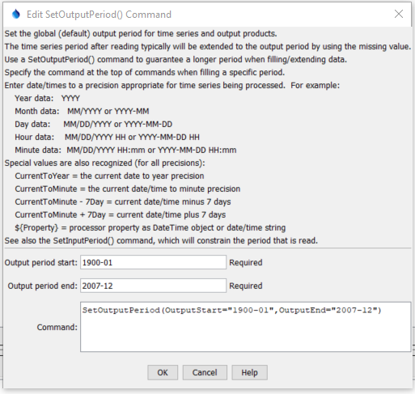

# StateDMI / Command / SetOutputPeriod #

* [Overview](#overview)
* [Command Editor](#command-editor)
* [Command Syntax](#command-syntax)
* [Examples](#examples)
* [Troubleshooting](#troubleshooting)
* [See Also](#see-also)

-------------------------

## Overview ##

The `SetOutputPeriod` does something...
sets the output period for time series.
Specifying the output period is necessary when creating model files or filling
an extended period (time series will not automatically be extended by fill commands).
The following dialog is used to edit this command and illustrates the syntax of the command.
Note that the output period should always use calendar month and year,
even if other than calendar year are used for output (see
[`SetOutputYearType`](../SetOutputYearType/SetOutputYearType.md).

## Command Editor ##

The following dialog is used to edit the command and illustrates the command syntax.

**<p style="text-align: center;">

</p>**

**<p style="text-align: center;">
`SetOutputPeriod` Command Editor (<a href="../SetOutputPeriod.png">see also the full-size image</a>)
</p>**

## Command Syntax ##

The command syntax is as follows:

```text
SetOutputPeriod(Parameter="Value",...)
```
**<p style="text-align: center;">
Command Parameters
</p>**

| **Parameter**&nbsp;&nbsp;&nbsp;&nbsp;&nbsp;&nbsp;&nbsp;&nbsp;&nbsp;&nbsp;&nbsp;&nbsp; | **Description** | **Default**&nbsp;&nbsp;&nbsp;&nbsp;&nbsp;&nbsp;&nbsp;&nbsp;&nbsp;&nbsp; |
| --------------|-----------------|----------------- |
| `OutputStart` | The output period start, in a standard date/time format.  The precision of this value should match that of data because it is used to iterate through the data.  For example, if monthly data are being processed, specify the `OutputStart` using year and month. | None – must be specified. |
| `OutputEnd` | The output period end, in a standard date/time format.  The precision of this value should match that of data because it is used to iterate through the data.  For example, if monthly data are being processed, specify the `OutputStart` using year and month. | None – must be specified. |

## Examples ##

See the [automated tests](https://github.com/OpenCDSS/cdss-app-statedmi-test/tree/master/test/regression/commands/SetOutputPeriod).

## Troubleshooting ##

## See Also ##

* [`SetOutputYearType`](../SetOutputYearType/SetOutputYearType.md) command
