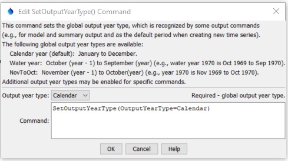

# StateDMI / Command / SetOutputYearType #

* [Overview](#overview)
* [Command Editor](#command-editor)
* [Command Syntax](#command-syntax)
* [Examples](#examples)
* [Troubleshooting](#troubleshooting)
* [See Also](#see-also)

-------------------------

## Overview ##

The `SetOutputYearType` command
sets the output year type for time series and other time-dependent data (e.g., the order of monthly efficiencies in the StateMod diversion stations file depends on the year type).  The output period used with SetOutputPeriod() should always use calendar month and year, even if other than calendar year are used for the output year type.  

## Command Editor ##

The following dialog is used to edit the command and illustrates the command syntax.

**<p style="text-align: center;">

</p>**

**<p style="text-align: center;">
`SetOutputYearType` Command Editor (<a href="../SetOutputYearType.png">see also the full-size image</a>)
</p>**

## Command Syntax ##

The command syntax is as follows:

```text
SetOutputYearType(Parameter="Value",...)
```
**<p style="text-align: center;">
Command Parameters
</p>**

| **Parameter**&nbsp;&nbsp;&nbsp;&nbsp;&nbsp;&nbsp;&nbsp;&nbsp;&nbsp;&nbsp;&nbsp;&nbsp; | **Description** | **Default**&nbsp;&nbsp;&nbsp;&nbsp;&nbsp;&nbsp;&nbsp;&nbsp;&nbsp;&nbsp; |
| --------------|-----------------|----------------- |
| `Parameter` | Description | Default |
| `OutputYearType` | The output year type, one of:<ul><li>`Calendar` – each year is Jan – Dec.</li><li>`NovToOct` – each year is Nov of the previous year to Oct of the current year</li><li>`Water` – each water year is Oct of the previous year to Sep of the current year.</li></ul> | None – must be specified. |

## Examples ##

See the [automated tests](https://github.com/OpenCDSScdss-app-statedmi-test/tree/master/test/regression/commands/SetOutputYearType).

## Troubleshooting ##

## See Also ##
