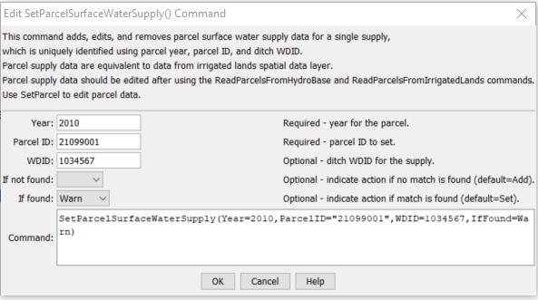

# StateDMI / Command / SetParcelSurfaceWaterSupply #

* [Overview](#overview)
* [Command Editor](#command-editor)
* [Command Syntax](#command-syntax)
* [Examples](#examples)
* [Troubleshooting](#troubleshooting)
* [See Also](#see-also)

-------------------------

## Overview ##

The `SetParcelSurfaceWaterSupply` command (for StateCU and StateMod) edits a single surface water
supply for a parcel.  The parcel must exist.
See also the [`SetParcel`](../SetParcel/SetParcel.md) and
[`SetParcelGroundWaterSupply`](../SetParcelGroundWaterSupply/SetParcelGroundWaterSupply.md) commands.

## Command Editor ##

The following dialog is used to edit the command and illustrates the command syntax.

**<p style="text-align: center;">

</p>**

**<p style="text-align: center;">
`SetParcelSurfaceWaterSupply` Command Editor (<a href="../SetParcelSurfaceWaterSupply.png">see also the full-size image</a>)
</p>**

## Command Syntax ##

The command syntax is as follows:

```text
SetParcelSurfaceWaterSupply(Parameter="Value",...)
```
**<p style="text-align: center;">
Command Parameters
</p>**

| **Parameter**&nbsp;&nbsp;&nbsp;&nbsp;&nbsp;&nbsp;&nbsp;&nbsp;&nbsp;&nbsp;&nbsp;&nbsp;&nbsp;&nbsp;&nbsp;&nbsp; | **Description** | **Default**&nbsp;&nbsp;&nbsp;&nbsp;&nbsp;&nbsp;&nbsp;&nbsp;&nbsp;&nbsp;&nbsp;&nbsp;&nbsp;&nbsp;&nbsp;&nbsp;&nbsp;&nbsp;&nbsp;&nbsp; |
| --------------|-----------------|----------------- |
| `Year`<br>**required**| Year for the parcel. | None - must be specified. |
| `ParcelID`<br>**required**| Parcel identifier. | None - must be specified. |
| `WDID` | Water district identifier (WDID) for the diversion (ditch) supply. | None - must be specified. |
| `IfNotFound` | Action taken if `Year`, `ParcelID`, and `WDID` are not matched:<ul><li>`Add` - add a new supply</li><li>`Fail` – generate a failure message</li><li>`Ignore` – ignore (don’t edit and don’t generate a message)</li><li>`Warn` – generate a warning message</li></ul> | `Add` |
| `IfFound` | Action taken if `Year` and `ParcelID`, and `WDID` are matched:<ul><li>`Set` - set the supply data</li><li>`Remove` - remove the supply</li><li>`Fail` – generate a failure message</li><li>`Ignore` – ignore (don’t edit and don’t generate a message)</li><li>`Warn` – generate a warning message</li></ul> | `Set` |

## Examples ##

See the [automated tests](https://github.com/OpenCDSS/cdss-app-statedmi-test/tree/master/test/regression/commands/SetParcelSurfaceWaterSupply).

## Troubleshooting ##

## See Also ##

* [`SetParcel`](../SetParcel/SetParcel.md) command
* [`SetParcelGroundWaterSupply`](../SetParcelGroundWaterSupply/SetParcelGroundWaterSupply.md) command
