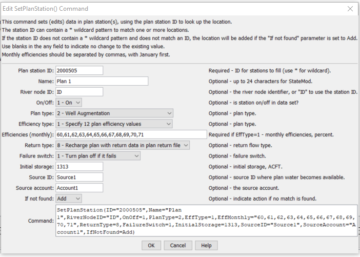

# StateDMI / Command / SetPlanStation #

* [Overview](#overview)
* [Command Editor](#command-editor)
* [Command Syntax](#command-syntax)
* [Examples](#examples)
* [Troubleshooting](#troubleshooting)
* [See Also](#see-also)

-------------------------

## Overview ##

The `SetPlanStation` command (for StateMod)
sets data in existing plan stations or adds a new plan station.

## Command Editor ##

The following dialog is used to edit the command and illustrates the command syntax.

**<p style="text-align: center;">

</p>**

**<p style="text-align: center;">
`SetPlanStation` Command Editor (<a href="../SetPlanStation.png">see also the full-size image</a>)
</p>**

## Command Syntax ##

The command syntax is as follows:

```text
SetPlanStation(Parameter="Value",...)
```
**<p style="text-align: center;">
Command Parameters
</p>**

| **Parameter**&nbsp;&nbsp;&nbsp;&nbsp;&nbsp;&nbsp;&nbsp;&nbsp;&nbsp;&nbsp;&nbsp;&nbsp; | **Description** | **Default**&nbsp;&nbsp;&nbsp;&nbsp;&nbsp;&nbsp;&nbsp;&nbsp;&nbsp;&nbsp; |
| --------------|-----------------|----------------- |
| `ID`<br>**required** | A single plan station identifier to match or a pattern using wildcards (e.g., `20*`). | None – must be specified. |
| `Name` | The name to be assigned for all matching plan stations. | If not specified, the original value will remain. |
| `RiverNodeID` | The river node identifier to be assigned for all matching plan stations.  Specify ID to assign to the plan station identifier. | If not specified, the original value will remain. |
| `OnOff` | The on/off switch value to be assigned for all matching plan stations, either 1 for on or 0 for off. | If not specified, the original value will remain. |
| `PlanType` | The plan station type to be assigned for all matching plan stations (see StateMod documentation). | If not specified, the original value will remain. |
| `EffType` | The efficiency type to assign for all matching plan stations (see StateMod documentation).  | If not specified, the original value will remain. |
| `EffMonthly` | The monthly efficiencies (percent, 0 – 100) to assign for all matching plan stations, specified as 12 comma-separated values, January to December. | If not specified, the original values will remain. |
| `ReturnType` | The return flow type to be assigned for all matching plan stations (see StateMod documentation). | If not specified, the original value will remain. |
| `FailureSwitch` | The failure switch to be assigned for all matching plan stations (see StateMod documentation). | If not specified, the original value will remain. |
| `InitialStorage` | The initial plan storage (ACFT) to be assigned for all matching plan stations. | If not specified, the original value will remain. |
| `SourceID` | The source identifier to be assigned for all matching plan stations. | If not specified, the original value will remain. |
| `UserName` | The source account to be assigned for all matching plan stations. | If not specified, the original value will remain. |
| `IfNotFound` | Used for error handling, one of the following:<ul><li>`Add` – add the diversion station if the ID is not matched and is not a wildcard</li><li>`Fail` – generate a failure message if the ID is not matched</li><li>`Ignore` – ignore (don’t add and don’t generate a message) if the ID is not matched</li><li>`Warn` – generate a warning message if the ID is not matched</li></ul> | `Warn` |

## Examples ##

See the [automated tests](https://github.com/OpenCDSS/cdss-app-statedmi-test/tree/master/test/regression/commands/SetPlanStation).

## Troubleshooting ##

## See Also ##
