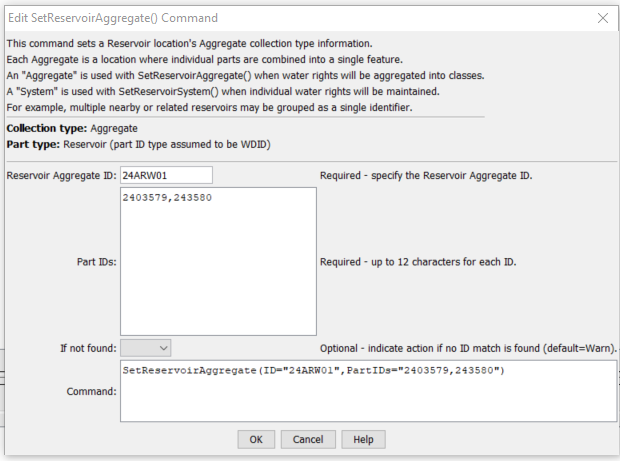

# StateDMI / Command / SetReservoirAggregate #

* [Overview](#overview)
* [Command Editor](#command-editor)
* [Command Syntax](#command-syntax)
* [Examples](#examples)
* [Troubleshooting](#troubleshooting)
* [See Also](#see-also)

-------------------------

## Overview ##

The `SetReservoirAggregate` command (for StateMod) sets reservoir aggregate part identifier data for a reservoir:

* a StateMod reservoir station

Aggregate reservoirs are defined as a combination of other reservoirs and may be used,
for example, to aggregate stock ponds or other small reservoirs.
This command should be specified before commands that need aggregate information during processing
(e.g., those that read data from HydroBase).
Aggregate information should be specified after reservoir stations are defined
and before their use in other processing, such as reading data from HydroBase.

## Command Editor ##

The following dialog is used to edit the command and illustrates the command syntax.

**<p style="text-align: center;">

</p>**

**<p style="text-align: center;">
`SetReservoirAggregate` Command Editor (<a href="../SetReservoirAggregate.png">see also the full-size image</a>)
</p>**

## Command Syntax ##

The command syntax is as follows:

```text
SetReservoirAggregate(Parameter="Value",...)
```
**<p style="text-align: center;">
Command Parameters
</p>**

| **Parameter**&nbsp;&nbsp;&nbsp;&nbsp;&nbsp;&nbsp;&nbsp;&nbsp;&nbsp;&nbsp;&nbsp;&nbsp; | **Description** | **Default**&nbsp;&nbsp;&nbsp;&nbsp;&nbsp;&nbsp;&nbsp;&nbsp;&nbsp;&nbsp; |
| --------------|-----------------|----------------- |
|`ID` <br>**required**| The reservoir identifier to associate with the aggregate part identifiers. | None – must be specified. |
|`PartIDs`<br>**required** | The list of part identifiers to comprise the aggregate. | None – must be specified. |
|`IfNotFound` | Used for error handling, one of the following:<ul><li>`Fail` – generate a failure message if the ID is not matched</li><li>`Ignore` – ignore (don’t add and don’t generate a message) if the ID is not matched</li><li>`Warn` – generate a warning message if the ID is not matched</li></ul> | `Warn` |

## Examples ##

See the [automated tests](https://github.com/OpenCDSS/cdss-app-statedmi-test/tree/master/test/regression/commands/SetReservoirAggregate).

## Troubleshooting ##

[See the main troubleshooting documentation](../../troubleshooting/troubleshooting.md)

## See Also ##

* [`SetReservoirAggregateFromList`](../SetReservoirAggregateFromList/SetReservoirAggregateFromList.md) command
