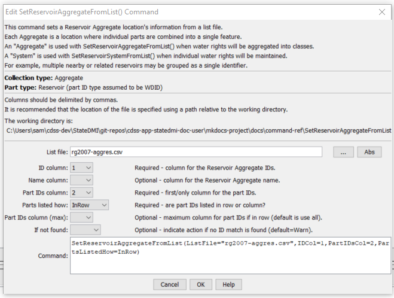

# StateDMI / Command / SetReservoirAggregateFromList #

* [Overview](#overview)
* [Command Editor](#command-editor)
* [Command Syntax](#command-syntax)
* [Examples](#examples)
* [Troubleshooting](#troubleshooting)
* [See Also](#see-also)

-------------------------

## Overview ##

The `SetReservoirAggregateFromList` command (for StateMod) reads reservoir aggregate part identifier
data from a list file and saves the information for the reservoir.
Aggregate reservoirs are defined as a combination of other reservoirs and may be used,
for example, to aggregate stock ponds or other small reservoirs.
Using a list file to define the aggregate allows the aggregate list to be shared between different command files, minimizing errors.
This command should be specified before commands that need aggregate information during processing
(e.g., those that read data from HydroBase).  

## Command Editor ##

The following dialog is used to edit the command and illustrates the command syntax.

**<p style="text-align: center;">

</p>**

**<p style="text-align: center;">
`SetReservoirAggregateFromList` Command Editor (<a href="../SetReservoirAggregateFromList.png">see also the full-size image</a>)
</p>**

## Command Syntax ##

The command syntax is as follows:

```text
SetReservoirAggregateFromList(Parameter="Value",...)
```
**<p style="text-align: center;">
Command Parameters
</p>**

| **Parameter**&nbsp;&nbsp;&nbsp;&nbsp;&nbsp;&nbsp;&nbsp;&nbsp;&nbsp;&nbsp;&nbsp;&nbsp; | **Description** | **Default**&nbsp;&nbsp;&nbsp;&nbsp;&nbsp;&nbsp;&nbsp;&nbsp;&nbsp;&nbsp; |
| --------------|-----------------|----------------- |
| `ListFile` | The name of the input file to read, surrounded by double quotes. | None – must be specified. |
| `IDCol` | The column number (1+) containing the aggregate reservoir identifiers. | None – must be specified. |
| `NameCol` | The column number (1+) containing the aggregate reservoir name. | None – optional (name will be initialized to blank). |
| `PartIDsCol` | The column number (1+) for the first column having part identifiers. | None – must be specified. |
| `PartIDsColMax` | The column number (1+) for the last column having part identifiers. | Use all available columns. |
| `PartsListedHow` | If `InRow`, it is expected that all parts defining an aggregate are listed in the same row.  If `InColumn`, it is expected that the parts defining an aggregate are listed one per row, with multiple rows defining the full aggregate (`PartIDsColMax` is ignored in this case). | None – must be specified. |
| `IfNotFound` | Used for error handling, one of the following:<ul><li>`Fail` – generate a failure message if the ID is not matched</li><li>`Ignore` – ignore (don’t add and don’t generate a message) if the ID is not matched</li><li>`Warn` – generate a warning message if the ID is not matched</li></ul>| `Warn` |

## Examples ##

See the [automated tests](https://github.com/OpenCDSS/cdss-app-statedmi-test/tree/master/test/regression/commands/SetReservoirAggregateFromList).

An example list file is shown below:

```
#
# Aggregate Reservoirs
20ARW01,203531,203533,203534,203535,203537,203540,203542,203543,203544,203545,203546
21ARW01,213584,213585,213586,213587,213589,217001
22ARW01,223301,223302,223303,223304,223305,223578,223580,223581,223583,223584
22ARW02,223575
24ARW01,243579,243580
25ARW01,250728,250729,250730,250731,253500,253501,253502,253503,253504,253505,253506
26ARW01,260721,260722,260723,260724,260725,263300,263581,263583,263584,263585,263586
27ARW01,273301,273303,273304,273305,273306,273307,273308,273309,273310,273311,273312
```

## Troubleshooting ##

[See the main troubleshooting documentation](../../troubleshooting/troubleshooting.md)

## See Also ##

* [`SetReservoirAggregate`](../SetReservoirAggregate/SetReservoirAggregate.md) command
