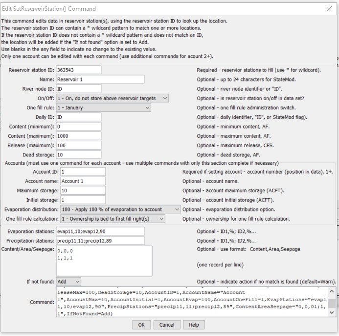

# StateDMI / Command / SetReservoirStation #

* [Overview](#overview)
* [Command Editor](#command-editor)
* [Command Syntax](#command-syntax)
* [Examples](#examples)
* [Troubleshooting](#troubleshooting)
* [See Also](#see-also)

-------------------------

## Overview ##

The `SetReservoirStation` command (for StateMod)
sets data in existing reservoir stations or adds a new reservoir station.
Because there are a large number of parameters, it may be desirable to use several commands for the same reservoir.
Only one reservoir account can be assigned per command – an account identifier of `1` will
clear all accounts before new accounts are defined.
Bounding zero and high-end records are not automatically added for the content/area/seepage
data – modelers must specify the bounds to prevent StateMod errors (the
[`FillReservoirStationsFromHydroBase`](../FillReservoirStationsFromHydroBase/FillReservoirStationsFromHydroBase.md)
command will provide bounding values).

## Command Editor ##

The following dialog is used to edit the command and illustrates the command syntax.

**<p style="text-align: center;">

</p>**

**<p style="text-align: center;">
`SetReservoirStation` Command Editor (<a href="../SetReservoirStation.png">see also the full-size image</a>)
</p>**

## Command Syntax ##

The command syntax is as follows:

```text
SetReservoirStation(Parameter="Value",...)
```
**<p style="text-align: center;">
Command Parameters
</p>**

| **Parameter**&nbsp;&nbsp;&nbsp;&nbsp;&nbsp;&nbsp;&nbsp;&nbsp;&nbsp;&nbsp;&nbsp;&nbsp;&nbsp;&nbsp;&nbsp;&nbsp;&nbsp;&nbsp;&nbsp;&nbsp;&nbsp;&nbsp; | **Description** | **Default**&nbsp;&nbsp;&nbsp;&nbsp;&nbsp;&nbsp;&nbsp;&nbsp;&nbsp;&nbsp;&nbsp;&nbsp;&nbsp;&nbsp;&nbsp;&nbsp;&nbsp;&nbsp;&nbsp;&nbsp; |
| --------------|-----------------|----------------- |
| `ID` | A single reservoir station identifier to match or a pattern using wildcards (e.g., `20*`). | None – must be specified. |
| `Name` | The name to be assigned for all matching reservoir stations. | If not specified, the original value will remain. |
| `RiverNodeID` | The river node identifier to be assigned for all matching reservoir stations.  Specify ID to assign to the reservoir station identifier. | If not specified, the original value will remain. |
| `OnOff` | The on/off switch value to be assigned for all matching reservoir stations, either `1` for on or `0` for off. | If not specified, the original value will remain. |
| `OneFillRule` | The date for one fill rule administration (see the StateMod documentation) to be assigned for all matching reservoir stations. | If not specified, the original value will remain. |
| `DailyID` | The daily identifier to be assigned for all matching reservoir stations. | If not specified, the original value will remain. |
| `ContentMin` | The reservoir minimum content, ACFT. | If not specified, the original value will remain. |
| `ContentMax` | The reservoir maximum content, ACFT. | If not specified, the original value will remain. |
| `ReleaseMax` | The reservoir maximum release, CFS. | If not specified, the original value will remain. |
| `DeadStorage` | The reservoir dead storage, ACFT. | If not specified, the original value will remain. |
| `AccountID` | A reservoir account identifier, a number 1+.  Reservoir accounts in the StateMod reservoir station are identified only by the account name.  This `AccountID` lets the software know the order of the accounts.  If the `AccountID` is specified as 1, all the accounts are deleted and a new list of accounts is started.  Therefore, specify account information in sequential order. | Must be specified when providing account information. |
| `AccountName` | A reservoir account name. | If not specified, the original value will remain. |
| `AccountMax` | The account maximum content, ACFT. | If not specified, the original value will remain. |
| `AccountInitial` | The account initial content, ACFT. | If not specified, the original value will remain. |
| `AccountEvap` | The account evaporation distribution – see the StateMod documentation. | If not specified, the original value will remain. |
| `AccountOneFill` | The account information for one fill calculations – see the StateMod documentation. | If not specified, the original value will remain. |
| `EvapStations` | A list of evaporation stations and weights (%) for the reservoir station, using the format:  `ID,%;ID,%` | If not specified, the original value will remain. |
| `PrecipStations` | A list of precipitation stations and weights (%) for the reservoir station, using the format:  `ID,%;ID,%` | If not specified, the original value will remain. |
| `ContentAreaSeepage` | Content/area/seepage values, using the format:  `Content,Area,Seepage;Content,Area,Seepage`. | If not specified, the original value will remain. |
| `IfNotFound` | Used for error handling, one of the following:<ul><li>`Add` – add the reservoir station if the ID is not matched and is not a wildcard</li><li>`Fail` – generate a failure message if the ID is not matched</li><li>`Ignore` – ignore (don’t add and don’t generate a message) if the ID is not matched</li><li>`Warn` – generate a warning message if the ID is not matched</li></ul> | `Warn` |

## Examples ##

See the [automated tests](https://github.com/OpenCDSS/cdss-app-statedmi-test/tree/master/test/regression/commands/SetReservoirStation).

The following example illustrates how to set multiple accounts for one reservoir (note that more information is set in the first command whereas only account information is set in subsequent commands):

```
# GREEN MOUNTAIN RESERVIOR Characteristics
SetReservoirStation(ID="363543",OnOff=3,OneFillRule=4,DailyID="5",ContentMin=0,ContentMax=154645,ReleaseMax=4010,DeadStorage=0,AccountID=1,AccountName="Hist_Users",AccountMax=66000,AccountInitial=0,AccountEvap=0,AccountOneFill=1,EvapStations="10008,100",IfNotFound=Warn)
SetReservoirStation(ID="363543",AccountID=2,AccountName="CBT_Pool",AccountMax=52000,AccountInitial=0,AccountEvap=0,AccountOneFill=1,IfNotFound=Warn)
SetReservoirStation(ID="363543",AccountID=3,AccountName="Contract",AccountMax=20000,AccountInitial=0,AccountEvap=0,AccountOneFill=1,IfNotFound=Warn)
SetReservoirStation(ID="363543",AccountID=4,AccountName="Silt_Proj",AccountMax=5000,AccountInitial=0,AccountEvap=0,AccountOneFill=1,IfNotFound=Warn)
SetReservoirStation(ID="363543",AccountID=5,AccountName="Inactive",AccountMax=11645,AccountInitial=0,AccountEvap=0,AccountOneFill=1,IfNotFound=Warn)
SetReservoirStation(ID="363543",AccountID=6,AccountName="SurplusFish",AccountMax=66000,AccountInitial=0,AccountEvap=0,IfNotFound=Warn)
```

## Troubleshooting ##

## See Also ##

* [`FillReservoirStationsFromHydroBase`](../FillReservoirStationsFromHydroBase/FillReservoirStationsFromHydroBase.md)
* [`FillReservoirStation`](../FillReservoirStation/FillReservoirStation.md) command
