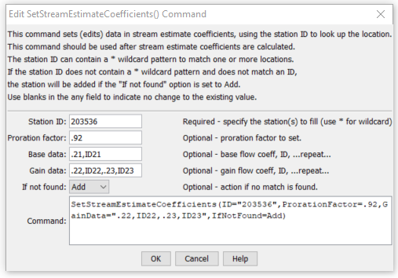

# StateDMI / Command / SetStreamEstimateCoefficients #

* [Overview](#overview)
* [Command Editor](#command-editor)
* [Command Syntax](#command-syntax)
* [Examples](#examples)
* [Troubleshooting](#troubleshooting)
* [See Also](#see-also)

-------------------------

## Overview ##

The `SetStreamEstimateCoefficients` sets data in existing stream estimate coefficients – the previous values will be overwritten.
If base or gain data are specified, the original values will be replaced (not appended).  

## Command Editor ##

The following dialog is used to edit the command and illustrates the command syntax.

**<p style="text-align: center;">

</p>**

**<p style="text-align: center;">
`SetStreamEstimateCoefficients` Command Editor (<a href="../SetStreamEstimateCoefficients.png">see also the full-size image</a>)
</p>**

## Command Syntax ##

The command syntax is as follows:

```text
SetStreamEstimateCoefficients(Parameter="Value",...)
```
**<p style="text-align: center;">
Command Parameters
</p>**

| **Parameter**&nbsp;&nbsp;&nbsp;&nbsp;&nbsp;&nbsp;&nbsp;&nbsp;&nbsp;&nbsp;&nbsp;&nbsp;&nbsp;&nbsp; | **Description** | **Default**&nbsp;&nbsp;&nbsp;&nbsp;&nbsp;&nbsp;&nbsp;&nbsp;&nbsp;&nbsp; |
| --------------|-----------------|----------------- |
| `ID` | A single stream estimate station identifier to match or a pattern using wildcards (e.g., `20*`). | None – must be specified. |
| `ProrationFactor` | The proration factor for all matching stream estimate stations. | If not specified, the original value will remain. |
| `BaseData` | The base flow coefficient and station ID pairs to be assigned for all matching stream estimate stations.  Repeat for as many pairs as necessary, separated by commas. | If not specified, the original value will remain. |
| `GainData` | The gain flow coefficient and station ID pairs to be assigned for all matching stream estimate stations.  Repeat for as many pairs as necessary, separated by commas. | If not specified, the original value will remain. |
| `IfNotFound` | Used for error handling, one of the following:<ul><li>`Add` – add the stream estimate coefficients if the ID is not matched and is not a wildcard</li><li>`Fail` – generate a failure message if the ID is not matched</li><li>`Ignore` – ignore (don’t add and don’t generate a message) if the ID is not matched</li><li>`Warn` – generate a warning message if the ID is not matched</li></ul> | `Warn` |

## Examples ##

See the [automated tests](https://github.com/OpenCDSS/cdss-app-statedmi-test/tree/master/test/regression/commands/SetStreamEstimateCoefficients).

The following command file illustrates how a StateMod stream estimate coefficients file can be created:

```
StartLog(LogFile="rib.commands.StateDMI.log")
# rib.commands.StateDMI
#
# Creates the Stream Estimate Station Coefficient Data file
#
#  Step 1 - read river nodes from the network file and create file framework
#
ReadStreamEstimateStationsFromNetwork(InputFile="..\Network\cm2005.net")
#
#  Step 2 - set preferred gages for "neighboring" gage approach
#           this baseflow nodes are generally on smaller non-gaged tribs and have
#           different flow characteristics than next downstream gages
#
SetStreamEstimateCoefficientsPFGage(ID="360645",GageID="09055300")
...similar commands omitted...
#
#  Step 3 - calculate stream coefficients
CalculateStreamEstimateCoefficients()
#
#  Step 4 - set proration factors directly
#
SetStreamEstimateCoefficients(ID="364512",ProrationFactor=1.000,IfNotFound=Warn)
...similar commands omitted...
#
#  Step 5 - create streamflow estimate coefficient file
#
WriteStreamEstimateCoefficientsToStateMod(OutputFile="..\StateMOD\cm2005.rib")
#
# Check the results
CheckStreamEstimateCoefficients(ID="*")
WriteCheckFile(OutputFile="rib.commands.StateDMI.check.html")
```

## Troubleshooting ##

[See the main troubleshooting documentation](../../troubleshooting/troubleshooting.md)

## See Also ##

* [`CalculateStreamEstimateCoefficients`](../CalculateStreamEstimateCoefficients/CalculateStreamEstimateCoefficients.md) command
* [`SetStreamEstimateCoefficientsPFGage`](../SetStreamEstimateCoefficientsPFGage/SetStreamEstimateCoefficientsPFGage.md) command
