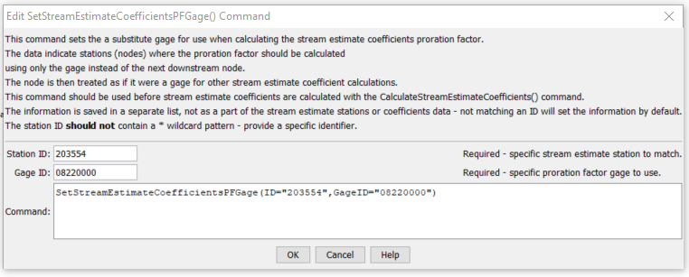

# StateDMI / Command / SetStreamEstimateCoefficientsPFGage #

* [Overview](#overview)
* [Command Editor](#command-editor)
* [Command Syntax](#command-syntax)
* [Examples](#examples)
* [Troubleshooting](#troubleshooting)
* [See Also](#see-also)

-------------------------

## Overview ##

The `SetStreamEstimateCoefficientsPFGage` command (for StateMod)
indicates that the proration factor for a specified station/node should be calculated using only the `area*precipitation`
value for the specified stream gage, rather than the next downstream node.
The station/node is then treated as if it were a stream gage node for other natural flow calculations (as carried out by the
[`CalculateStreamEstimateCoefficients`](../CalculateStreamEstimateCoefficients/CalculateStreamEstimateCoefficients.md) command).
These commands should be specified before the
[`CalculateStreamEstimateCoefficients`](../CalculateStreamEstimateCoefficients/CalculateStreamEstimateCoefficients.md) command.

## Command Editor ##

The following dialog is used to edit the command and illustrates the command syntax.

**<p style="text-align: center;">

</p>**

**<p style="text-align: center;">
`SetStreamEstimateCoefficientsPFGage` Command Editor (<a href="../SetStreamEstimateCoefficientsPFGage.png">see also the full-size image</a>)
</p>**

## Command Syntax ##

The command syntax is as follows:

```text
SetStreamEstimateCoefficientsPFGage(Parameter="Value",...)
```
**<p style="text-align: center;">
Command Parameters
</p>**

| **Parameter**&nbsp;&nbsp;&nbsp;&nbsp;&nbsp;&nbsp;&nbsp;&nbsp;&nbsp;&nbsp;&nbsp;&nbsp; | **Description** | **Default**&nbsp;&nbsp;&nbsp;&nbsp;&nbsp;&nbsp;&nbsp;&nbsp;&nbsp;&nbsp; |
| --------------|-----------------|----------------- |
| `ID`<br>**required** | A single stream estimate station identifier to match. | None – must be specified. |
| `GageID`<br>**required** | A stream gage station identifier to use, instead of the downstream gage. | None – must be specified. |

## Examples ##

See the [automated tests](https://github.com/OpenCDSS/cdss-app-statedmi-test/tree/master/test/regression/commands/SetStreamEstimateCoefficientsPFGage).

The following command file illustrates how a StateMod stream estimate coefficients file can be created:

```
StartLog(LogFile="rib.commands.StateDMI.log")
# rib.commands.StateDMI
#
# Creates the Stream Estimate Station Coefficient Data file
#
#  Step 1 - read river nodes from the network file and create file framework
#
ReadStreamEstimateStationsFromNetwork(InputFile="..\Network\cm2005.net")
#
#  Step 2 - set preferred gages for "neighboring" gage approach
#           this baseflow nodes are generally on smaller non-gaged tribs and have
#           different flow characteristics than next downstream gages
#
SetStreamEstimateCoefficientsPFGage(ID="360645",GageID="09055300")
SetStreamEstimateCoefficientsPFGage(ID="360801",GageID="09055300")
SetStreamEstimateCoefficientsPFGage(ID="362002",GageID="09054000")
SetStreamEstimateCoefficientsPFGage(ID="360829",GageID="09047500")
...similar commands omitted...
#
#  Step 3 - calculate stream coefficients
CalculateStreamEstimateCoefficients()
#
#  Step 4 - set proration factors directly
#
SetStreamEstimateCoefficients(ID="364512",ProrationFactor=1.000,IfNotFound=Warn)
SetStreamEstimateCoefficients(ID="374641",ProrationFactor=0.200,IfNotFound=Warn)
SetStreamEstimateCoefficients(ID="374648",ProrationFactor=0.350,IfNotFound=Warn)
SetStreamEstimateCoefficients(ID="380880",ProrationFactor=1.000,IfNotFound=Warn)
SetStreamEstimateCoefficients(ID="381594",ProrationFactor=0.800,IfNotFound=Warn)
SetStreamEstimateCoefficients(ID="384617",ProrationFactor=0.700,IfNotFound=Warn)
SetStreamEstimateCoefficients(ID="510639",ProrationFactor=1.000,IfNotFound=Warn)
SetStreamEstimateCoefficients(ID="514603",ProrationFactor=0.800,IfNotFound=Warn)
SetStreamEstimateCoefficients(ID="514620",ProrationFactor=1.000,IfNotFound=Warn)
SetStreamEstimateCoefficients(ID="510728",ProrationFactor=1.000,IfNotFound=Warn)
SetStreamEstimateCoefficients(ID="530555",ProrationFactor=0.180,IfNotFound=Warn)
SetStreamEstimateCoefficients(ID="530678",ProrationFactor=0.230,IfNotFound=Warn)
SetStreamEstimateCoefficients(ID="531082",ProrationFactor=1.000,IfNotFound=Warn)
SetStreamEstimateCoefficients(ID="954683",ProrationFactor=0.400,IfNotFound=Warn)
#
#  Step 5 - create streamflow estimate coefficient file
#
WriteStreamEstimateCoefficientsToStateMod(OutputFile="..\StateMOD\cm2005.rib")
#
# Check the results
CheckStreamEstimateCoefficients(ID="*")
WriteCheckFile(OutputFile="rib.commands.StateDMI.check.html")
```

## Troubleshooting ##

[See the main troubleshooting documentation](../../troubleshooting/troubleshooting.md)

## See Also ##

* [`CalculateStreamEstimateCoefficients`](../CalculateStreamEstimateCoefficients/CalculateStreamEstimateCoefficients.md) command
* [`SetStreamEstimateCoefficientsPFGage`](../SetStreamEstimateCoefficientsPFGage/SetStreamEstimateCoefficientsPFGage.md) command
