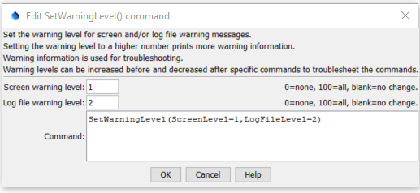

# StateDMI / Command / SetWarningLevel #

* [Overview](#overview)
* [Command Editor](#command-editor)
* [Command Syntax](#command-syntax)
* [Examples](#examples)
* [Troubleshooting](#troubleshooting)
* [See Also](#see-also)

-------------------------

## Overview ##

The `SetWarningLevel` command
is used to set warning levels for the screen and log file.  The following dialog is used to edit this command and illustrates the command syntax.

Warning messages are useful during troubleshooting.
A general guideline is that a warning level of 1 prints important messages that a user should see,
2 prints warnings that by default are printed to the log file but are not displayed in the user interface,
and 100 prints very low-level messages about input/output.  Intermediate values will result in more or less output.

This command is useful for troubleshooting and can be specified multiple times to increase warning information for a specific command, if necessary.

## Command Editor ##

The following dialog is used to edit the command and illustrates the command syntax.

**<p style="text-align: center;">

</p>**

**<p style="text-align: center;">
`SetWarningLevel` Command Editor (<a href="../SetWarningLevel.png">see also the full-size image</a>)
</p>**

## Command Syntax ##

The command syntax is as follows:

```text
SetWarningLevel(Parameter="Value",...)
```
**<p style="text-align: center;">
Command Parameters
</p>**

| **Parameter**&nbsp;&nbsp;&nbsp;&nbsp;&nbsp;&nbsp;&nbsp;&nbsp;&nbsp;&nbsp;&nbsp;&nbsp; | **Description** | **Default**&nbsp;&nbsp;&nbsp;&nbsp;&nbsp;&nbsp;&nbsp;&nbsp;&nbsp;&nbsp; |
| --------------|-----------------|----------------- |
|`ScreenLevel`| Level for screen (user interface) messages.| Only important messages will be shown.|
|`LogFileLevel`| Level for log file messages. | Only important messages will be printed to the log file.|

## Examples ##

See the [automated tests](https://github.com/OpenCDSS/cdss-app-statedmi-test/tree/master/test/regression/commands/SetWarningLevel).

## Troubleshooting ##

## See Also ##

* [`SetDebugLevel`](../SetDebugLevel/SetDebugLevel.md) command
