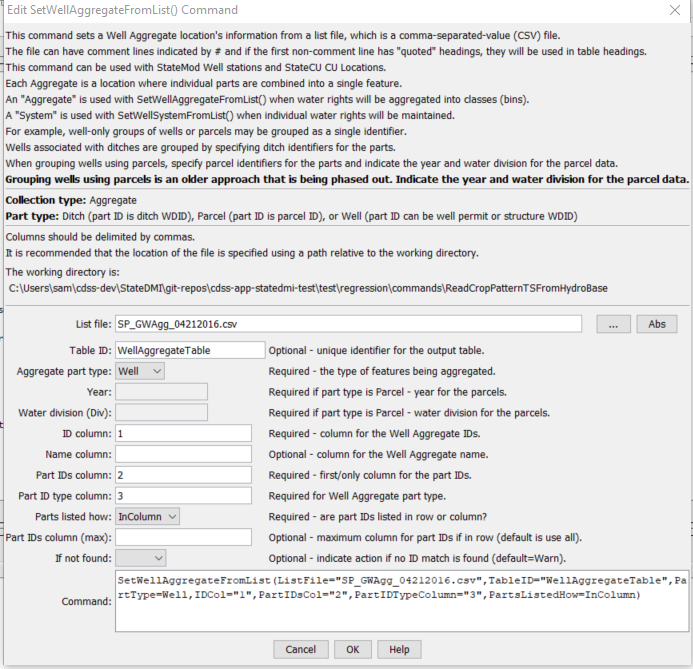

# StateDMI / Command / SetWellAggregateFromList #

* [Overview](#overview)
* [Command Editor](#command-editor)
* [Command Syntax](#command-syntax)
* [Examples](#examples)
* [Troubleshooting](#troubleshooting)
* [See Also](#see-also)

-------------------------

## Overview ##

The `SetWellAggregateFromList` command (for StateCU and StateMod) 
sets well aggregate part identifier data for:

* a StateCU well (a CU Location that corresponds to a location with well supply)
* or a or StateMod well station with groundwater supply.

Well aggregates are specified using a list of part identifiers as follows:

* **Part type is Ditch** – the collection includes wells that are associated with a list of ditches,
identified using ditch water district identifiers (WDIDs).
The list of ditches is used for the full period.
* **Part type is Parcel** – the collection includes wells that are associated with a list of parcels.
The division and year must be specified in the command because well
to parcel relationships are determined for specific years.
**This approach was used in the past for all basins but is being phased out and is currently only used for Rio Grande.**
* **Part type is Well** – the collection includes wells identified by well WDID or well permit receipt.
The `PartIdTypeColumn` parameter must be specified to indicate the part ID type.
**This approach is being phased in and is preferred (except for Rio Grande).**

To facilitate processing, the list of parts is specified in a delimited list file.
Aggregates by convention have their water rights grouped into classes.
To represent all water rights at a location, use a system
(see the similar [`SetWellSystemFromList`](../SetWellSystemFromList/SetWellSystemFromList.md) commands).
See also the StateDMI Introduction chapter,
which provides additional information about aggregates and other modeling conventions.
Aggregate information should be specified after well locations are defined and
before their use in other processing, such as reading data from HydroBase.

The [`SetWellSystemFromList`](../SetWellSystemFromList/SetWellSystemFromList.md) command is often used instead of the
`SetWellAggregateFromList` command if specific well rights are referred in
augmentation plans (therefore the examples shown below are contrived).

## Command Editor ##

The following dialog is used to edit the command and illustrates the command syntax.

**<p style="text-align: center;">

</p>**

**<p style="text-align: center;">
`SetWellAggregateFromList` Command Editor (<a href="../SetWellAggregateFromList.png">see also the full-size image</a>)
</p>**

## Command Syntax ##

The command syntax is as follows:

```text
SetWellAggregateFromList(Parameter="Value",...)
```
**<p style="text-align: center;">
Command Parameters
</p>**

| **Parameter**&nbsp;&nbsp;&nbsp;&nbsp;&nbsp;&nbsp;&nbsp;&nbsp;&nbsp;&nbsp;&nbsp;&nbsp; | **Description** | **Default**&nbsp;&nbsp;&nbsp;&nbsp;&nbsp;&nbsp;&nbsp;&nbsp;&nbsp;&nbsp; |
| --------------|-----------------|----------------- |
| `ListFile` <br>**required** | The name of the input file to read, surrounded by double quotes. | None – must be specified. |
| `PartType` <br>**required** | Indicate the type of features being aggregated and specified by PartIDs, one of:<ul><li>`Ditch` – the `PartIDs` (ditch WDIDs) indicate ditch service areas supplemented by wells.</li><li>`Parcel` – the `PartIDs` (parcel numbers from GIS processing) indicate parcels irrigated by wells, with no surface water supply.</li><li>`Well` – the `PartIDs` indicate wells (WDIDs), with no surface water supply. | None – must be specified. |
| `Year` | The year defining the parcels. | Required when `PartType` is `Parcel` because parcel identifiers from well matching are specific to the data year. |
| `Div` | Water division for the parcels in the aggregate. | Required when `PartType` is `Parcel` because parcels require the division. |
| `IDCol`<br>**required** | The column number (1+) containing the aggregate well identifiers. | None – must be specified. |
| `NameCol` | The column number (1+) containing the aggregate well name. | None – optional (name will remain as previously defined). |
| `PartIDsCol`<br>**required** | The column number (1+) for the first column having part identifiers.  The identifiers are ditch WDIDs that will be found in HydroBase.  The part identifiers are by default of type Ditch. | None – must be specified. |
| `PartsListedHow`| If `InRow`, it is expected that all parts defining an aggregate are listed in the same row (as shown in the example below).  If `InColumn`, it is expected that the parts defining an aggregate are listed one per row, with multiple rows defining the full aggregate (`PartIDsColMax` is ignored in this case). | None – must be specified. |
| `PartIDsColMax`| The column number (1+) for the last column having part identifiers.  Use if extra columns on the right need to be excluded from the list. | Use all available non-blank columns starting with `PartIDsCol`. |
| `IfNotFound`| Used for error handling, one of the following: <ul><li>`Fail` – generate a failure message if the aggregate identifier is not matched</li><li>`Ignore` – ignore (don’t add and don’t generate a message) if the aggregate identifier is not matched</li><li>`Warn` – generate a warning message if the aggregate identifier is not matched</li></ul> | `Warn` |

## Examples ##

See the [automated tests](https://github.com/OpenCDSS/cdss-app-statedmi-test/tree/master/test/regression/commands/SetWellAggregateFromList).

The following example illustrates a list file is used with `PartType=Parcel` and `PartsListedHow=InColumn`:

```
"UZONES","PARCEL"
20URF0,16831
20URF0,16832
20URF0,16834
...
20URF0,18606
20URF24,10295
20URF24,10318
...
```

The following example illustrates a list file is used with `PartType=Ditch` and `PartsListedHow=InColumn`, with the name being provided in column 2:

```
# Aggregate_ID/Agg_Name/WDID
01_ADP037,South Platte River below Kersey Co North 2,0100643
01_ADP037,South Platte River below Kersey Co North 2,0100644
01_ADP037,South Platte River below Kersey Co North 2,0100835
01_ADP037,South Platte River below Kersey Co North 2,0104486
```

The following example illustrates a list file for `PartType=Well` and `PartsListedHow=InColumn`, with the part ID type specified in column 2, and part ID type in column 3:

```
# List file created by intersecting the well coverages (that are included in the CDSS 
# irrigated acreage GDB) with the GW Aggregate Coverage,
# removing duplicates, and limiting the list to only wells tied to a GW only irrigated
# parcel in any of the acreage snapshots.
# Files/versions used include:
#  HydroBase_CO_20160407
#  SPDSS GIS Coverages 3/30/2016
#  Aggregate_03_2008.shp
#GWID,WELL_ID,ID_TYPE
01_AWP022,0000072A,RECEIPT
01_AWP022,0000218A,RECEIPT
01_AWP012,0003643,RECEIPT
01_AWP022,0004850C,RECEIPT
03_AWP001,0013828,RECEIPT
01_AWP003,0105001,WDID
01_AWP003,0105003,WDID
01_AWP002,0105005,WDID
01_AWP002,0105006,WDID
01_AWP027,0105012,WDID
```

## See Also ##

* [`SetWellAggregate`](../SetWellAggregate/SetWellAggregate.md) command
* [`SetWellSystem`](../SetWellSystem/SetWellSystem.md) command
* [`SetWellSystemFromList`](../SetWellSystemFromList/SetWellSystemFromList.md) command
