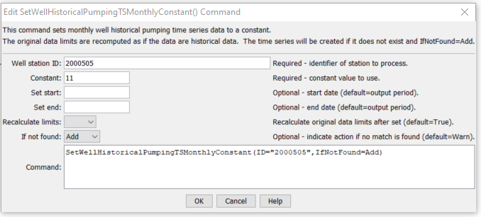

# StateDMI / Command / SetWellHistoricalPumpingTSMonthly #

* [Overview](#overview)
* [Command Editor](#command-editor)
* [Command Syntax](#command-syntax)
* [Examples](#examples)
* [Troubleshooting](#troubleshooting)
* [See Also](#see-also)

-------------------------

## Overview ##

The `SetWellHistoricalPumpingTSMonthly` command (for StateCU and StateMod)
command sets the well historical pumping time series (monthly) for a specific well, by reading another time series.  If data already exist, the previous time series is discarded.  The period of the time series is set to the output period.  This command is useful if data cannot be calculated in an automated fashion (e.g., municipal pumping may need to be specified manually).

## Command Editor ##

The following dialog is used to edit the command and illustrates the command syntax.

**<p style="text-align: center;">

</p>**

**<p style="text-align: center;">
`SetWellHistoricalPumpingTSMonthly` Command Editor (<a href="../SetWellHistoricalPumpingTSMonthly.png">see also the full-size image</a>)
</p>**

## Command Syntax ##

The command syntax is as follows:

```text
SetWellHistoricalPumpingTSMonthly(Parameter="Value",...)
```
**<p style="text-align: center;">
Command Parameters
</p>**

| **Parameter**&nbsp;&nbsp;&nbsp;&nbsp;&nbsp;&nbsp;&nbsp;&nbsp;&nbsp;&nbsp;&nbsp;&nbsp;&nbsp;&nbsp; | **Description** | **Default**&nbsp;&nbsp;&nbsp;&nbsp;&nbsp;&nbsp;&nbsp;&nbsp;&nbsp;&nbsp; |
| --------------|-----------------|----------------- |
| `ID`<br>**required** | A single well station identifier to match or a pattern using wildcards (e.g., `20*`). | None – must be specified. |
| `TSID` | The full time series identifier, which is used to locate and read the time series.  Currently time series from StateMod and DateValue files, and HydroBase are recognized.  See the TSTool input type appendices for the formats of these files.  Other input types can be enabled if necessary. | None – must be specified. |
| `LEZeroInAverage` | Indicates whether values <= 0 should be considered when computing historical averages. | `True` |
| `IfNotFound` | Used for error handling, one of the following:<ul><li>`Add` – add the time series if the ID is not matched and is not a wildcard</li><li>`Fail` – generate a failure message if the ID is not matched</li><li>`Ignore` – ignore (don’t add and don’t generate a message) if the ID is not matched</li><li>`Warn` – generate a warning message if the ID is not matched</li></ul> | `Warn` |

## Examples ##

See the [automated tests](https://github.com/OpenCDSS/cdss-app-statedmi-test/tree/master/test/regression/commands/SetWellHistoricalPumpingTSMonthly).

## Troubleshooting ##

[See the main troubleshooting documentation](../../troubleshooting/troubleshooting.md)

## See Also ##

* [`FillWellHistoricalPumpingTSMonthlyAverage`](../FillWellHistoricalPumpingTSMonthlyAverage/FillWellHistoricalPumpingTSMonthlyAverage.md) command
* [`FillWellHistoricalPumpingTSMonthlyConstant`](../FillWellHistoricalPumpingTSMonthlyConstant/FillWellHistoricalPumpingTSMonthlyConstant.md) command
* [`FillWellHistoricalPumpingTSMonthlyPattern`](../FillWellHistoricalPumpingTSMonthlyPattern/FillWellHistoricalPumpingTSMonthlyPattern.md) command
* [`SetWellHistoricalPumpingTSMonthlyConstant`](../SetWellHistoricalPumpingTSMonthlyConstant/SetWellHistoricalPumpingTSMonthlyConstant.md) command
