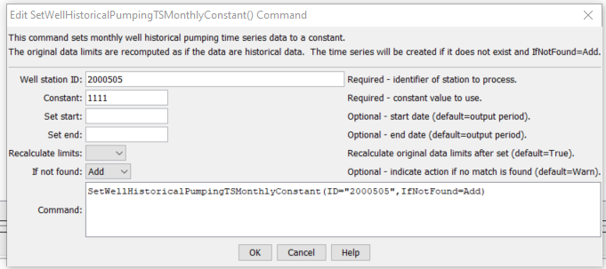

# StateDMI / Command / SetWellHistoricalPumpingTSMonthlyConstant #

* [Overview](#overview)
* [Command Editor](#command-editor)
* [Command Syntax](#command-syntax)
* [Examples](#examples)
* [Troubleshooting](#troubleshooting)
* [See Also](#see-also)

-------------------------

## Overview ##

The `SetWellHistoricalPumpingTSMonthlyConstant` command (for StateCU and StateMod)
sets well historical pumping time series (monthly) data to a constant value.
The output period can be set or will default to that defined by the most recent
[`SetOutputPeriod`](../SetOutputPeriod/SetOutputPeriod.md) command.

## Command Editor ##

The following dialog is used to edit the command and illustrates the command syntax.

**<p style="text-align: center;">

</p>**

**<p style="text-align: center;">
`SetWellHistoricalPumpingTSMonthlyConstant` Command Editor (<a href="../SetWellHistoricalPumpingTSMonthlyConstant.png">see also the full-size image</a>)
</p>**

## Command Syntax ##

The command syntax is as follows:

```text
SetWellHistoricalPumpingTSMonthlyConstant(Parameter="Value",...)
```
**<p style="text-align: center;">
Command Parameters
</p>**

| **Parameter**&nbsp;&nbsp;&nbsp;&nbsp;&nbsp;&nbsp;&nbsp;&nbsp;&nbsp;&nbsp;&nbsp;&nbsp; | **Description** | **Default**&nbsp;&nbsp;&nbsp;&nbsp;&nbsp;&nbsp;&nbsp;&nbsp;&nbsp;&nbsp; |
| --------------|-----------------|----------------- |
| `ID`<br>**required** | A single well station identifier to match or a pattern using wildcards (e.g., `20*`). | None – must be specified. |
| `Constant` | A constant historical value to set. | None – must be specified. |
| `SetStart` | The start of the period for the set, in a standard date/time format for monthly data (e.g., `YYYY-MM` or `MM/YYYY`). | The output period start. |
| `SetEnd` | The end of the period for the set, in a standard date/time format for monthly data (e.g., `YYYY-MM` or `MM/YYYY`). | The output period end. |
| `RecalcLimits` | If `True`, then the time series limits will be recalculated as if the provided values are observations.  If `False`, the limits from before the set will remain. | `True` |
| `IfNotFound` | Used for error handling, one of the following:<ul><li>`Add` – add the time series if the ID is not matched and is not a wildcard</li><li>`Fail` – generate a failure message if the ID is not matched</li><li>`Ignore` – ignore (don’t add and don’t generate a message) if the ID is not matched</li><li>`Warn` – generate a warning message if the ID is not matched</li></ul> | `Warn` |

## Examples ##

See the [automated tests](https://github.com/OpenCDSS/cdss-app-statedmi-test/tree/master/test/regression/commands/SetWellHistoricalPumpingTSMonthlyConstant).

## Troubleshooting ##

## See Also ##

* [`FillWellHistoricalPumpingTSMonthlyAverage`](../FillWellHistoricalPumpingTSMonthlyAverage/FillWellHistoricalPumpingTSMonthlyAverage.md) command
* [`FillWellHistoricalPumpingTSMonthlyConstant`](../FillWellHistoricalPumpingTSMonthlyConstant/FillWellHistoricalPumpingTSMonthlyConstant.md) command
* [`FillWellHistoricalPumpingTSMonthlyPattern`](../FillWellHistoricalPumpingTSMonthlyPattern/FillWellHistoricalPumpingTSMonthlyPattern.md) command
* [`SetOutputPeriod`](../SetOutputPeriod/SetOutputPeriod.md) command
* [`SetWellHistoricalPumpingTSMonthly`](../SetWellHistoricalPumpingTSMonthly/SetWellHistoricalPumpingTSMonthly.md) command
