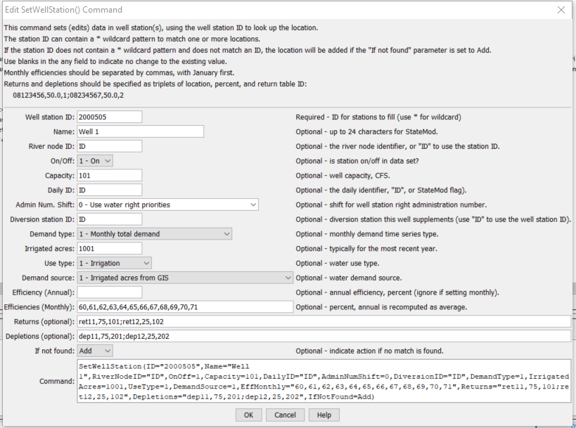

# StateDMI / Command / SetWellStation #

* [Overview](#overview)
* [Command Editor](#command-editor)
* [Command Syntax](#command-syntax)
* [Examples](#examples)
* [Troubleshooting](#troubleshooting)
* [See Also](#see-also)

-------------------------

## Overview ##

The `SetWellStation` command
sets data in existing well stations or adds a new well station.

## Command Editor ##

The following dialog is used to edit the command and illustrates the command syntax.

**<p style="text-align: center;">

</p>**

**<p style="text-align: center;">
`SetWellStation` Command Editor (<a href="../SetWellStation.png">see also the full-size image</a>)
</p>**

## Command Syntax ##

The command syntax is as follows:

```text
SetWellStation(Parameter="Value",...)
```
**<p style="text-align: center;">
Command Parameters
</p>**

| **Parameter**&nbsp;&nbsp;&nbsp;&nbsp;&nbsp;&nbsp;&nbsp;&nbsp;&nbsp;&nbsp;&nbsp;&nbsp; | **Description** | **Default**&nbsp;&nbsp;&nbsp;&nbsp;&nbsp;&nbsp;&nbsp;&nbsp;&nbsp;&nbsp;&nbsp;&nbsp;&nbsp;&nbsp;&nbsp;&nbsp;&nbsp;&nbsp;&nbsp;&nbsp; |
| --------------|-----------------|----------------- |
| `ID` | A single well station identifier to match or a pattern using wildcards (e.g., `20*`). | None – must be specified. |
| `Name` | The name to be assigned for all matching well stations. | If not specified, the original value will remain. |
| `RiverNodeID` | The river node identifier to be assigned for matching well stations.  Specify ID to set to the well station identifier. | If not specified, the original value will remain. |
| `OnOff` | The on/off switch value to be assigned for all matching well stations, either `1` for on or `0` for off. | If not specified, the original value will remain. |
| `Capacity` | The well station capacity, CFS. | If not specified, the original value will remain. |
| `DailyID` | The daily identifier to be assigned for all matching well stations.  Specify ID to set to the well station identifier. | If not specified, the original value will remain. |
| `AdminNumShift` | For all matching well stations, a shift to be applied to the administration number for well rights.  See the “primary” flag in the StateMod well station documentation. | If not specified, the original value will remain. |
| `DiversionID` | For all matching well stations, the diversion station identifier associated with the well station.  Typically, where well water supplements surface supply, one well station is assigned to the diversion station.  Specify ID to assign to the well station identifier. | If not specified, the original value will remain. |
| `DemandType` | The demand type to be assigned for all matching well stations (see StateMod documentation). | If not specified, the original value will remain. |
| `IrrigatedAcres` | The irrigated acres to be assigned for all matching well stations. | If not specified, the original value will remain. |
| `UseType` | The use type to be assigned for all matching well stations (see StateMod documentation). | If not specified, the original value will remain. |
| `DemandSource` | The demand source to be assigned for all matching well stations (see StateMod documentation). | If not specified, the original value will remain. |
| `EffAnnual` | The annual efficiency (percent, `0`  - `100`) to be assigned for matching well stations.  Monthly efficiencies will be set to the same value (but not used). | If not specified, the original value will remain. |
| `EffMonthly` | The monthly efficiencies  (percent, `0` – `100`) to be assigned for all matching well stations, specified as 12 comma-separated values, January to December.  The annual efficiency will be set to the average value.  The order of the values in the output file will be according to the output year type set by [`SetOutputYearType`](../SetOutputYearType/SetOutputYearType.md), or calendar by default. | If not specified, the original value will remain. |
| `Returns` | The return flows to be assigned for all matching well stations.  Specify as `StationID,Percent,DelayTableID;StationID,Percent,DelayTableID` etc. | If not specified, the original value will remain. |
| `Depletions` | The depletions to be assigned for all matching well stations.  Specify as `StationID,Percent,DelayTableID;StationID,Percent,DelayTableID` etc. | If not specified, the original value will remain. |
| `IfNotFound` | Used for error handling, one of the following:<ul><li>`Add` – add the well station if the ID is not matched and is not a wildcard</li><li>`Fail` – generate a failure message if the ID is not matched</li><li>`Ignore` – ignore (don’t add and don’t generate a message) if the ID is not matched</li><li>`Warn` – generate a warning message if the ID is not matched</li></ul> | `Warn` |

## Examples ##

See the [automated tests](https://github.com/OpenCDSS/cdss-app-statedmi-test/tree/master/test/regression/commands/SetWellStation).

## Troubleshooting ##

[See the main troubleshooting documentation](../../troubleshooting/troubleshooting.md)

## See Also ##

* [`FillWellStation`](../FillWellStation/FillWellStation.md) command
* [`SetOutputYearType`](../SetOutputYearType/SetOutputYearType.md) command
* [`SetWellStationAreaToCropPatternTS`](../SetWellStationAreaToCropPatternTS/SetWellStationAreaToCropPatternTS.md) command
* [`SetWellStationCapacitiesFromTS`](../SetWellStationCapacitiesFromTS/SetWellStationCapacitiesFromTS.md) command
* [`SetWellStationCapacityToWellRights`](../SetWellStationCapacityToWellRights/SetWellStationCapacityToWellRights.md) command
* [`SetWellStationsFromList`](../SetWellStationsFromList/SetWellStationsFromList.md) command
