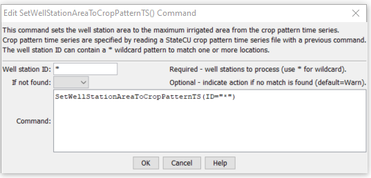

# StateDMI / Command / SetWellStationAreaToCropPatternTS #

* [Overview](#overview)
* [Command Editor](#command-editor)
* [Command Syntax](#command-syntax)
* [Examples](#examples)
* [Troubleshooting](#troubleshooting)
* [See Also](#see-also)

-------------------------

## Overview ##

The `SetWellStationAreaToCropPatternTS` command (for StateMod)
sets the well station area for each well station to the maximum crop pattern time series total area.
The crop pattern time series must have been read or assigned with previous commands.
If there is no crop pattern time series, the area will not be set.

## Command Editor ##

The following dialog is used to edit the command and illustrates the command syntax.

**<p style="text-align: center;">

</p>**

**<p style="text-align: center;">
`SetWellStationAreaToCropPatternTS` Command Editor (<a href="../SetWellStationAreaToCropPatternTS.png">see also the full-size image</a>)
</p>**

## Command Syntax ##

The command syntax is as follows:

```text
SetWellStationAreaToCropPatternTS(Parameter="Value",...)
```
**<p style="text-align: center;">
Command Parameters
</p>**

| **Parameter**&nbsp;&nbsp;&nbsp;&nbsp;&nbsp;&nbsp;&nbsp;&nbsp;&nbsp;&nbsp;&nbsp;&nbsp; | **Description** | **Default**&nbsp;&nbsp;&nbsp;&nbsp;&nbsp;&nbsp;&nbsp;&nbsp;&nbsp;&nbsp; |
| --------------|-----------------|----------------- |
| `ID`<br>**required**| A single well station identifier to match or a pattern using wildcards (e.g., `20*`). | None – must be specified. |
| `IfNotFound` | Used for error handling, one of the following:<ul><li>`Fail` – generate a failure message if the ID is not matched</li><li>`Ignore` – ignore (don’t add and don’t generate a message) if the ID is not matched</li><li>`Warn` – generate a warning message if the ID is not matched</li></ul> | `Warn` |

## Examples ##

See the [automated tests](https://github.com/OpenCDSS/cdss-app-statedmi-test/tree/master/test/regression/commands/SetWellStationAreaToCropPatternTS).

## Troubleshooting ##

[See the main troubleshooting documentation](../../troubleshooting/troubleshooting.md)

## See Also ##

* [`FillWellStation`](../FillWellStation/FillWellStation.md) command
* [`FillWellStationsFromDiversionStations`](../FillWellStationsFromDiversionStations/FillWellStationsFromDiversionStations.md) command
* [`FillWellStationsFromNetwork`](../FillWellStationsFromNetwork/FillWellStationsFromNetwork.md) command
* [`SetWellStation`](../SetWellStation/SetWellStation.md) command
* [`SetWellStationCapacitiesFromTS`](../SetWellStationCapacitiesFromTS/SetWellStationCapacitiesFromTS.md) command
* [`SetWellStationCapacityToWellRights`](../SetWellStationCapacityToWellRights/SetWellStationCapacityToWellRights.md) command
