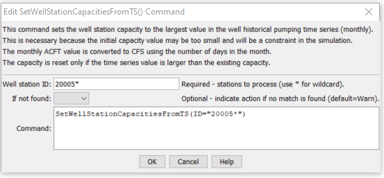

# StateDMI / Command / SetWellStationCapacitiesFromTS #

* [Overview](#overview)
* [Command Editor](#command-editor)
* [Command Syntax](#command-syntax)
* [Examples](#examples)
* [Troubleshooting](#troubleshooting)
* [See Also](#see-also)

-------------------------

## Overview ##

The `SetWellStationCapacitiesFromTS` command (for StateCU and StateMod)
sets well station capacities to the maximum historical pumping time series (monthly) value.
The historical time series must have been previously read or calculated with other commands.
Monthly ACFT values are converted to CFS units by applying the conversion:

```
CFS = X ACFT/(1.9835*DaysInMonth)
```

## Command Editor ##

The following dialog is used to edit the command and illustrates the command syntax.

**<p style="text-align: center;">

</p>**

**<p style="text-align: center;">
`SetWellStationCapacitiesFromTS` Command Editor (<a href="../SetWellStationCapacitiesFromTS.png">see also the full-size image</a>)
</p>**

## Command Syntax ##

The command syntax is as follows:

```text
SetWellStationCapacitiesFromTS(Parameter="Value",...)
```
**<p style="text-align: center;">
Command Parameters
</p>**

| **Parameter**&nbsp;&nbsp;&nbsp;&nbsp;&nbsp;&nbsp;&nbsp;&nbsp;&nbsp;&nbsp;&nbsp;&nbsp; | **Description** | **Default**&nbsp;&nbsp;&nbsp;&nbsp;&nbsp;&nbsp;&nbsp;&nbsp;&nbsp;&nbsp; |
| --------------|-----------------|----------------- |
| `ID`<br>**required** | A single well station identifier to match or a pattern using wildcards (e.g., `20*`). | None – must be specified. |
| `IfNotFound` | Used for error handling, one of the following:<ul><li>`Fail` – generate a failure message if the ID is not matched</li><li>`Ignore` – ignore (do not generate a message) if the ID is not matched</li><li>`Warn` – generate a warning message if the ID is not matched</li></ul> | `Warn` |

## Examples ##

See the [automated tests](https://github.com/OpenCDSS/cdss-app-statedmi-test/tree/master/test/regression/commands/SetWellStationCapacitiesFromTS).

## Troubleshooting ##

## See Also ##

* [`FillWellStation`](../FillWellStation/FillWellStation.md) command
* [`FillWellStationsFromDiversionStations`](../FillWellStationsFromDiversionStations/FillWellStationsFromDiversionStations.md) command
* [`FillWellStationsFromNetwork`](../FillWellStationsFromNetwork/FillWellStationsFromNetwork.md) command
* [`SetWellStation`](../SetWellStation/SetWellStation.md) command
* [`SetWellStationAreaToCropPatternTS`](../SetWellStationAreaToCropPatternTS/SetWellStationAreaToCropPatternTS.md) command
* [`SetWellStationCapacityToWellRights`](../SetWellStationCapacityToWellRights/SetWellStationCapacityToWellRights.md) command
