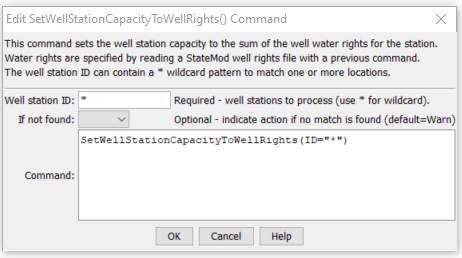

# StateDMI / Command / SetWellStationCapacityToWellRights #

* [Overview](#overview)
* [Command Editor](#command-editor)
* [Command Syntax](#command-syntax)
* [Examples](#examples)
* [Troubleshooting](#troubleshooting)
* [See Also](#see-also)

-------------------------

## Overview ##

The `SetWellStationCapacityToWellRights` command (for StateMod)
sets the well station capacity for each well station to the sum of the well rights corresponding to the station.
The well rights must have been read or assigned with previous commands.
If there are no well rights in the file, the capacity is set to zero.

## Command Editor ##

The following dialog is used to edit the command and illustrates the command syntax.

**<p style="text-align: center;">

</p>**

**<p style="text-align: center;">
`SetWellStationCapacityToWellRights` Command Editor (<a href="../SetWellStationCapacityToWellRights.png">see also the full-size image</a>)
</p>**

## Command Syntax ##

The command syntax is as follows:

```text
SetWellStationCapacityToWellRights(Parameter="Value",...)
```
**<p style="text-align: center;">
Command Parameters
</p>**

| **Parameter**&nbsp;&nbsp;&nbsp;&nbsp;&nbsp;&nbsp;&nbsp;&nbsp;&nbsp;&nbsp;&nbsp;&nbsp; | **Description** | **Default**&nbsp;&nbsp;&nbsp;&nbsp;&nbsp;&nbsp;&nbsp;&nbsp;&nbsp;&nbsp; |
| --------------|-----------------|----------------- |
| `ID`<br>**required** | A single well station identifier to match or a pattern using wildcards (e.g., `20*`). | None – must be specified. |
| `IfNotFound` | Used for error handling, one of the following:<ul><li>`Fail` – generate a failure message if the ID is not matched</li><li>`Ignore` – ignore (don’t add and don’t generate a message) if the ID is not matched</li><li>`Warn` – generate a warning message if the ID is not matched</li></ul> | `Warn` |

## Examples ##

See the [automated tests](https://github.com/OpenCDSS/cdss-app-statedmi-test/tree/master/test/regression/commands/SetWellStationCapacityToWellRights).

## Troubleshooting ##

## See Also ##

* [`FillWellStation`](../FillWellStation/FillWellStation.md) command
* [`FillWellStationsFromDiversionStations`](../FillWellStationsFromDiversionStations/FillWellStationsFromDiversionStations.md) command
* [`FillWellStationsFromNetwork`](../FillWellStationsFromNetwork/FillWellStationsFromNetwork.md) command
* [`SetWellStation`](../SetWellStation/SetWellStation.md) command
* [`SetWellStationAreaToCropPatternTS`](../SetWellStationAreaToCropPatternTS/SetWellStationAreaToCropPatternTS.md) command
* [`SetWellStationCapacitiesFromTS`](../SetWellStationCapacitiesFromTS/SetWellStationCapacitiesFromTS.md) command
